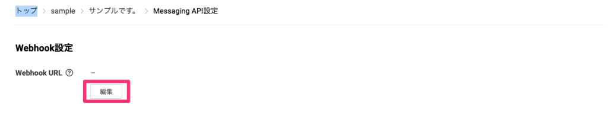
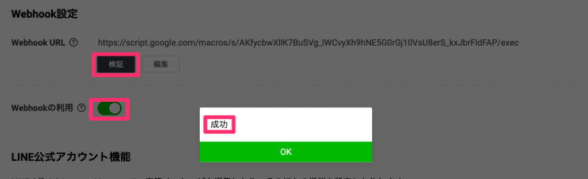

こんにちは「くら」です！

今回は<strong>Google Apps Script（通称GAS）</strong>で作成するLINE BOTの

簡単な作り方を紹介します。

<strong>無料のGoogleアカウント</strong>さえあれば作成可能なので、ぜひチャレンジしてみてください！

『 <strong>サンプル</strong> 』と発言すると、『 <strong>サンプルサンプルサンプル</strong> 』と返してくれるLINE BOTを作る手順を紹介します！<figure class="wp-block-image aligncenter">

](img_5dfa326c0486c.gif) <figcaption class="wp-element-caption">LINEBOTが動作している様子</figcaption></figure> 

## 必要なもの

<ul class="wp-block-list">
  <li>
    LINEアカウント
  </li>
  <li>
    LINEBOTのチャンネルアクセストークン
  </li>
</ul>

  <a href="https://arukayies.com/gas/line_bot/gettoken" title="LINE Messaging APIアクセストークンの取得方法" class="blogcard-wrap internal-blogcard-wrap a-wrap cf" target="_blank">
  
  

    

      
    
](gettoken-1-160x90.png)
    
    

      

        LINE Messaging APIアクセストークンの取得方法
      

      
      

        LINEBOTに必要なトークンの取得方法を画像付きで解説します。
      

    

    
    

      

        

          
          
          <noscript>
            
          </noscript>
        

        
        

          arukayies.com
        

      

      
      

        

          2024.11.19
        

      

    

  
</a>

<ul class="wp-block-list">
  <li>
    Googleアカウント
  </li>
</ul>

## GASのコードを追加する

1　最初に『 **Googleドライブ** 』へアクセスします。

  <a rel="noopener" href="https://drive.google.com/drive/my-drive" title="Google Drive: Sign-in" class="blogcard-wrap external-blogcard-wrap a-wrap cf" target="_blank">
  
  

    

      
    
<figure class="blogcard-thumbnail external-blogcard-thumbnail">
    
    
    
    <noscript>
      
    </noscript></figure>
    
    

      

        Google Drive: Sign-in
      

      
      

        Access Google Drive with a Google account (for personal use) or Google Workspace account (for business use).
      

    

    
    

      

        

          
          
          <noscript>
            
          </noscript>
        

        
        

          drive.google.com
        

      

    

  
</a>

2　『 **新規** 』>『 **その他** 』>『 **Google Apps Script** 』の順で押下します。

  

    <figure class="wp-block-image size-large">](【Google】新規を押下する.png)<figcaption class="wp-element-caption"><strong>新規</strong> を押下する</figcaption></figure>
  

  
  

    <figure class="wp-block-image size-large">](【Google】その他を押下する.png)<figcaption class="wp-element-caption"><strong>その他</strong> を押下する</figcaption></figure> 
    
        
  

  
  

    <figure class="wp-block-image size-large">](【Google】Google-Apps-Scriptを押下する.png)<figcaption class="wp-element-caption"><strong>Google Apps Script</strong> を押下する</figcaption></figure>
  
3　プロジェクト名を設定します。好きな名前を入力し、『 **名前を変更** 』を押下してください。

  

    <figure class="wp-block-image size-large">](スクリーンショット_2021-02-27_12_57_21.png)<figcaption class="wp-element-caption"><strong>無題のプロジェクト</strong> を選択する</figcaption></figure>
  

  
  

    <figure class="wp-block-image size-large">](スクリーンショット_2021-02-27_13_00_59.png)<figcaption class="wp-element-caption">プロジェクト名を入力し、<strong>名前を変更</strong> を押下する</figcaption></figure> 
    
        
  
4　『 **コード.gs** 』に以下のコードを貼り付け、名前を『 **main** 』に変更します、

1行目のトークンは事前に取得したLINEのチャンネルアクセストークンを入力してください。

  

    <figure class="wp-block-image size-large">](スクリーンショット-2021-02-27-13.03.16-1024x424.png)<figcaption class="wp-element-caption"><strong>main</strong> のコードを貼り付ける</figcaption></figure>
  

  
  

    <figure class="wp-block-image size-large">](スクリーンショット-2021-02-27-13.04.08.png)<figcaption class="wp-element-caption"><strong>main</strong> に名前を変える</figcaption></figure>
  
### main処理の説明

**main** の処理ではLINEから **Webhock** を受け取り、送られてきたイベントを処理します。

      <strong>Webhockとは？</strong>
  
  
  <ul class="wp-block-list">
    <li>
      アプリケーションの更新情報を<strong>他のアプリケーションへリアルタイム提供する</strong>仕組みのことを言います。
    </li>
    <li>
      ここではLINEの更新をGASに通知するという意味になります。
    </li>
  </ul>

      <strong>main処理の概要</strong>
  
  
  <ol class="wp-block-list">
    <li>
      LINEから送られてきたデータをdoPost(e)の<strong>e</strong>で受け取ります。
    </li>
    <li>
      受け取ったデータから、イベントタイプと返信するための宛先を取得します。
    </li>
    <li>
      イベントタイプが <strong>message</strong> の場合、<strong>messageController</strong> に送られてきたデータ、返信するための宛先を渡します。
    </li>
  </ol>

5　『 **ファイル** 』>『 **＋** 』 > 『 **スクリプト** 』で新規にスクリプトを追加します。

名前を**messageController** に設定し、以下のコードを貼り付けます。

  

    <figure class="wp-block-image size-large">](スクリーンショット-2021-02-27-13.06.41.png)<figcaption class="wp-element-caption"><strong>スクリプト</strong> を追加する</figcaption></figure>
  

  
  

    <figure class="wp-block-image size-large">](スクリーンショット-2021-02-27-13.08.38.png)<figcaption class="wp-element-caption"><strong>messageController</strong> を貼り付ける</figcaption></figure>
  
### messageController処理の説明

特定文字列が含まれていた場合に、返信メッセージを組み立てる処理を行います。

      <strong>messageController処理の概要</strong>
  
  
  <ol class="wp-block-list">
    <li>
      LINEから送られてきたメッセージを取得します。
    </li>
    <li>
      メッセージに <strong>サンプル</strong> という文字列が含まれていた場合、<strong>サンプルサンプルサンプル</strong> という返信メッセージを組み立てます。
    </li>
    <li>
      組み立てられた返信メッセージは <strong>replyLine</strong> に渡されます。その時に返信メッセージ、返信するための宛先を引数として渡します。
    </li>
  </ol>

6　最後に **replyLine** 処理を追加します。以下のコードを貼り付けます。

  

    <figure class="wp-block-image size-large">](スクリーンショット-2021-02-27-13.06.41.png)<figcaption class="wp-element-caption"><strong>スクリプト</strong> を追加する</figcaption></figure>
  

  
  

    <figure class="wp-block-image size-large">](スクリーンショット-2021-02-27-13.11.35-1024x471.png)<figcaption class="wp-element-caption"><strong>replyLine</strong> を貼り付ける</figcaption></figure>
  
### replyLine処理の説明

LINEで返信する処理を行います。

      <strong>replyLine処理の概要</strong>
  
  
  <ol class="wp-block-list">
    <li>
      LINE返信URLに <strong>POSTリクエスト</strong> を送るためのパラメータを組み立てます。
    </li>
    <li>
      組み立てたパラメータをLINE返信URLに送信します。
    </li>
  </ol>

## ウェブアプリをデプロイする

1　『 **デプロイ** 』>『 **新しいデプロイ** 』を押下します。<figure class="wp-block-image aligncenter size-large">

](スクリーンショット_2021-02-27_13_13_58-1024x282.png) <figcaption class="wp-element-caption">『 **デプロイ** 』>『 **新しいデプロイ** 』を押下する</figcaption></figure> 

2　『 <strong>デプロイ</strong> 』>『 <strong>新しいデプロイ </strong>』を押下します。<figure class="wp-block-image aligncenter size-large">

](スクリーンショット_2021-02-27_13_16_16-2.png) <figcaption class="wp-element-caption">『 **デプロイ** 』>『 **新しいデプロイ** 』を押下する</figcaption></figure> 

3　アクセス出来るユーザーを『 <strong>全員 </strong>』に変更し、『 **デプロイ** 』を押下します。<figure class="wp-block-image aligncenter size-large">

](スクリーンショット_2021-02-27_13_21_06-2.png) <figcaption class="wp-element-caption">アクセス出来るユーザーを『 **全員** 』に変更し、**デプロイ** を押下する</figcaption></figure> 

4　承認画面が表示されるので、下の赤枠の順に押下します。

  

    

      

      

      
      

      

      
      

      

    
<figure class="wp-block-image size-large">
    
    ](スクリーンショット_2021-02-27_13_24_02.png)<figcaption class="wp-element-caption">承認1</figcaption></figure>
  

  
  

    <figure class="wp-block-image size-large">](【Google】承認2.png)<figcaption class="wp-element-caption">承認2</figcaption></figure>
  

  
  

    <figure class="wp-block-image size-large">](【Google】承認3.png)<figcaption class="wp-element-caption">承認3</figcaption></figure>
  

  

    <figure class="wp-block-image size-large is-resized">](【Google】承認4.png)<figcaption class="wp-element-caption">承認4</figcaption></figure>
  

  
  

    <figure class="wp-block-image size-large is-resized">](【Google】承認5.png)<figcaption class="wp-element-caption">承認5</figcaption></figure>
  

  
  

    <figure class="wp-block-image size-large">](スクリーンショット_2021-02-27_13_25_17.png)<figcaption class="wp-element-caption">承認6</figcaption></figure>
  
最後に表示される **ウェブアプリのURL** が次の **Webhook URL** です！

      コードを変更した場合は再度デプロイをすることで変更が反映されます！
  

## LINE DevelopersにWebhook URLを設定する

1　LINE チャンネル基本設定のページに遷移し、『**Webhook設定**』の『**編集**』を押下します。

LINEチャンネル基本設定の遷移先は過去の記事を参考にしてください。

  <a href="https://arukayies.com/gas/line_bot/gettoken#toc5" title="LINE Messaging APIアクセストークンの取得方法" class="blogcard-wrap internal-blogcard-wrap a-wrap cf" target="_blank">
  
  

    

      
    
](gettoken-1-160x90.png)
    
    

      

        LINE Messaging APIアクセストークンの取得方法
      

      
      

        LINEBOTに必要なトークンの取得方法を画像付きで解説します。
      

    

    
    

      

        

          
          
          <noscript>
            
          </noscript>
        

        
        

          arukayies.com
        

      

      
      

        

          2024.11.19
        

      

    

  
</a>

<figure class="wp-block-image aligncenter size-large">

](【LINE】Webhook設定-1024x196.png) <figcaption class="wp-element-caption">【LINE】Webhook設定</figcaption></figure> 

2　GASの**ウェブアプリケーションのURL**を入力し、『**更新**』を押下します。<figure class="wp-block-image aligncenter size-large">

](【LINE】WebhookURLの入力-1024x199.png) <figcaption class="wp-element-caption">【LINE】WebhookURLの入力</figcaption></figure> 

3　『**検証**』を押下し、『**成功**』と表示されたらOKです。Webhookの利用を『**ON**』にします。<figure class="wp-block-image aligncenter size-large">

](【LINE】WebhookURLの検証-1024x313.png) <figcaption class="wp-element-caption">【LINE】WebhookURLの検証</figcaption></figure> 

## LINEBOTが動作している様子

設定したBOTを友だち登録します。チャンネル基本設定のQRコードから友達登録してください。<figure class="wp-block-image aligncenter size-large">

](【LINE】友達登録.png) <figcaption class="wp-element-caption">【LINE】友達登録</figcaption></figure> 

      <strong>サンプル機能</strong>
  
  
  <ul class="wp-block-list">
    <li>
      『<strong>サンプル</strong>』としゃべると、『<strong>サンプルサンプルサンプル</strong>』と発言します。
    </li>
  </ul>

<figure class="wp-block-image aligncenter">

](img_5dfa326c0486c.gif) <figcaption class="wp-element-caption">LINEBOTが動作している様子</figcaption></figure> 

## まとめ

なるべく<strong>シンプルな</strong>作りになるようにコードを書いてみました。

コードにはコメントを多く入れているので、理解の助けになれば嬉しいです。

