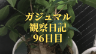

こんにちは！

妻が育てていた**ガジュマル**を受け継ぎ成長を見守っています。

観察100日目の様子です！

      前回までの日記はこちらです。
  
  
  

    <a href="https://arukayies.com/house_plants/banyan/diary3-7" title="【観葉植物】ガジュマルの観察日記(96日目)" class="blogcard-wrap internal-blogcard-wrap a-wrap cf" target="_blank">
    
    

      

        
      
](diary3-7-160x90.png)
      
      

        

          【観葉植物】ガジュマルの観察日記(96日目)
        

        
        

          こんにちは！妻が育てていたガジュマルを受け継ぎ成長を見守っています。観察96日目の様子です！前回までの日記はこちらです。観察96日目観察し始めて3か月経過しました。暖かい気候が続いたからか、葉っぱがいっぱいです！3か月前↓今回↓
        

      

      
      

        

          

            
            
            <noscript>
              
            </noscript>
          

          
          

            arukayies.com
          

        

        
        

          

            2019.12.22
          

        

      

    
</a>
  
## 観察100日目

ガジュマルの植替を行います！  
](img_5dfef68b54333.jpg) 

鉢からガジュマルを抜きます  
](img_5dfef68c129cd.jpg) 

新しい鉢に鉢底ネットを敷きます  
](img_5dfef68cc4ad4.jpg) 

軽石を入れます  
](img_5dfef68d882f2.jpg) 

ガジュマルを植えます！  
](img_5dfef68e5edf0.jpg) 

土の乾燥防止に化粧石を敷きます  
](img_5dfef68eeeb74.jpg) 

生まれ変わったガジュマルの完成です！  
](img_5dfef68faf4fc.jpg)
