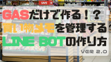

こんにちは！

前回このような記事を書きました！

  <a href="https://arukayies.com/gas/line_bot/line_bot_with_gas" title="GASで作る簡単なLINE BOTの作り方" class="blogcard-wrap external-blogcard-wrap a-wrap cf" target="_blank">
  
  

    

      
    
<figure class="blogcard-thumbnail external-blogcard-thumbnail">
    
    ](line-bot-with-gas.png)
    
    <noscript>
      ](line-bot-with-gas.png)
    </noscript></figure>
    
    

      

        GASで作る簡単なLINE BOTの作り方
      

      
      

        GASで作るLINE BOTの簡単な作り方を紹介します！
      

    

    
    

      

        

          
          
          <noscript>
            
          </noscript>
        

        
        

          arukayies.com
        

      

    

  
</a>

今回はこの応用で、LINE BOTを使って<strong>スプレッドシートの情報を通知</strong>させたいと思います。

日々のタスクや買い物リスト等、スプレッドシートの情報を通知させることが出来たらいろいろ応用がききます！！

## GASでコーディング

GASでコーディングする方法は前回の記事を参照お願いします。

  <a href="https://arukayies.com/gas/line_bot/line-bot-with-gas#toc2" title="GASで作る簡単なLINE BOTの作り方" class="blogcard-wrap internal-blogcard-wrap a-wrap cf" target="_blank">
  
  

    

      
    
](line-bot-with-gas-160x90.png)
    
    

      

        GASで作る簡単なLINE BOTの作り方
      

      
      

        GASで作るLINE BOTの簡単な作り方を紹介します！
      

    

    
    

      

        

          
          
          <noscript>
            
          </noscript>
        

        
        

          arukayies.com
        

      

      
      

        

          2024.11.19
        

      

    

  
</a>

前回の「**messageController**」処理を変更します。今回は**買い物リスト**と発言があった場合にスプレッドシート上のリストを通知する処理を作ります。

  

    チェック
  

  
  

          どんな処理？
    
    
    <ul class="wp-block-list">
      <li>
        LINEから送られてきたメッセージを取得します。
      </li>
      <li>
        メッセージに<strong>買い物リスト</strong>という文字列が含まれていた場合、<strong>スプレッドシートに書かれているリスト</strong>を通知します。
      </li>
      <li>
        通知メッセージは<strong>replyLine</strong>に渡されます。その時にスクリプトプロパティのオブジェクト、返信メッセージ、返信するための宛先を引数として渡します。
      </li>
    </ul>
  
## ウェブアプリをデプロイする

過去の記事で手順を紹介しているので、そちらを参照お願いします！

  <a href="https://arukayies.com/gas/line_bot/line-bot-with-gas#toc6" title="GASで作る簡単なLINE BOTの作り方" class="blogcard-wrap internal-blogcard-wrap a-wrap cf" target="_blank">
  
  

    

      
    
](line-bot-with-gas-160x90.png)
    
    

      

        GASで作る簡単なLINE BOTの作り方
      

      
      

        GASで作るLINE BOTの簡単な作り方を紹介します！
      

    

    
    

      

        

          
          
          <noscript>
            
          </noscript>
        

        
        

          arukayies.com
        

      

      
      

        

          2024.11.19
        

      

    

  
</a>

## LINE DevelopersにWebhook URLを設定する

過去の記事で手順を紹介しているので、そちらを参照お願いします！

  <a href="https://arukayies.com/gas/line_bot/line-bot-with-gas#toc7" title="GASで作る簡単なLINE BOTの作り方" class="blogcard-wrap internal-blogcard-wrap a-wrap cf" target="_blank">
  
  

    

      
    
](line-bot-with-gas-160x90.png)
    
    

      

        GASで作る簡単なLINE BOTの作り方
      

      
      

        GASで作るLINE BOTの簡単な作り方を紹介します！
      

    

    
    

      

        

          
          
          <noscript>
            
          </noscript>
        

        
        

          arukayies.com
        

      

      
      

        

          2024.11.19
        

      

    

  
</a>

## 話しかけてみた

買い物リスト通知機能

<ul class="wp-block-list">
  <li>
    『<strong>買い物リスト</strong>』としゃべると、『<strong>スプレッドシートに書かれているリスト</strong>』を通知します。
  </li>
</ul><figure class="wp-block-image aligncenter is-resized">

](img_5dfa287f5a4fd.png) <figcaption class="wp-element-caption">買い物リスト</figcaption></figure> <figure class="wp-block-image aligncenter is-resized">](img_5dfa287fa479c.gif)<figcaption class="wp-element-caption">買い物リストを通知する様子</figcaption></figure> 

## まとめ

スプレッドシートの情報をLINEBOTで通知できるようになると、いろいろ応用ができそうですね！

Googleカレンダーと連携すると、予定をLINEに通知することも出来たりします！

LINEに情報を集中させて、効率よくするのもいいかもしれないですね！

  後日・・・

買い物リストを管理するLINEBOTを作ってみたので、よかったらこちらも見てください！

  <a href="https://arukayies.com/gas/line_bot/shopping-list-post-v2" title="GASだけで作れる買い物リストを管理するLINE BOTの作り方Ver2.0" class="blogcard-wrap internal-blogcard-wrap a-wrap cf" target="_blank">
  
  

    

      
    
](shopping-list-post-v2-160x90.png)
    
    

      

        GASだけで作れる買い物リストを管理するLINE BOTの作り方Ver2.0
      

      
      

        以前作った買い物リストを管理してくれるLINE BOT を少し改良しました！削除の面倒な手間を減らし、V8ランタイムを意識してリファクタリング行いました！
      

    

    
    

      

        

          
          
          <noscript>
            
          </noscript>
        

        
        

          arukayies.com
        

      

      
      

        

          2024.11.19
        

      

    

  
</a>

