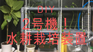
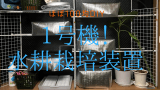
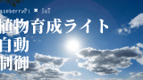

こんにちは！

前回作成した水耕栽培装置【2号機】のさらなる進化を考えている「くら」です！

水耕栽培装置【2号機】の詳細はこちらです。

  <a href="https://arukayies.com/diy/hydroponic-culture-second-machine" title="【2号機】循環式の水耕栽培装置を本格的に作ってみた" class="blogcard-wrap internal-blogcard-wrap a-wrap cf" target="_blank">
  
  

    

      
    
](hydroponic_culture_second_machine-160x90.png)
    
    

      

        【2号機】循環式の水耕栽培装置を本格的に作ってみた
      

      
      

        こんにちは！水耕栽培装置1号機を運用して4ヶ月ほど・・・。　ふと見かけたAmazonの水耕栽培キットを見て、これなら自作できるんじゃね？　と思いさっそく作ってみた「くら」です！前回の水耕栽培装置【1号機】はこちらです。見かけたAmazonは...
      

    

    
    

      

        

          
          
          <noscript>
            
          </noscript>
        

        
        

          arukayies.com
        

      

      
      

        

          2024.11.19
        

      

    

  
</a>

ついでに水耕栽培装置【1号機】の詳細はこちらです。

  <a href="https://arukayies.com/diy/hydroponic-culture-first-machine" title="ほぼ100均で作る循環式の水耕栽培装置の紹介" class="blogcard-wrap internal-blogcard-wrap a-wrap cf" target="_blank">
  
  

    

      
    
](hydroponic_culture_first_machine-160x90.png)
    
    

      

        ほぼ100均で作る循環式の水耕栽培装置の紹介
      

      
      

        こんにちは！自宅で野菜を作ってみたくて、水耕栽培に興味を持った「くら」です！これが実際に自作した水耕栽培装置です。↓今回は私が自作した水耕栽培装置を紹介します！大規模にやるならこれも気になる・・・【2024進化版】LAPOND 水耕栽培シス...
      

    

    
    

      

        

          
          
          <noscript>
            
          </noscript>
        

        
        

          arukayies.com
        

      

      
      

        

          2024.11.19
        

      

    

  
</a>

これが今回作成した<strong>植物育成LEDライト</strong>がON/OFFしている様子です。↓](img_5dfa2817134a9.gif) 

ライトのON/OFFはRaspberry Piを使って、<strong>日の出・日の入時刻で連動するように自動制御</strong>しています！

Raspberry Piを使ったライトの自動制御はこちらをご覧ください。

  <a href="https://arukayies.com/raspberrypi/hydroponic-culture-led-automatic-control" title="【IoT】Raspberry Piで日没・日の出時刻に植物育成LEDライトを自動ON・OFFしてみた" class="blogcard-wrap internal-blogcard-wrap a-wrap cf" target="_blank">
  
  

    

      
    
](hydroponic_culture_led_automatic_control-160x90.png)
    
    

      

        【IoT】Raspberry Piで日没・日の出時刻に植物育成LEDライトを自動ON・OFFしてみた
      

      
      

        こんにちは！水耕栽培装置を自作し、いろんな野菜を育成している「くら」です！自作した水耕栽培装置はこちらです。さらなる栽培の効率化を求めて、植物育成LEDライトを導入しました！この植物育成LEDライトをRaspberry Piを使って、日没・...
      

    

    
    

      

        

          
          
          <noscript>
            
          </noscript>
        

        
        

          arukayies.com
        

      

      
      

        

          2024.11.19
        

      

    

  
</a>

市販のだとこんなやつです↓

## 使う材料

<ul class="wp-block-list">
  <li>
    LEDライト(100均) ](img_5dfa28175aea4.jpg)
  </li>
  <li>
    ランプシェード的なやつ(100均) ](img_5dfa281790e65.jpg)
  </li>
</ul>

## 植物育成LEDライトって？

こんなやつです。ライトの色があやしい・・・　笑

## 作る手順

](img_5dfa2818087c5.jpg) 

キャンドゥで購入したLEDライトです。明るさはこのぐらいです。  
](img_5dfa281851f85.jpg) 

ランプシェードは台所のゴミ受けがちょうどステンレスで光を反射して良さそう！と思い購入してみました。これを穴開けて、LEDライトを通せばいい感じになるんじゃないかなー？と思い。。。  

これで穴開けようとしてましたが、、、、

