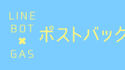
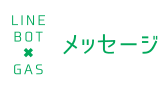
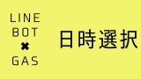
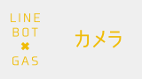
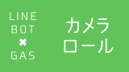
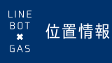

<strong>LINE BOT</strong>を作成する機会が増えきた「くら」です！

[LINE公式ドキュメント][1]を参考に<strong>GAS</strong>を使って各APIを試してみました。

今回はユーザーが受け取ったメッセージに対して、  
Botが実行できる[アクションオブジェクト][2]のまとめになります。

## ポストバックアクション

  <a href="https://arukayies.com/gas/line_bot/postback-action" title="【LINE BOT】GASで『ポストバックアクション』を試してみた" class="blogcard-wrap internal-blogcard-wrap a-wrap cf" target="_blank">
  
  

    

      
    
](postback_action-160x90.png)
    
    

      

        【LINE BOT】GASで『ポストバックアクション』を試してみた
      

      
      

        LINE BOTを作成する機会が増えきた「くら」です！LINE公式ドキュメントを参考にGASを使って各APIを試してみました。今回はユーザーが受け取ったメッセージに対して、Botが実行できるアクションオブジェクトをそれぞれ試してみたのでその...
      

    

    
    

      

        

          
          
          <noscript>
            
          </noscript>
        

        
        

          arukayies.com
        

      

      
      

        

          2024.11.19
        

      

    

  
</a>

](img_5dfa23a0b71e8.jpg) 

## メッセージアクション

  <a href="https://arukayies.com/gas/line_bot/message-action" title="【LINE BOT】GASで『メッセージアクション』を試してみた" class="blogcard-wrap internal-blogcard-wrap a-wrap cf" target="_blank">
  
  

    

      
    
](message_action-160x90.png)
    
    

      

        【LINE BOT】GASで『メッセージアクション』を試してみた
      

      
      

        LINE BOTを作成する機会が増えきた「くら」です！LINE公式ドキュメントを参考にGASを使って各APIを試してみました。今回はユーザーが受け取ったメッセージに対して、Botが実行できるアクションオブジェクトをそれぞれ試してみたのでその...
      

    

    
    

      

        

          
          
          <noscript>
            
          </noscript>
        

        
        

          arukayies.com
        

      

      
      

        

          2024.11.19
        

      

    

  
</a>

](img_5dfa23a1031e6.jpg) 

## URIアクション

  <a href="https://arukayies.com/gas/line_bot/uri-action" title="【LINE BOT】GASで『URIアクション』を試してみた" class="blogcard-wrap internal-blogcard-wrap a-wrap cf" target="_blank">
  
  

    

      
    
](uri_action-160x90.png)
    
    

      

        【LINE BOT】GASで『URIアクション』を試してみた
      

      
      

        LINE BOTを作成する機会が増えきた「くら」です！LINE公式ドキュメントを参考にGASを使って各APIを試してみました。今回はユーザーが受け取ったメッセージに対して、Botが実行できるアクションオブジェクトをそれぞれ試してみたのでその...
      

    

    
    

      

        

          
          
          <noscript>
            
          </noscript>
        

        
        

          arukayies.com
        

      

      
      

        

          2024.11.19
        

      

    

  
</a>

](img_5dfa23a13fdf0.jpg) 

## 日時選択アクション

  <a href="https://arukayies.com/gas/line_bot/datetime-picker-action" title="【LINE BOT】GASで『日時選択アクション』を試してみた" class="blogcard-wrap internal-blogcard-wrap a-wrap cf" target="_blank">
  
  

    

      
    
](datetime_picker_action-160x90.png)
    
    

      

        【LINE BOT】GASで『日時選択アクション』を試してみた
      

      
      

        LINE BOTを作成する機会が増えきた「くら」です！LINE公式ドキュメントを参考にGASを使って各APIを試してみました。今回はユーザーが受け取ったメッセージに対して、Botが実行できるアクションオブジェクトをそれぞれ試してみたのでその...
      

    

    
    

      

        

          
          
          <noscript>
            
          </noscript>
        

        
        

          arukayies.com
        

      

      
      

        

          2024.11.19
        

      

    

  
</a>

](img_5dfa23a17f87b.jpg) 

## カメラアクション

  <a href="https://arukayies.com/gas/line_bot/camera-action" title="【LINE BOT】GASで『カメラアクション』を試してみた" class="blogcard-wrap internal-blogcard-wrap a-wrap cf" target="_blank">
  
  

    

      
    
](camera_action-160x90.png)
    
    

      

        【LINE BOT】GASで『カメラアクション』を試してみた
      

      
      

        LINE BOTを作成する機会が増えきた「くら」です！LINE公式ドキュメントを参考にGASを使って各APIを試してみました。今回はユーザーが受け取ったメッセージに対して、Botが実行できるアクションオブジェクトをそれぞれ試してみたのでその...
      

    

    
    

      

        

          
          
          <noscript>
            
          </noscript>
        

        
        

          arukayies.com
        

      

      
      

        

          2024.11.19
        

      

    

  
</a>

](img_5dfa23a1d9d9c.jpg) 

## カメラロールアクション

  <a href="https://arukayies.com/gas/line_bot/camera-roll-action" title="【LINE BOT】GASで『カメラロールアクション』を試してみた" class="blogcard-wrap internal-blogcard-wrap a-wrap cf" target="_blank">
  
  

    

      
    
](camera_roll_action-160x90.png)
    
    

      

        【LINE BOT】GASで『カメラロールアクション』を試してみた
      

      
      

        LINE BOTを作成する機会が増えきた「くら」です！LINE公式ドキュメントを参考にGASを使って各APIを試してみました。今回はユーザーが受け取ったメッセージに対して、Botが実行できるアクションオブジェクトをそれぞれ試してみたのでその...
      

    

    
    

      

        

          
          
          <noscript>
            
          </noscript>
        

        
        

          arukayies.com
        

      

      
      

        

          2024.11.19
        

      

    

  
</a>

](img_5dfa23a2249d8.jpg) 

## 位置情報アクション

  <a href="https://arukayies.com/gas/line_bot/location-action" title="【LINE BOT】GASで『位置情報アクション』を試してみた" class="blogcard-wrap internal-blogcard-wrap a-wrap cf" target="_blank">
  
  

    

      
    
](location_action-160x90.png)
    
    

      

        【LINE BOT】GASで『位置情報アクション』を試してみた
      

      
      

        LINE BOTを作成する機会が増えきた「くら」です！LINE公式ドキュメントを参考にGASを使って各APIを試してみました。今回はユーザーが受け取ったメッセージに対して、Botが実行できるアクションオブジェクトをそれぞれ試してみたのでその...
      

    

    
    

      

        

          
          
          <noscript>
            
          </noscript>
        

        
        

          arukayies.com
        

      

      
      

        

          2024.11.19
        

      

    

  
</a>

](img_5dfa23a25eaa4.jpg) 

 [1]: https://developers.line.biz/ja/docs/messaging-api/
 [2]: https://developers.line.biz/ja/reference/messaging-api/#action-objects
