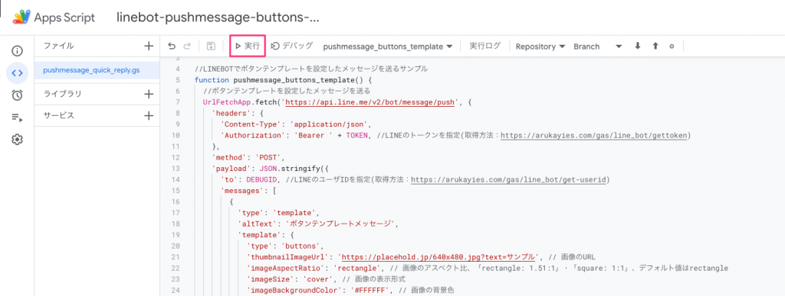
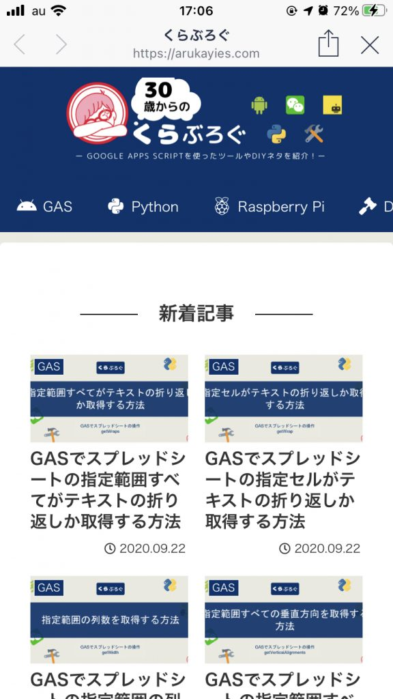

こんにちは「くら」です！

<a href="https://developers.line.biz/ja/docs/messaging-api/">LINE公式ドキュメント</a> を参考に <strong>GAS</strong> を使って各APIを試しています。

その他のアクションについては別記事で紹介しています。

  <a href="https://arukayies.com/gas/line_bot/action-objects" title="【LINE BOT】GASでBOTが実行できる『アクションタイプ』のまとめ" class="blogcard-wrap internal-blogcard-wrap a-wrap cf" target="_blank">
  
  

    

      
    
](action_objects-160x90.png)
    
    

      

        【LINE BOT】GASでBOTが実行できる『アクションタイプ』のまとめ
      

      
      

        LINE BOTを作成する機会が増えきた「くら」です！LINE公式ドキュメントを参考にGASを使って各APIを試してみました。今回はユーザーが受け取ったメッセージに対して、Botが実行できるアクションオブジェクトのまとめになります。ＬＩＮＥ...
      

    

    
    

      

        

          
          
          <noscript>
            
          </noscript>
        

        
        

          arukayies.com
        

      

      
      

        

          2024.11.19
        

      

    

  
</a>

今回は「<strong>ボタンテンプレートメッセージ</strong> 」の送り方を紹介します。

公式ドキュメントは<a href="https://developers.line.biz/ja/docs/messaging-api/message-types/#buttons-template"> こちら</a> を参照してください。

## 事前準備

LINE Developersで **チャンネルアクセストークン** を取得してください。

  <a href="https://arukayies.com/gas/line_bot/gettoken" title="LINE Messaging APIアクセストークンの取得方法" class="blogcard-wrap internal-blogcard-wrap a-wrap cf" target="_blank">
  
  

    

      
    
](gettoken-1-160x90.png)
    
    

      

        LINE Messaging APIアクセストークンの取得方法
      

      
      

        LINEBOTに必要なトークンの取得方法を画像付きで解説します。
      

    

    
    

      

        

          
          
          <noscript>
            
          </noscript>
        

        
        

          arukayies.com
        

      

      
      

        

          2024.11.19
        

      

    

  
</a>

LINEの **ユーザID** の調べ方はこの手順で確認できます。

  <a href="https://arukayies.com/gas/line_bot/get-userid" title="【LINE BOT】GASでLINEの『ユーザID』の取得方法" class="blogcard-wrap internal-blogcard-wrap a-wrap cf" target="_blank">
  
  

    

      
    
](get_userid-160x90.png)
    
    

      

        【LINE BOT】GASでLINEの『ユーザID』の取得方法
      

      
      

        くらこんにちは「くら」です！LINE公式ドキュメント を参考に GAS を使って各APIを試しています。くら今回はLINEの「ユーザID」の取得方法を紹介します。ログを見るときによく使っています。ＬＩＮＥ　ＢＯＴを作ろう！ Ｍｅｓｓａｇｉｎ...
      

    

    
    

      

        

          
          
          <noscript>
            
          </noscript>
        

        
        

          arukayies.com
        

      

      
      

        

          2024.11.19
        

      

    

  
</a>

## 『ボタンテンプレートメッセージ』を送るコード

1行目のトークンは事前に取得したLINEのチャンネルアクセストークンを入力してください。

2行目のユーザーIDも事前に取得したIDを入力してください。

## 『ボタンテンプレートメッセージ』を送ってみる

**pushmessage\_buttons\_template** を実行します。<figure class="wp-block-image size-large">

](スクリーンショット_2021-02-28_17_03_56-1024x388.png) <figcaption class="wp-element-caption">**pushmessage\_buttons\_template** を実行する</figcaption></figure> 

実行すると、LINEに **ボタンテンプレートメッセージ** が送られます！](LINE_capture_636192301.334029.jpg) 

「 **TOPを開く** 」を選択すると「 **指定したURL** 」を開きます！](IMG_7401DC506856-1-576x1024.jpeg) 

その他のアクションについては別記事で紹介しています。

  <a href="https://arukayies.com/gas/line_bot/action-objects" title="【LINE BOT】GASでBOTが実行できる『アクションタイプ』のまとめ" class="blogcard-wrap internal-blogcard-wrap a-wrap cf" target="_blank">
  
  

    

      
    
](action_objects-160x90.png)
    
    

      

        【LINE BOT】GASでBOTが実行できる『アクションタイプ』のまとめ
      

      
      

        LINE BOTを作成する機会が増えきた「くら」です！LINE公式ドキュメントを参考にGASを使って各APIを試してみました。今回はユーザーが受け取ったメッセージに対して、Botが実行できるアクションオブジェクトのまとめになります。ＬＩＮＥ...
      

    

    
    

      

        

          
          
          <noscript>
            
          </noscript>
        

        
        

          arukayies.com
        

      

      
      

        

          2024.11.19
        

      

    

  
</a>

