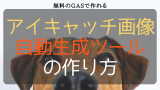

以前の記事でこんなことを紹介しました。

  <a href="https://arukayies.com/gas/wordpress-rest-api/postreport" title="GASを使ってWordPressに自動投稿する方法" class="blogcard-wrap internal-blogcard-wrap a-wrap cf" target="_blank">
  
  

    

      
    
](postreport-160x90.png)
    
    

      

        GASを使ってWordPressに自動投稿する方法
      

      
      

        WordPress を使って広告収入を得たい！でもサラリーマンで毎日記事を書いてる時間はない！だったら、自動化だ！と思い立って、年末からいろいろ試していました「くら」です。まずはメインである。記事の自動投稿をGASを使って自動化します。プロ...
      

    

    
    

      

        

          
          
          <noscript>
            
          </noscript>
        

        
        

          arukayies.com
        

      

      
      

        

          2024.11.19
        

      

    

  
</a>

この記事ではタイトルと内容を自動投稿させるのみでしたが、

今回は**アイキャッチ画像付き**で自動投稿させます！

前回同様にプログラム未経験者でもコピペで実現できるように手順を紹介します。

## 自動投稿できるまでの流れ

<ol class="wp-block-list">
  <li>
    WordPressにプラグイン「Application Password」をインストール＆設定！
  </li>
  <li>
    GASのコードをコピーし、実行！
  </li>
  <li>
    これだけで自動投稿できます！
  </li>
</ol>

## WordPressにプラグイン「Application Password」をインストール

前回の手順を参考にしてください！

  <a href="https://arukayies.com/gas/wordpress-rest-api/postreport#toc2" title="GASを使ってWordPressに自動投稿する方法" class="blogcard-wrap internal-blogcard-wrap a-wrap cf" target="_blank">
  
  

    

      
    
](postreport-160x90.png)
    
    

      

        GASを使ってWordPressに自動投稿する方法
      

      
      

        WordPress を使って広告収入を得たい！でもサラリーマンで毎日記事を書いてる時間はない！だったら、自動化だ！と思い立って、年末からいろいろ試していました「くら」です。まずはメインである。記事の自動投稿をGASを使って自動化します。プロ...
      

    

    
    

      

        

          
          
          <noscript>
            
          </noscript>
        

        
        

          arukayies.com
        

      

      
      

        

          2024.11.19
        

      

    

  
</a>

## GASを使ってWordPressに自動投稿するコード(アイキャッチ画像付)

以下の部分を書き換えることで、自分のサイトにアイキャッチ画像付で自動投稿できます！

<pre class="wp-block-preformatted">var siteUrl = 'WordpressサイトのURL';
var user = 'ユーザ名';
var pass = 'パスワード';
var title = '自動投稿テスト';
var content = 'これは自動投稿です。';
var imageID = postImage(siteUrl, user, pass, 'アイキャッチ画像にしたい画像URL');</pre>

## 処理の説明

記事のタイトル・内容を投稿する処理は前回と変わりません。

アイキャッチ画像を設定するためには2つの処理が必要になります。

### 画像をアップロードする

画像をアップロードし、その結果をJSONで取得する処理です。

このJSONにWordPress上での画像IDが含まれています。

<pre class="wp-block-code"><code>function postImage(siteUrl, user, pass, imageUrl) {

	var apiUrl = siteUrl + 'wp-json/wp/v2/media';

	var headers = {
		'Content-Type': 'image/png',
		'Content-Disposition': 'attachment;filename=画像のファイル名.png',
		'accept': 'application/json',
		'Authorization': 'Basic ' + Utilities.base64Encode(user + ":" + pass)
	};

	var options = {
		'method': 'POST',
		'muteHttpExceptions': true,
		'headers': headers,
		'payload': UrlFetchApp.fetch(imageUrl)
	};

	var response = UrlFetchApp.fetch(apiUrl, options);
	var responseJson = JSON.parse(response.getContentText());

	return responseJson;
}</code></pre>

### JSONから画像IDを取得する

アップロードした結果はJSONとして、imageIDに格納されます。

WordPressでの画像IDは、imageID[&#8220;id&#8221;]これで取得できます。

WordPressAPIではIntger型で画像IDを指定するため、Number(imageID[&#8220;id&#8221;])で文字列を変換しています。

<pre class="wp-block-code"><code>//画像をアップロードする
var imageID = postImage(siteUrl, user, pass, 'アイキャッチ画像にしたい画像URL');
//アップロードした結果の画像IDを取得
imageID = Number(imageID&#91;"id"])</code></pre>

## 実際に自動投稿してみた結果

このような感じに記事を自動投稿できます！](スクリーンショット-2020-02-08-22.56.18.png) 

## まとめ

アイキャッチ画像付で自動投稿できることで、一気に記事のクオリティが上がったと思います。

次はなんと・・・

アイキャッチ画像の自動生成を紹介します！

  <a href="https://arukayies.com/gas/wordpress-rest-api/create-eyecatchimage" title="GASでアイキャッチ画像を自動生成させるツールを作ってみた" class="blogcard-wrap internal-blogcard-wrap a-wrap cf" target="_blank">
  
  

    

      
    
](create-eyecatchimage2-160x90.png)
    
    

      

        GASでアイキャッチ画像を自動生成させるツールを作ってみた
      

      
      

        誰でも作れるように詳細な解説付きです！背景画像と文字入り画像を合成して、Wordpressにアップロードまで自動化しています。
      

    

    
    

      

        

          
          
          <noscript>
            
          </noscript>
        

        
        

          arukayies.com
        

      

      
      

        

          2024.11.19
        

      

    

  
</a>

