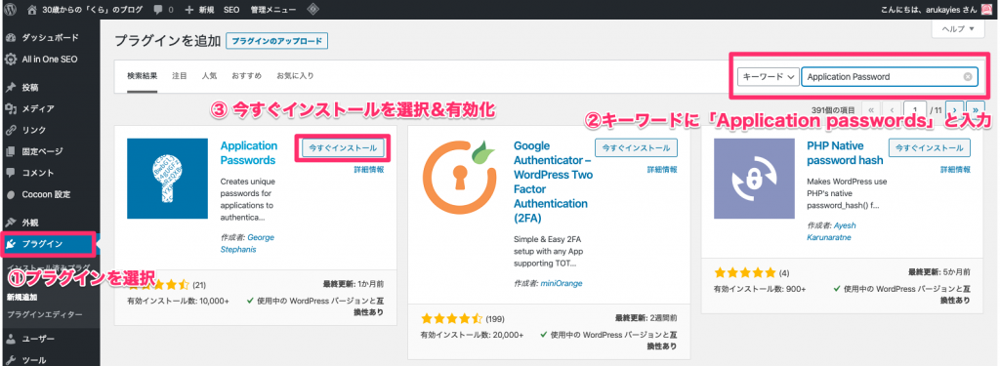
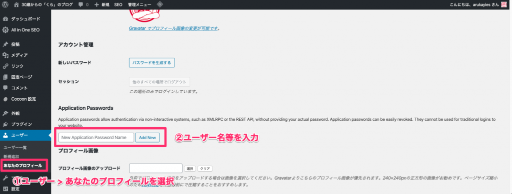

WordPress を使って広告収入を得たい！でもサラリーマンで毎日記事を書いてる時間はない！

だったら、自動化だ！と思い立って、年末からいろいろ試していました「くら」です。

まずはメインである。記事の自動投稿をGASを使って自動化します。

プログラム未経験者でもコピペで実現できるように手順を紹介します。

WordPressのサイトを持っている前提で話をすすめます！

## 自動投稿できるまでの流れ

<ol class="wp-block-list">
  <li>
    WordPressにプラグイン「Application Password」をインストール＆設定！
  </li>
  <li>
    GASのコードをコピーし、実行！
  </li>
  <li>
    これだけで自動投稿できます！
  </li>
</ol>

## WordPressにプラグイン「Application Password」をインストール

### 「Application Password」をインストール＆有効化

サイドメニューからプラグインを押下。

プラグイン　＞　新規追加を押下し、キーワードに【Application Passwords】と入力。

下の画像が出てきたら、【Application Passwords】をインストールし、有効化する。](スクリーンショット_2020-02-08_20_06_51-1024x375.png) 

### パスワードの発行

サイドメニューからユーザーを選択。

ユーザー　＞　あなたのプロフィールを押下し、【New Application Password Name】にユーザー名を入力。](スクリーンショット_2020-02-08_20_16_10-1024x389.png) 

ユーザ名とパスワードが表示されるので、これを控えておいてください。](スクリーンショット_2020-02-08_20_18_22.png) 

## GASを使ってWordPressに自動投稿するコード

以下の部分を書き換えることで、自分のサイトに自動投稿することができます！

<pre class="wp-block-preformatted">var siteUrl = 'WordpressサイトのURL';
var user = 'ユーザ名';
var pass = 'パスワード';
var title = '自動投稿テスト';
var content = 'これは自動投稿です。';</pre>

## 実際に自動投稿してみた結果

このような感じに記事を自動投稿できます！](スクリーンショット-2020-02-08-20.46.16.png) 

## まとめ

この記事ではシンプルにタイトルと内容のみを自動投稿できる方法を紹介しました。

この他にもWordPressAPIを使ったネタが溜まっているので随時紹介していきます！

