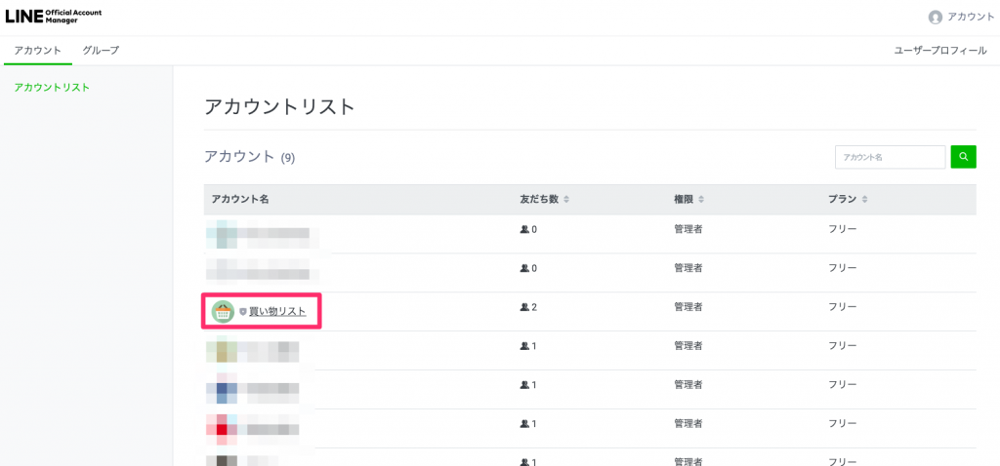
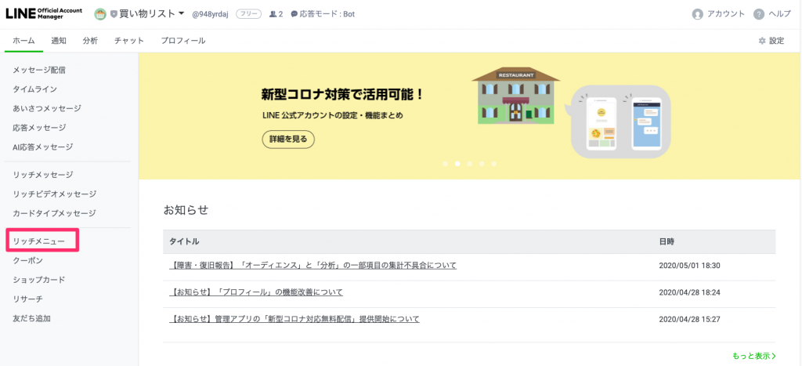
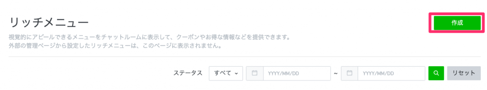
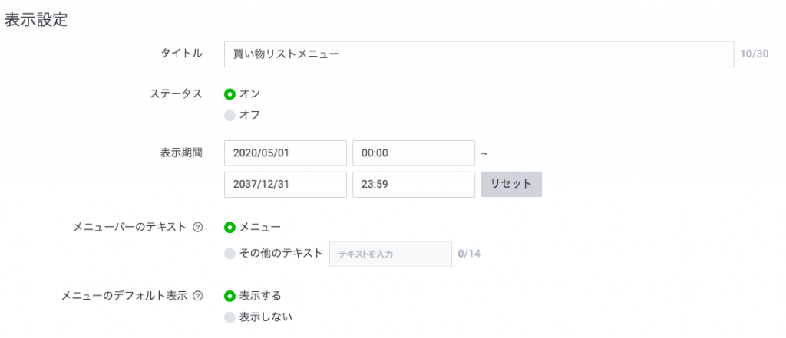
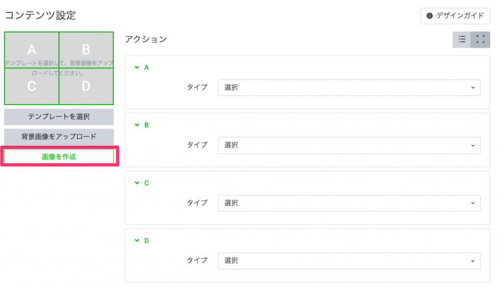
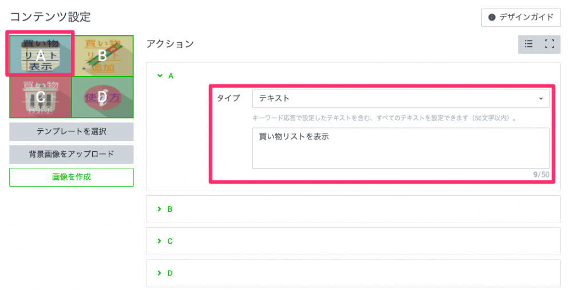
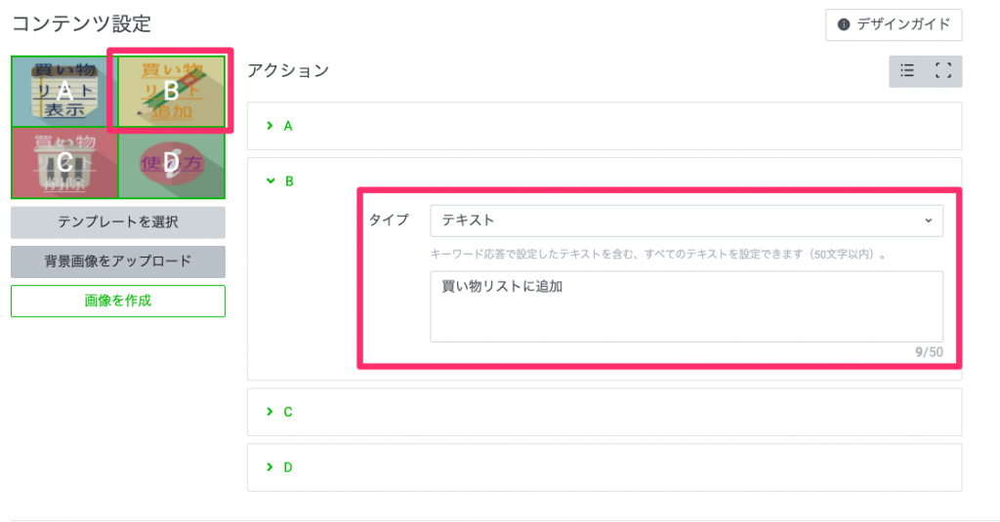
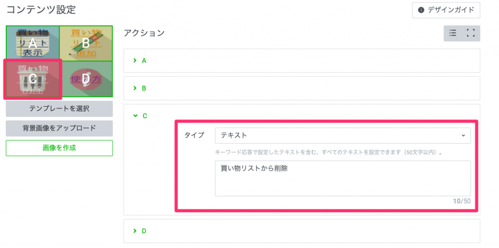
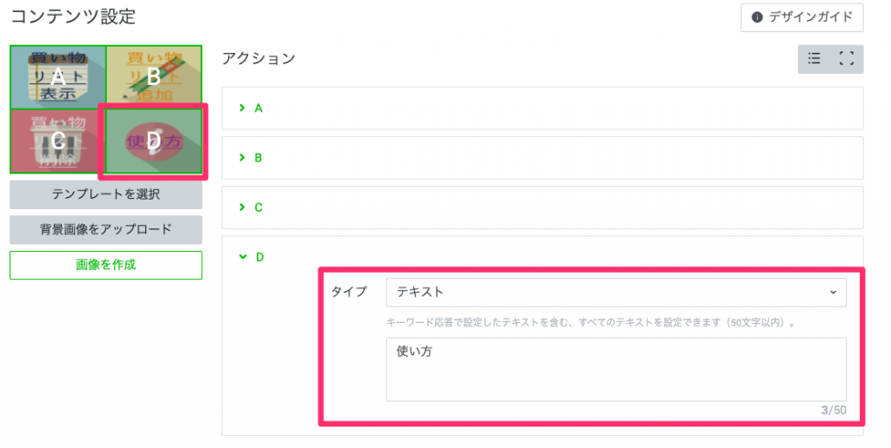

<strong>さっそくですが、こんなことができます！！！</strong><figure class="wp-block-embed aligncenter is-type-rich is-provider-twitter wp-block-embed-twitter">

  <blockquote class="twitter-tweet" data-width="550" data-dnt="true">
    

      有志の社内活動によるもくもく会の中で、 買い物リストを管理してくれるLINE BOTを作ってみた。  リストをスプレッドシートで管理する方法なら、検索すれば見つかるけど、スプレッドシートは使わずに作ったのがこだわりです。  スクリプトのプロパティに買い物リスト保存してます。<a href="https://twitter.com/hashtag/GAS?src=hash&ref_src=twsrc%5Etfw">#GAS</a> <a href="https://twitter.com/hashtag/LINE?src=hash&ref_src=twsrc%5Etfw">#LINE</a> <a href="https://t.co/jSGijS1dWk">pic.twitter.com/jSGijS1dWk</a>
    
&mdash; arukayies (@arukayies) 
    
    <a href="https://twitter.com/arukayies/status/1256587001244995585?ref_src=twsrc%5Etfw">May 2, 2020</a>
  </blockquote>

</figure> 

  

    機能一覧
  

  
  

    <ul class="wp-block-list">
      <li>
        『<strong>買い物リスト表示</strong>』ボタンで買い物リストを表示できます。
      </li>
      <li>
        『<strong>買い物リスト追加</strong>』ボタンで買い物リストに品目を追加できます。
      </li>
      <li>
        『<strong>買い物リスト削除</strong>』ボタンで買い物リストから品目を削除できます。
      </li>
      <li>
        『<strong>使い方</strong>』ボタンで使い方を表示します。 <ul class="wp-block-list">
          <li>
            『<strong>表示・追加・削除・使い方</strong>』のテキストに反応します。
          </li>
        </ul>
      </li>
    </ul>
  
それでは作り方を紹介します！

コードだけ見たい！って方は<a href="https://arukayies.com/gas/line_bot/shopping-list-post#toc4" class="aioseop-link">こちら</a>からどうぞ！

## 【LINE】BOTを作成する

BOTの作成方法は過去記事を参考にしてください！

  <a href="https://arukayies.com/gas/line_bot/gettoken" title="LINE Messaging APIアクセストークンの取得方法" class="blogcard-wrap internal-blogcard-wrap a-wrap cf" target="_blank">
  
  

    

      
    
](gettoken-1-160x90.png)
    
    

      

        LINE Messaging APIアクセストークンの取得方法
      

      
      

        LINEBOTに必要なトークンの取得方法を画像付きで解説します。
      

    

    
    

      

        

          
          
          <noscript>
            
          </noscript>
        

        
        

          arukayies.com
        

      

      
      

        

          2024.11.19
        

      

    

  
</a>

ちなみに私はこんなBOTを作成しました！<figure class="wp-block-image aligncenter size-large">

](お買い物BOT.png) <figcaption class="wp-element-caption">お買い物BOT</figcaption></figure> 

## 【LINE】リッチメニューを作成する

1　管理画面へアクセスします。※LINE Deverlopersにログインしている状態でアクセスしてください。

  <a rel="noopener" href="https://manager.line.biz/" title="LINE Business ID" class="blogcard-wrap external-blogcard-wrap a-wrap cf" target="_blank">
  
  

    

      
    
<figure class="blogcard-thumbnail external-blogcard-thumbnail">
    
    
    
    <noscript>
      
    </noscript></figure>
    
    

      

        LINE Business ID
      

      
      

      

    

    
    

      

        

          
          
          <noscript>
            
          </noscript>
        

        
        

          manager.line.biz
        

      

    

  
</a>

2　作成した**アカウント**を選択します。<figure class="wp-block-image aligncenter size-large is-resized">

](アカウントリスト-1024x478.png) <figcaption class="wp-element-caption">アカウントリスト</figcaption></figure> 

3　リッチメニューから『**作成**』ボタンを押下します。

  

    <figure class="wp-block-image size-large">](リッチメニューを選択-1024x467.png)<figcaption class="wp-element-caption">リッチメニューを選択</figcaption></figure>
  

  
  

    <figure class="wp-block-image size-large">](リッチメニューの作成を選択-1024x190.png)<figcaption class="wp-element-caption">リッチメニューの作成を選択</figcaption></figure>
  

4　**表示設定**を以下のように設定します。<figure class="wp-block-image aligncenter size-large is-resized">

](表示設定の例-1024x441.png) <figcaption class="wp-element-caption">表示設定の例</figcaption></figure> 

5　コンテンツ設定で『テンプレートを選択』ボタンを押下します。<figure class="wp-block-image aligncenter size-large is-resized">

](テンプレートを選択-1024x303.png) <figcaption class="wp-element-caption">テンプレートを選択</figcaption></figure> 

6　**大**の**4分割**の**テンプレート**を選択します。<figure class="wp-block-image aligncenter size-large is-resized">

](テンプレート大を選択.png) <figcaption class="wp-element-caption">テンプレート大4分割を選択</figcaption></figure> 

7　『**画像を作成**』ボタンを押下します。<figure class="wp-block-image size-large is-resized">

](画像を作成-1024x591.png) <figcaption class="wp-element-caption">画像を作成</figcaption></figure> 

8　4枚の画像をアップロードして、適用します。

  

    <figure class="wp-block-image aligncenter size-large is-resized">](画像を設定.png)<figcaption class="wp-element-caption">画像をアップロード</figcaption></figure>
  

  
  

    <figure class="wp-block-image aligncenter size-large is-resized">](画像の例.png)<figcaption class="wp-element-caption">画像の例</figcaption></figure> 
    
        
  

9　A,B,C,Dのアクションタイプを『**テキスト**』にし、以下のような文言を入力します。

  

    <figure class="wp-block-image aligncenter size-large is-resized">](Aを押下した時の動作-1024x515.png)<figcaption class="wp-element-caption">Aのアクション</figcaption></figure>
  

  
  

    <figure class="wp-block-image aligncenter size-large">](Bを押下した時の動作-1024x535.png)<figcaption class="wp-element-caption">Bのアクション</figcaption></figure>
  

  

    <figure class="wp-block-image aligncenter size-large is-resized">](Cを押下した時の動作-1024x509.png)<figcaption class="wp-element-caption">Cのアクション</figcaption></figure>
  

  
  

    <figure class="wp-block-image aligncenter size-large">](Dを押下したときの動作-1024x516.png)<figcaption class="wp-element-caption">Dのアクション</figcaption></figure>
  

10　すべて入力できたら、『**保存**』ボタンを押下します。<figure class="wp-block-image aligncenter size-large is-resized">

](設定できたら保存する-1024x461.png) <figcaption class="wp-element-caption">保存</figcaption></figure> 

## 【LINE】チャンネルアクセストークンを取得する

チャンネルアクセストークンの取得方法は過去記事を参考にしてください！

  <a href="https://arukayies.com/gas/line_bot/gettoken" title="LINE Messaging APIアクセストークンの取得方法" class="blogcard-wrap internal-blogcard-wrap a-wrap cf" target="_blank">
  
  

    

      
    
](gettoken-1-160x90.png)
    
    

      

        LINE Messaging APIアクセストークンの取得方法
      

      
      

        LINEBOTに必要なトークンの取得方法を画像付きで解説します。
      

    

    
    

      

        

          
          
          <noscript>
            
          </noscript>
        

        
        

          arukayies.com
        

      

      
      

        

          2024.11.19
        

      

    

  
</a>

取得したトークンはGASのスクリプトプロパティに保存します。[こちら][1]{.aioseop-link}からどうぞ！

## 【Google】GASのコードを登録する

1ファイルのコードだけで動作します！

登録方法は過去記事を参考にしてください！

  <a href="https://arukayies.com/gas/line_bot/line-bot-with-gas#toc2" title="GASで作る簡単なLINE BOTの作り方" class="blogcard-wrap internal-blogcard-wrap a-wrap cf" target="_blank">
  
  

    

      
    
](line-bot-with-gas-160x90.png)
    
    

      

        GASで作る簡単なLINE BOTの作り方
      

      
      

        GASで作るLINE BOTの簡単な作り方を紹介します！
      

    

    
    

      

        

          
          
          <noscript>
            
          </noscript>
        

        
        

          arukayies.com
        

      

      
      

        

          2024.11.19
        

      

    

  
</a>

## 【Gogole】スクリプトプロパティを設定する

スクリプトプロパティに保存する方法は過去記事を参考にしてください！

  <a href="https://arukayies.com/gas/line_bot/line-bot-with-gas#toc6" title="GASで作る簡単なLINE BOTの作り方" class="blogcard-wrap internal-blogcard-wrap a-wrap cf" target="_blank">
  
  

    

      
    
](line-bot-with-gas-160x90.png)
    
    

      

        GASで作る簡単なLINE BOTの作り方
      

      
      

        GASで作るLINE BOTの簡単な作り方を紹介します！
      

    

    
    

      

        

          
          
          <noscript>
            
          </noscript>
        

        
        

          arukayies.com
        

      

      
      

        

          2024.11.19
        

      

    

  
</a>

登録するプロパティは**3つ**あります。

| プロパティ | 値         | 説明                               |
| ----- | --------- | -------------------------------- |
| CONF  |           | 『0』と登録してください。                    |
| TOKEN | LINEのトークン | LINEのトークンを登録してください。              |
| LIST  | 初期値       | ここに買い物リストが保存されます。『初期値』と登録してください。 |<figure class="wp-block-image aligncenter size-large is-resized">

](スクリプトプロパティ.png) <figcaption class="wp-element-caption">スクリプトプロパティ</figcaption></figure> 

## 【Google】ウェブアプリケーションの公開URLを取得する

ウェブアプリケーションの公開URLの取得方法は過去記事を参考にしてください！

  <a href="https://arukayies.com/gas/line_bot/line-bot-with-gas#toc7" title="GASで作る簡単なLINE BOTの作り方" class="blogcard-wrap internal-blogcard-wrap a-wrap cf" target="_blank">
  
  

    

      
    
](line-bot-with-gas-160x90.png)
    
    

      

        GASで作る簡単なLINE BOTの作り方
      

      
      

        GASで作るLINE BOTの簡単な作り方を紹介します！
      

    

    
    

      

        

          
          
          <noscript>
            
          </noscript>
        

        
        

          arukayies.com
        

      

      
      

        

          2024.11.19
        

      

    

  
</a>

## 【LINE】LINE DevelopersにWebhook URLを設定する

LINE DevelopersにWebhook URLを設定する方法は過去記事を参考にしてください！

  <a href="https://arukayies.com/gas/line_bot/line-bot-with-gas#toc8" title="GASで作る簡単なLINE BOTの作り方" class="blogcard-wrap internal-blogcard-wrap a-wrap cf" target="_blank">
  
  

    

      
    
](line-bot-with-gas-160x90.png)
    
    

      

        GASで作る簡単なLINE BOTの作り方
      

      
      

        GASで作るLINE BOTの簡単な作り方を紹介します！
      

    

    
    

      

        

          
          
          <noscript>
            
          </noscript>
        

        
        

          arukayies.com
        

      

      
      

        

          2024.11.19
        

      

    

  
</a>

## 買い物リストBOTを動かしてみる

  <blockquote class="twitter-tweet" data-width="550" data-dnt="true">
    

      有志の社内活動によるもくもく会の中で、 買い物リストを管理してくれるLINE BOTを作ってみた。  リストをスプレッドシートで管理する方法なら、検索すれば見つかるけど、スプレッドシートは使わずに作ったのがこだわりです。  スクリプトのプロパティに買い物リスト保存してます。<a href="https://twitter.com/hashtag/GAS?src=hash&ref_src=twsrc%5Etfw">#GAS</a> <a href="https://twitter.com/hashtag/LINE?src=hash&ref_src=twsrc%5Etfw">#LINE</a> <a href="https://t.co/jSGijS1dWk">pic.twitter.com/jSGijS1dWk</a>
    
&mdash; arukayies (@arukayies) 
    
    <a href="https://twitter.com/arukayies/status/1256587001244995585?ref_src=twsrc%5Etfw">May 2, 2020</a>
  </blockquote>

</figure> 

## まとめ

<strong>リッチメニュー</strong>を初めて使ってみました！

豊富なテンプレートもあり、なにも調べることなく簡単に設定できました！　<strong>LINEすごい！</strong>

他にもいろんなことがLINE BOTで出来そうなので、どんどん作ってブログで紹介したいと思います！

 [1]: https://arukayies.com/gas/line_bot/shopping-list-post#toc5
