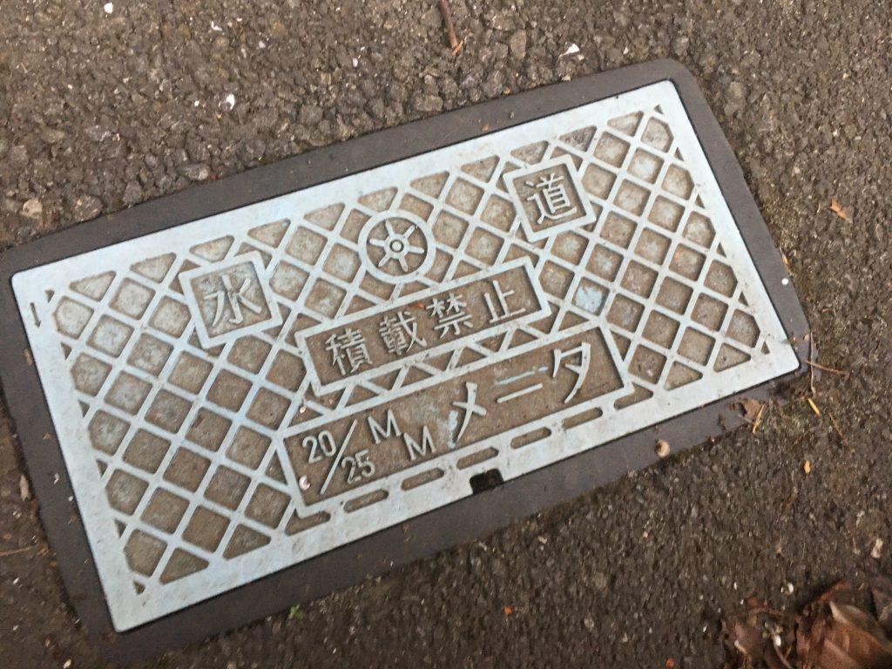
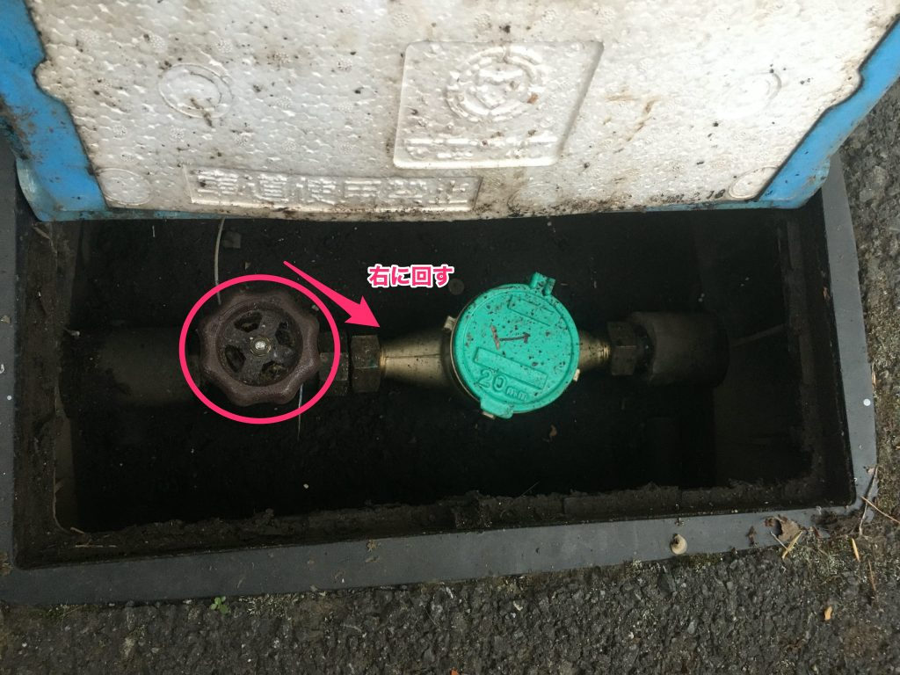
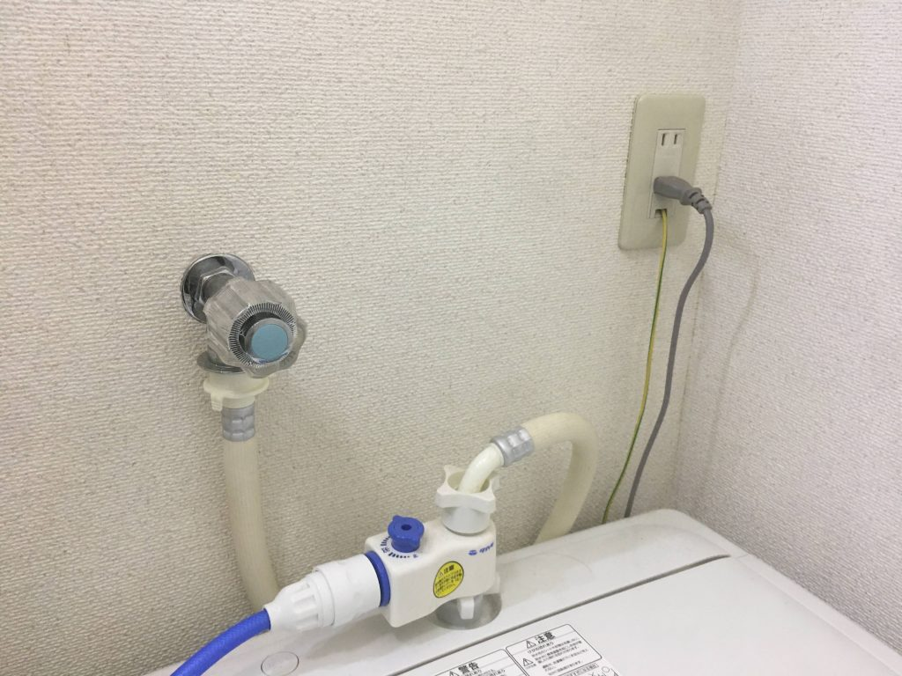
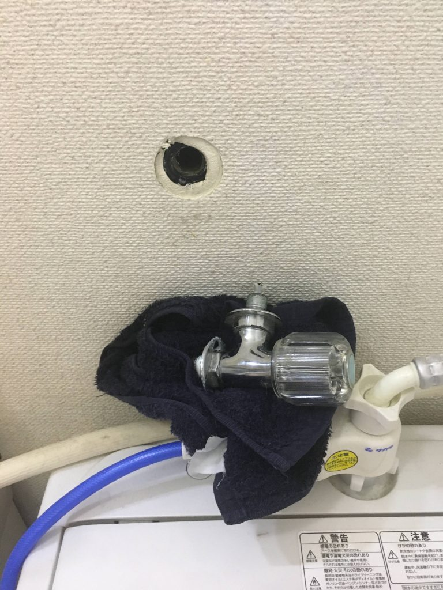
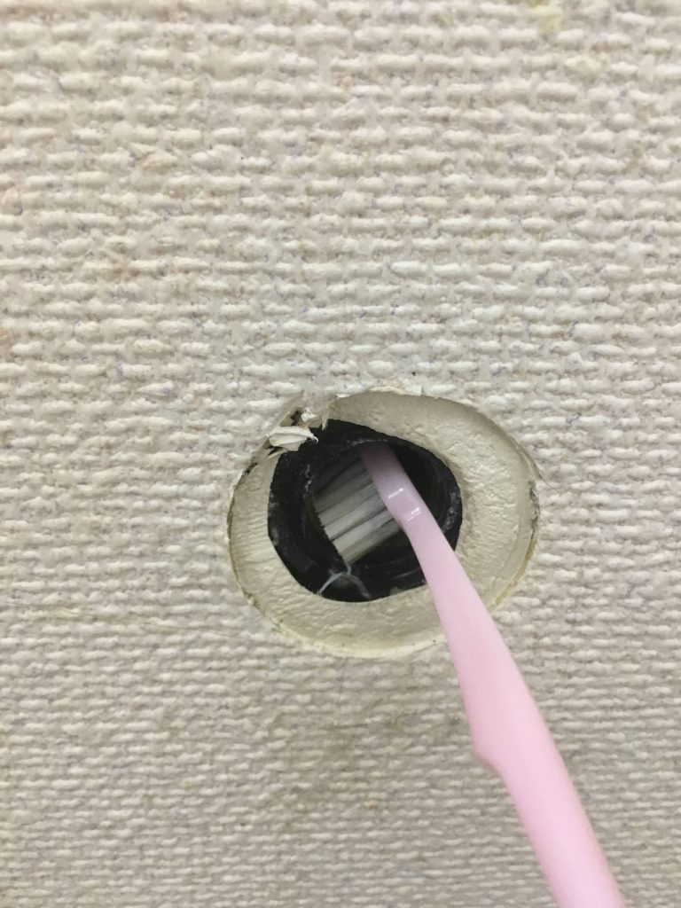
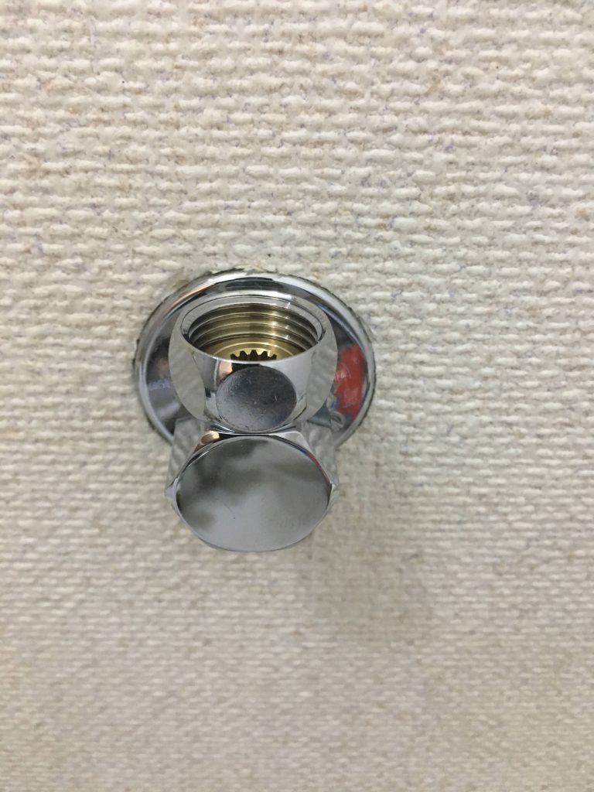
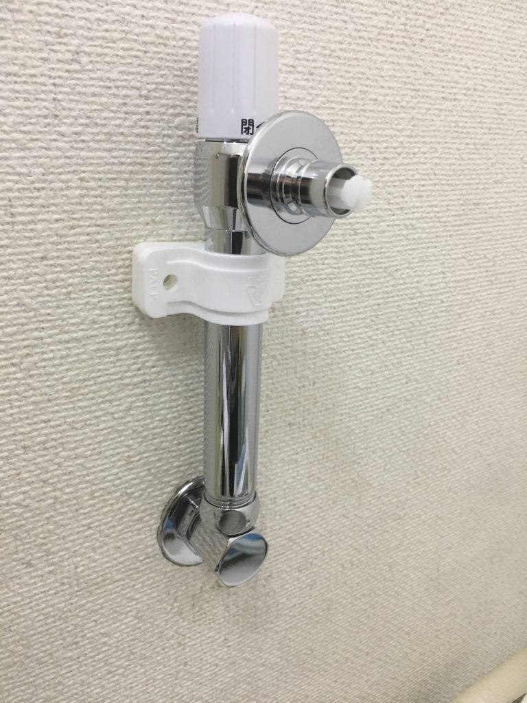
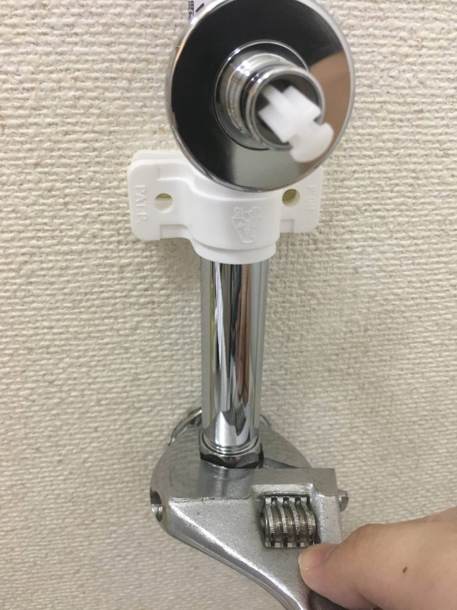
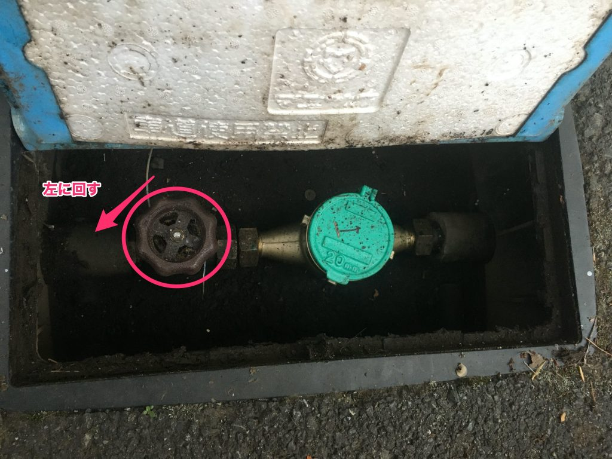
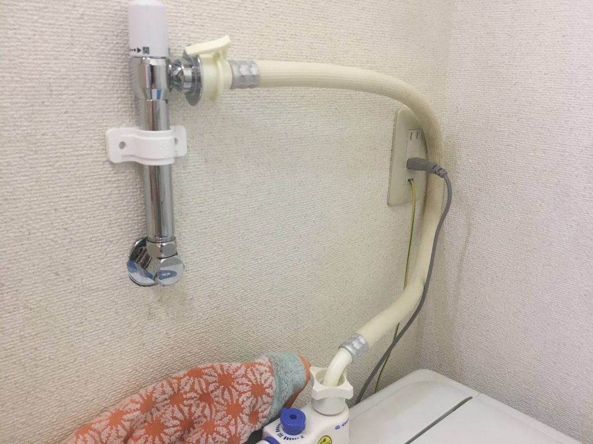

  

    ](icon-1.png)
    

  

  
  

          給付金入ったらドラム式洗濯機がほしい！！！
    
  

  

    ](icon-1.png)
    

  

  
  

          はい。そんな理由で最近ドラム式洗濯機のことばかり調べています。
    
    
          狙っている型番は『 <strong>BD-SG100E</strong> 』 です！
    
    
    

      <a rel="noopener" href="https://kadenfan.hitachi.co.jp/wash/lineup/bdsg100e/" title="&#27927;&#28655;&#20094;&#29157;&#27231; BD-SG100E &#65306; &#27927;&#28655;&#27231;&#12539;&#34915;&#39006;&#20094;&#29157;&#27231; &#65306; &#26085;&#31435;&#12398;&#23478;&#38651;&#21697;" class="blogcard-wrap external-blogcard-wrap a-wrap cf" target="_blank">
      
      

        

          
        
<figure class="blogcard-thumbnail external-blogcard-thumbnail">
        
        
        
        <noscript>
          
        </noscript></figure>
        
        

          

            &#27927;&#28655;&#20094;&#29157;&#27231; BD-SG100E &#65306; &#27927;&#28655;&#27231;&#12539;&#34915;&#39006;&#20094;&#29157;&#27231; &#65306; &#26085;&#31435;&#12398;&#23478;&#38651;&#21697;
          

          
          

            日立の洗濯機に関する情報をご紹介するページです。洗濯乾燥機や全自動洗濯機・衣類乾燥機等の情報がご覧いただけます。
          

        

        
        

          

            

              
              
              <noscript>
                
              </noscript>
            

            
            

              kadenfan.hitachi.co.jp
            

          

        

      
</a>
    

  

  

    ](icon-1.png)
    

  

  
  

          そこで私は気づいてしまったのです。
    
    
          搬入経路と洗濯機置場を計測してみると・・・。
    
    
    

    

    
          もしかして蛇口の高さたりなくない？？？
    
  

  

    ](icon-1.png)
    

  

  
  

          日立の<a href="https://kadenfan.hitachi.co.jp/wash/contents/wash_qa/04.html">公式HP</a>の説明によると
    
    
          1,050mm未満の場合は 壁ピタ水栓 が必要な場合があるようです。
    
    
    

  

    ](icon-1.png)
    

  

  
  

          水栓代 5,000円ぐらい とスパナ等の工具があれば自分で対応できます！
    
  
## 用意するもの

  

    必要なもの
  

  
  <ul class="wp-block-list">
    <li>
      壁ピタ水栓
    </li>
    <li>
      水栓取り外しレンチ
    </li>
    <li>
      スパナ
    </li>
    <li>
      タオル
    </li>
  </ul>

1、**壁ピタ水栓**。これがドラム式洗濯機を設置するために水栓の高さを上げてくれる蛇口です。交換手順も添付されており、シールテープも付属しています。僕が購入したのは少しだけ高さがある **カクダイ 洗濯機用水栓** になります。

2、**水栓取り外しレンチ**は蛇口を取り外すときに使う工具です。僕は購入したのに結局使わなかったけど、蛇口の形状によってはこの工具が活躍できます！

3、**スパナ**は蛇口を取り外すのに使います。結局これだけあれば作業はできました！

4、**タオル**は蛇口を取るときに内部に残ってる水が出るので、受け止める用です。

## 給水栓を締める

  

    <figure class="wp-block-image size-large">](IMG_1196-1024x768.jpg)<figcaption>こんな箱に入ってます</figcaption></figure>
  

  
  

    <figure class="wp-block-image size-large is-resized">](IMG_1197-1024x768.jpg)<figcaption>右に回すと水が止まります</figcaption></figure>
  
水道メーターを探して、給水を止めます。

## 古い蛇口を取る

  

    <figure class="wp-block-image size-large is-resized">](IMG_1185-1024x768.jpg)<figcaption>取り外し前</figcaption></figure>
  

  
  

    <figure class="wp-block-image size-large is-resized">](IMG_1186-768x1024.jpg)<figcaption>取り外し後</figcaption></figure>
  
古い蛇口を取ります。ハンドルタイプの蛇口だと以下の工具で簡単に取り外せます。

## 取り付け口を掃除する

  <figure class="aligncenter size-large is-resized">](IMG_1187-768x1024.jpg)<figcaption>古い歯ブラシで掃除する</figcaption></figure>

蛇口に付いていたテープ等あるので、古い歯ブラシ等で綺麗に掃除します。

## 新しい蛇口を取り付ける

  

    <figure class="wp-block-image size-large is-resized">](IMG_1190-768x1024.jpg)<figcaption>蛇口取付1</figcaption></figure>
  

  
  

    <figure class="wp-block-image size-large">](IMG_1191-768x1024.jpg)<figcaption>蛇口取付2</figcaption></figure>
  

  
  

    <figure class="wp-block-image size-large is-resized">](IMG_1193-768x1024.jpg)<figcaption>蛇口取付3</figcaption></figure>
  
取説どおりの手順で新しい蛇口を取り付けます。

（後で気づくのですが、ちょっぴり水漏れしてたのでしっかり締めましょう）

## 給水栓を開ける

](IMG_1197-2-1024x768.jpg) <figcaption>給水栓を開ける</figcaption></figure> 

取り付けが完了したら、給水栓を開けます。

## 水漏れチェック

](IMG_1239-1024x768.jpg) <figcaption>向き変えた</figcaption></figure> 

水が漏れるとしたら、給水した瞬間だと思うので接続部分をチェックしましょう。

（僕は次の日に漏れてる事に気づきました・・・。）

## まとめ

  

    ](icon-1.png)
    

  

  
  

          購入した水栓には取り付け方法も丁寧に書かれていたので難なく取り付けることが出来ました！
    
    
          しかし、ちょっと水漏れしてたのでやっぱり業者に頼むのが安心だと思います。
    
    
          いい経験なりました！　笑
    
  