こんにちは！
この記事を見ていただいている方、ご興味を持っていただいた方、ありがとうございます。

タイトルの通りヨーロッパへ新婚旅行に行きました。

前回はトランジット8時間でタイ観光編をまとめました。

  <a href="https://arukayies.com/diy/travel/europe-honeymoon-thailand-tourism" title="【予算は100万円！個人手配で行くヨーロッパ新婚旅行】トランジット8時間でタイ観光編" class="blogcard-wrap internal-blogcard-wrap a-wrap cf" target="_blank">
  
  

    

      
    
](1-160x90.jpg)
    
    

      

        【予算は100万円！個人手配で行くヨーロッパ新婚旅行】トランジット8時間でタイ観光編
      

      
      

        くらこんにちは！この記事を見ていただいている方、ご興味を持っていただいた方、ありがとうございます。タイトルの通りヨーロッパへ新婚旅行に行きました。くら前回は事前に行った準備をまとめました。くらこの記事ではトランジットで訪れたタイで観光した記...
      

    

    
    

      

        

          
          
          <noscript>
            
          </noscript>
        

        
        

          arukayies.com
        

      

      
      

        

          2024.10.30
        

      

    

  
</a>

  <a href="https://arukayies.com/diy/travel/europe-honeymoon-summary" title="【予算は100万円！個人手配で行くヨーロッパ新婚旅行】3カ国を巡った様子のまとめ" class="blogcard-wrap internal-blogcard-wrap a-wrap cf" target="_blank">
  
  

    

      
    
](アイキャッチ画像-6721c6d77511e-160x90.jpg)
    
    

      

        【予算は100万円！個人手配で行くヨーロッパ新婚旅行】3カ国を巡った様子のまとめ
      

      
      

        くらこんにちは！この記事を見ていただいている方、ご興味を持っていただいた方、ありがとうございます。タイトルの通りヨーロッパへ新婚旅行に行きました。ここまでヨーロッパ新婚旅行（ロンドン、ブダペスト、パリ）シリーズをお伝えしてきました。今回はそ...
      

    

    
    

      

        

          
          
          <noscript>
            
          </noscript>
        

        
        

          arukayies.com
        

      

      
      

        

          2024.10.30
        

      

    

  
</a>

この記事ではロンドン観光の記録になります。

## 1日目：夜に到着のため空港直結のホテルへ

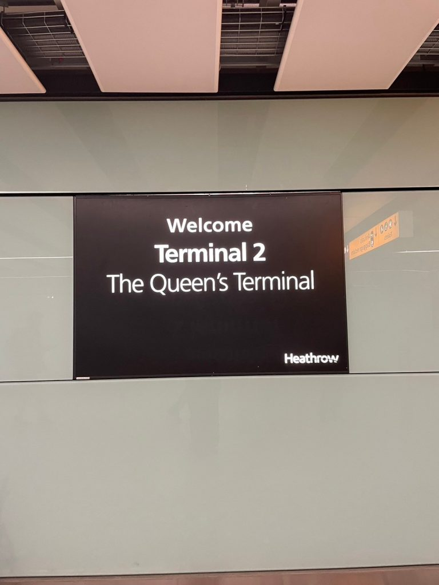](IMG_3999-768x1024.jpg) 

定刻通りヒースロー空港へと到着しました。

事前に購入したeSIMも楽天モバイルも問題なく使えました。

<a rel="nofollow" href="https://px.a8.net/svt/ejp?a8mat=3ZHJ8N+1CTKDU+399O+644DT"> ](31_bgtaid241003175082wid001eno01mids00000015198001027000mc1.png)</a>](img_66fe59b996a7f.gif) 

### 19時：ヒースロー空港へ到着・入国手続き・ホテルへ移動

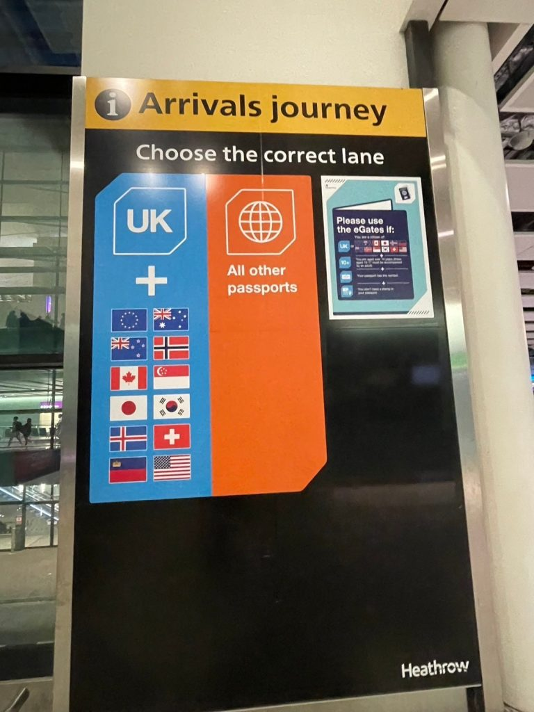](IMG_4001-768x1024.jpg) 

入国手続きは日本国籍であれば自動化ゲートが使えるようでした。こんなやつです。

  <a rel="noopener" href="https://360degreestravelflight.com/2019/07/11/%E3%83%92%E3%83%BC%E3%82%B9%E3%83%AD%E3%83%BC%E7%A9%BA%E6%B8%AF%E3%81%A7%E6%97%A5%E6%9C%AC%E4%BA%BA%E3%82%82%E8%87%AA%E5%8B%95%E5%8C%96%E3%82%B2%E3%83%BC%E3%83%88%E3%82%92%E5%88%A9%E7%94%A8%E3%81%A7/" title="404 Error - Not Found" class="blogcard-wrap external-blogcard-wrap a-wrap cf" target="_blank">
  
  

    

      
    
<figure class="blogcard-thumbnail external-blogcard-thumbnail">
    
    
    
    <noscript>
      
    </noscript></figure>
    
    

      

        404 Error - Not Found
      

      
      

      

    

    
    

      

        

          
          
          <noscript>
            
          </noscript>
        

        
        

          360degreestravelflight.com
        

      

    

  
</a>

しかし、**何度試しても夫婦ともにうまくいかず結局は通常の手続き**となりました。係の人からは「ドント・ウォーリー」と言ってくれて優しかったです。

通常の入国手続きは特に難しいことはなく、パスポートを渡すだけでした。

    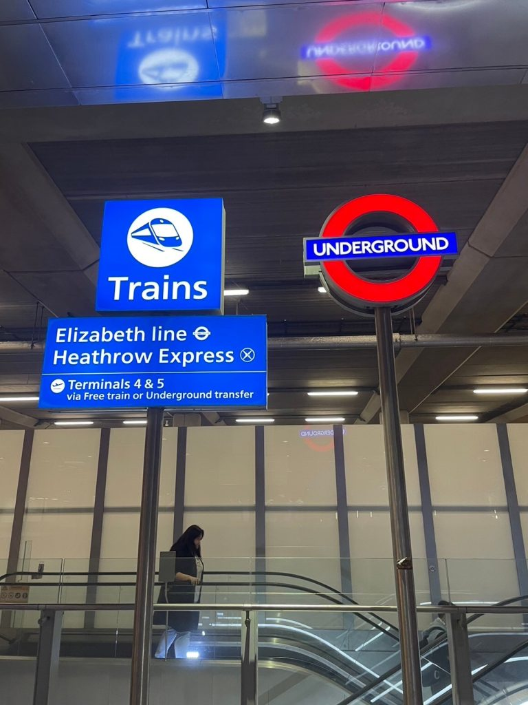](IMG_4002-768x1024.jpg)
      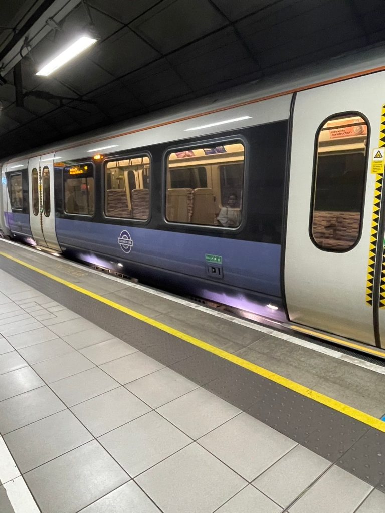](IMG_4003-768x1024.jpg)
  
無事入国手続きが終わり、ホテルへと移動します。

ターミナル4直結のホテルを予約してありますが、到着はターミナル2です。

地下鉄エリザベスラインでターミナル2→4へと移動します。](IMG_4007-edited.jpg) 

ターミナル間移動は無料のチケットで乗ることができました。

しかし、扉が閉まっていて出発するのかな？と迷っていたら1本見過ごしたのと電車遅延もあり空港直結ホテルなのに**到着から2時間も掛かってしまいました**。（ホームのベンチで1時間ぐらい待っていたと思います。）

ロンドン市内のホテルだったらさらに遅くなっていたので、空港直結にして正解でした。

      <strong>学び①</strong>　ロンドンの電車は扉が閉まっていたら<strong>ボタンを押して開けられる</strong>。
  
  
      <strong>学び②</strong>　ロンドンでは<strong>電車の遅延</strong>や<strong>運休</strong>が珍しくありません、旅程は余裕を持ったが良いです。
  

### 21時：プレミア イン ヒースロー エアポート ターミナル 4 (Premier Inn Heathrow Airport Terminal 4)へ到着

    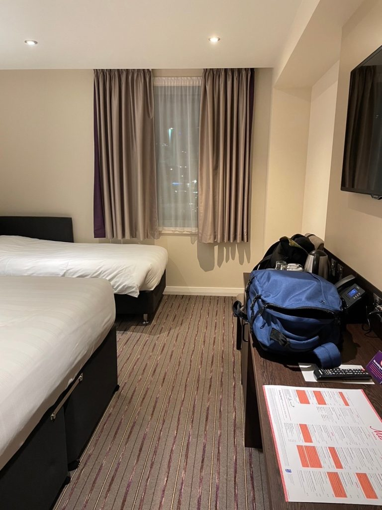](IMG_4006-768x1024.jpg)
      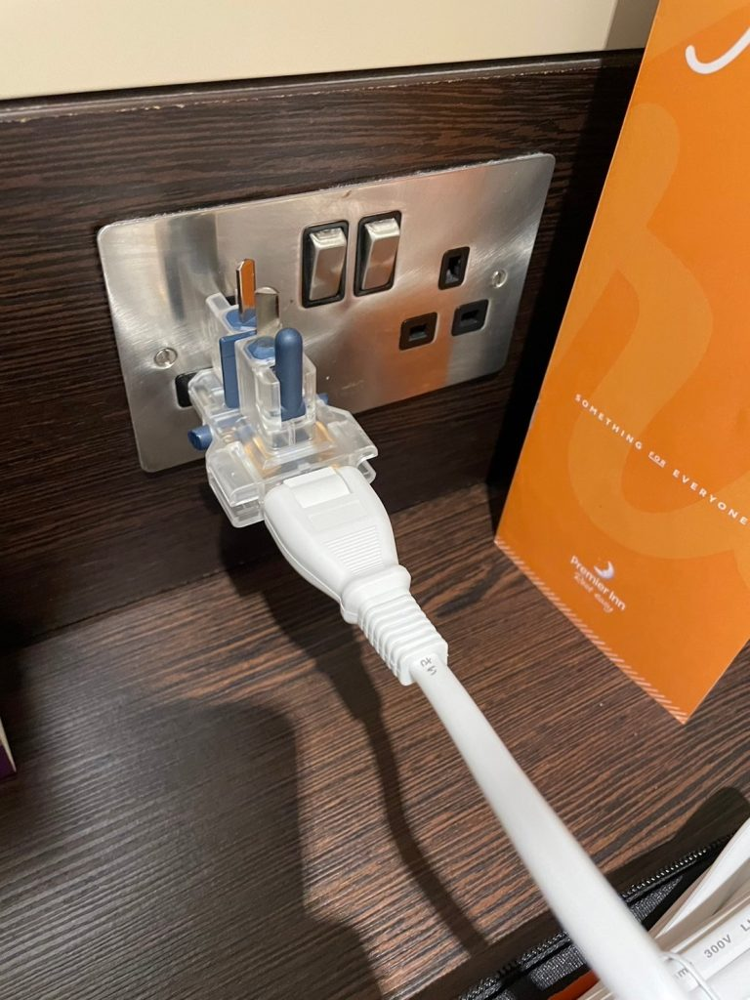](IMG_4005-768x1024.jpg)
  
地下鉄の改札を出て、エレベータに向かうとホテルへの案内が書かれています。（初日は気づかなかった・・・。）

エレベータで1階に上がり、すぐ右手の渡り廊下から空港直結のホテルへ行くことができました。

ホテルでは自動チェックインの機械がありましたが、アゴダの予約では予約番号？のような情報はなくて、受付の人に対応してもらいました。名前を伝えればなんとかチェックインできました！

変換プラグもここで初登場！明日に備えます！

泊まったホテル

  <a rel="noopener" href="https://www.agoda.com/ja-jp/premier-inn-heathrow-airport-terminal-4/hotel/london-gb.html" title="https://www.agoda.com/ja-jp/premier-inn-heathrow-airport-terminal-4/hotel/london-gb.html" class="blogcard-wrap external-blogcard-wrap a-wrap cf" target="_blank">
  
  

    

      
    
<figure class="blogcard-thumbnail external-blogcard-thumbnail">
    
    
    
    <noscript>
      
    </noscript></figure>
    
    

      

        https://www.agoda.com/ja-jp/premier-inn-heathrow-airport-terminal-4/hotel/london-gb.html
      

      
      

      

    

    
    

      

        

          
          
          <noscript>
            
          </noscript>
        

        
        

          www.agoda.com
        

      

    

  
</a>

## 2日目：丸一日ロンドンを満喫

1日目と3日目は移動のため、この日がロンドンでのメインの記録です！

### 9時：ヒースロー空港内「Co-Pilots Bar and Kitchen」で朝食

    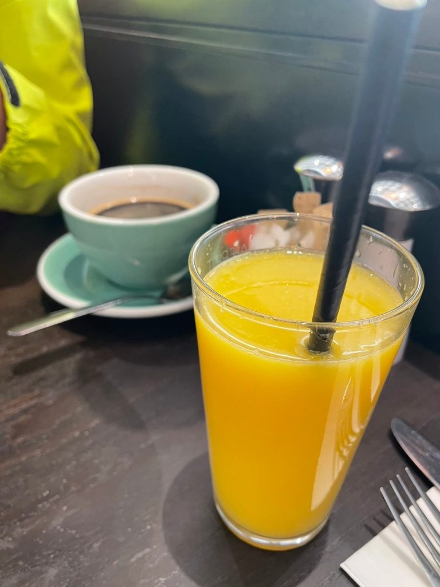](IMG_4009-768x1024.jpg)
      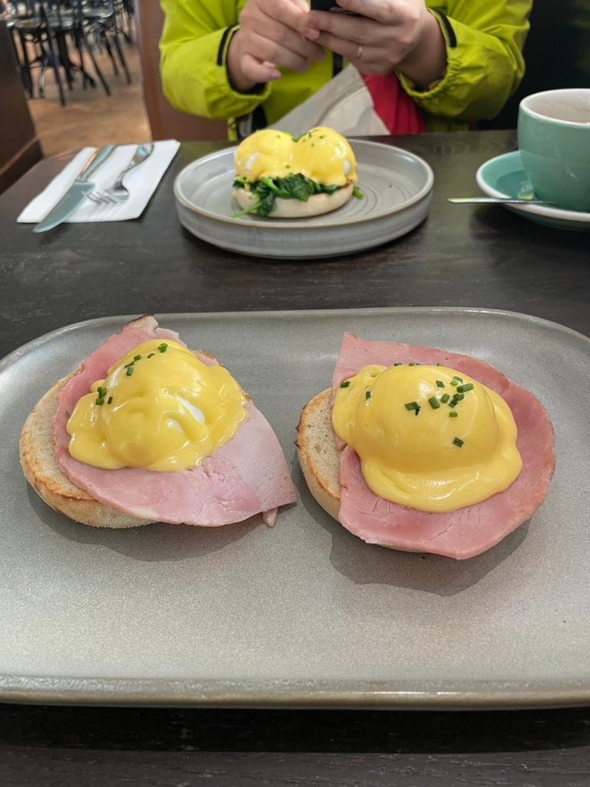](IMG_4008-768x1024.jpg)
  
ロンドンで初の食事です。美味しかったが、やはり物価は高いと実感。空港価格というのもありそう。

ドリンク２つと料理２つで33.4ポンド！（**6,360円！**）

  <a rel="noopener" href="https://maps.app.goo.gl/KCc6fBCEkGukqdLPA" title="Co-Pilots Bar and Kitchen · Stop 10, Terminal 4, Hounslow TW6 3XA イギリス" class="blogcard-wrap external-blogcard-wrap a-wrap cf" target="_blank">
  
  

    

      
    
<figure class="blogcard-thumbnail external-blogcard-thumbnail">
    
    
    
    <noscript>
      
    </noscript></figure>
    
    

      

        Co-Pilots Bar and Kitchen · Stop 10, Terminal 4, Hounslow TW6 3XA イギリス
      

      
      

        ★★★★☆ · ブラッセリー
      

    

    
    

      

        

          
          
          <noscript>
            
          </noscript>
        

        
        

          maps.app.goo.gl
        

      

    

  
</a>

このタイミングで**時差ボケ**っぽい頭痛を感じたので、持ってきてたロキソニンを飲みました。

他にも胃薬とかも旅の後半で飲みました。**常備薬を少し持っていくと良い**かもです！

体調が少し悪いと感じたのはこのタイミングのみで、残りの旅は問題なく過ごせました〜。

      <strong>時差ボケや胃もたれ対策に日本から薬を持ち込んでおく</strong>とより旅を楽しめます！
  

### ロンドンの交通事情（地下鉄と２階建てバス)

地下鉄とバスを利用しましたが、どちらも**クレジットカードのタッチ決済で乗ることができました**！

事前にやったことは、iPhoneを利用していたのでクレジットカードをエクスプレスカードとして登録しておくだけでした。地下鉄とバスの乗り方は**日本と同じで簡単**です。

<ul class="wp-block-list">
  <li>
    地下鉄は改札でタッチして、出る時もタッチする。
  </li>
</ul>

<ul class="wp-block-list">
  <li>
    バスは乗る時にタッチして、降りたい駅に近づいたらボタンを押して、降りるだけ。
  </li>
</ul>

目的地までの道のりはGoogleマップ通りに進めば問題なかったです。

交通費は地下鉄とバスを利用して、1日2人で31.2ポンドでした（**5,942円**）

  <a rel="noopener" href="https://support.apple.com/ja-jp/105123" title="Apple ウォレットの交通系 IC カード、パス、キーをエクスプレスモードで使う - Apple サポート (日本)" class="blogcard-wrap external-blogcard-wrap a-wrap cf" target="_blank">
  
  

    

      
    
<figure class="blogcard-thumbnail external-blogcard-thumbnail">
    
    
    
    <noscript>
      
    </noscript></figure>
    
    

      

        Apple ウォレットの交通系 IC カード、パス、キーをエクスプレスモードで使う - Apple サポート (日本)
      

      
      

        エクスプレスモードに設定したカード、パス、キーは、ワンタップで使えます。
      

    

    
    

      

        

          
          
          <noscript>
            
          </noscript>
        

        
        

          support.apple.com
        

      

    

  
</a>

      タッチ決済に対応したクレジットカードをApple Payのエクスプレスカードとして登録しておくことで<strong>日本と変わらないスタイル</strong>で公共交通機関を利用することができました！
  

### 11時：バッキンガム宮殿で衛兵交代式を見る

    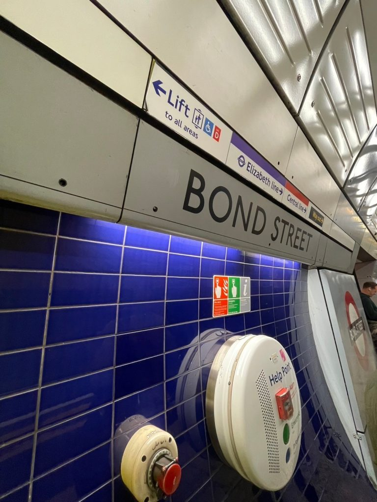](IMG_4010-768x1024.jpg)
      ](IMG_4011-768x1024.jpg)
      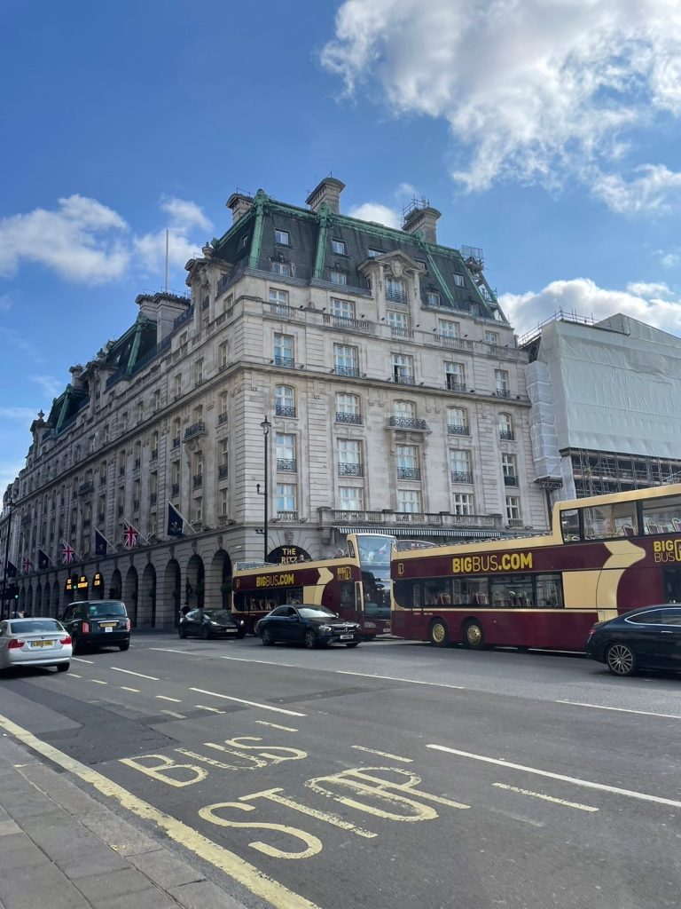](IMG_4012-768x1024.jpg)
  
エリザベスラインでボンド・ストリート駅まで行き、近くの駅まで地下鉄で向かいました。

地下鉄の車両がレトロで味があり、地上に出るとヨーロッパらしい街並みが広がっていました。

ルートはこちらです。

  <a rel="noopener" href="https://maps.app.goo.gl/Dg9iRGMjjkcspg329" title="Heathrow Terminal 4 to バッキンガム宮殿" class="blogcard-wrap external-blogcard-wrap a-wrap cf" target="_blank">
  
  

    

      
    
<figure class="blogcard-thumbnail external-blogcard-thumbnail">
    
    
    
    <noscript>
      
    </noscript></figure>
    
    

      

        Heathrow Terminal 4 to バッキンガム宮殿
      

      
      

      

    

    
    

      

        

          
          
          <noscript>
            
          </noscript>
        

        
        

          maps.app.goo.gl
        

      

    

  
</a>

    ](IMG_4013-1024x768.jpg)
      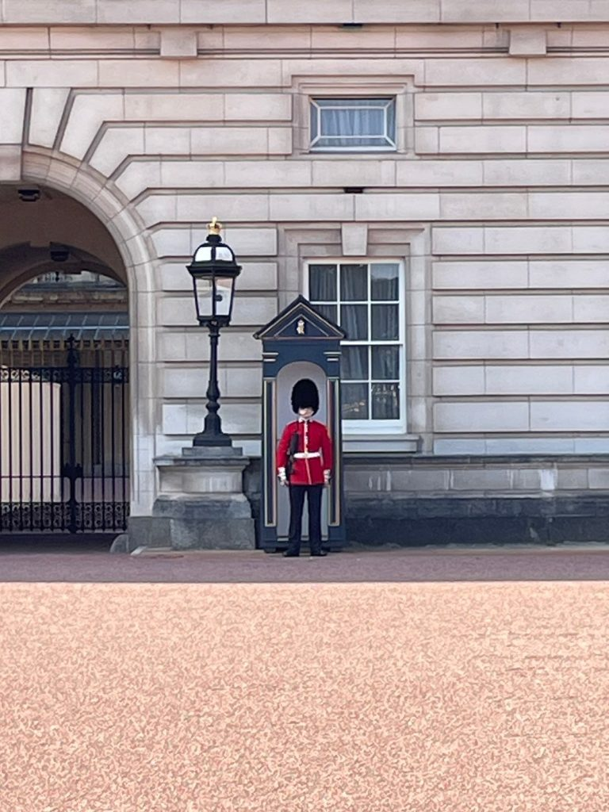](IMG_4014-768x1024.jpg)
      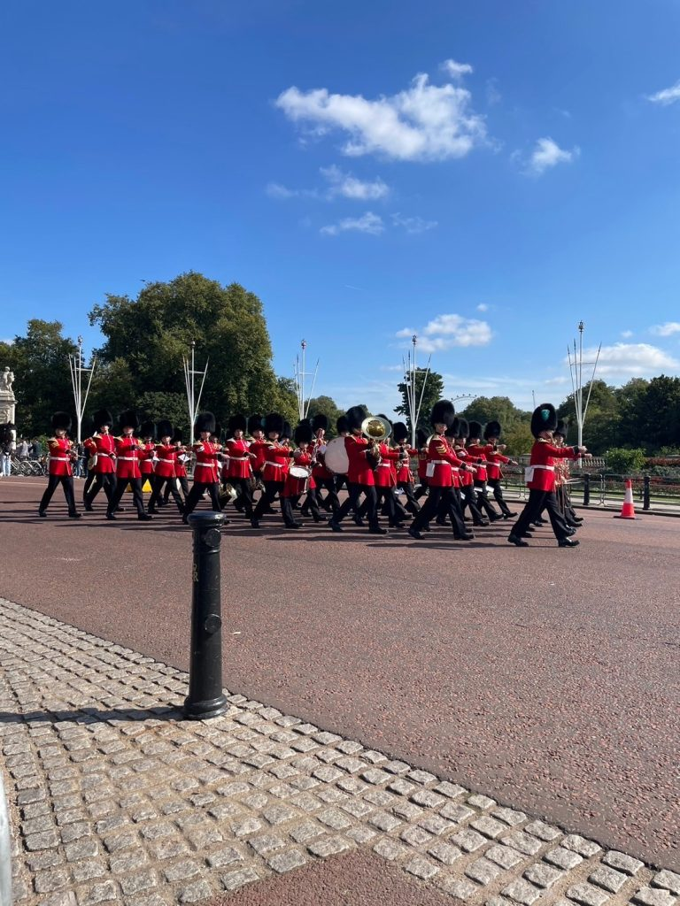](IMG_4015-768x1024.jpg)
  
10時45分から衛兵交代式が始まるとのことで、その時間になるように向かいました。

着いたのは11時。すでに宮殿前の広場は人でいっぱいでした。宮殿の玄関前で行われている式の様子は遠めにしか見れませんでしたが、しばらくすると広場の方に出てくるので**広場周辺で待っていると近くで見れて良かった**です。

### 13時：ビックベンを見る

    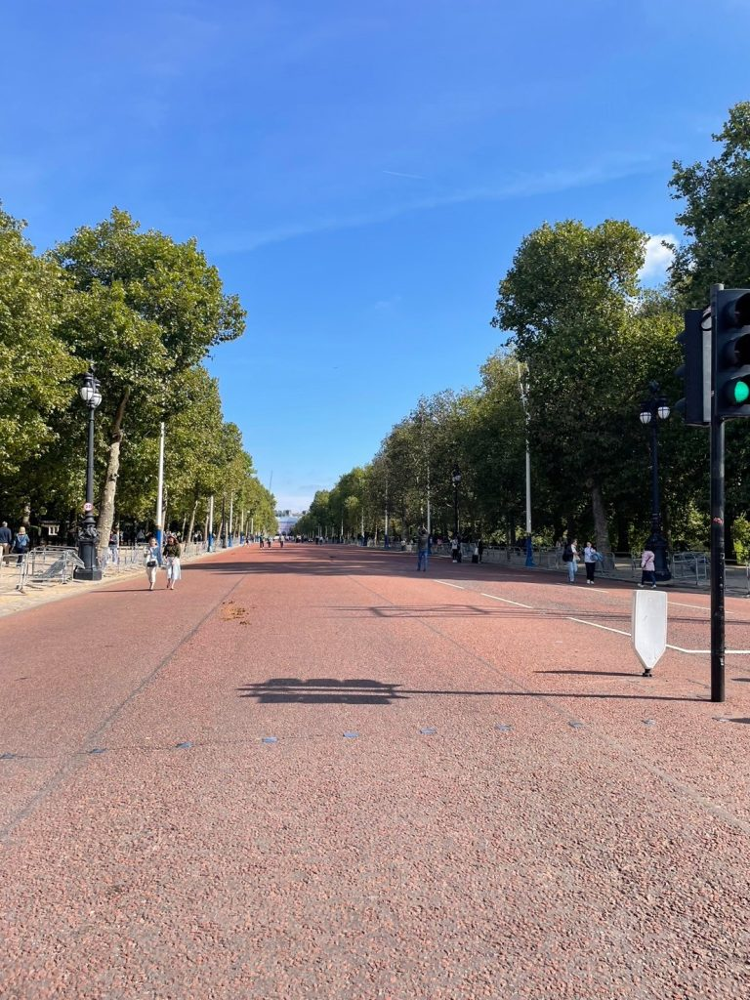](IMG_4016-768x1024.jpg)
      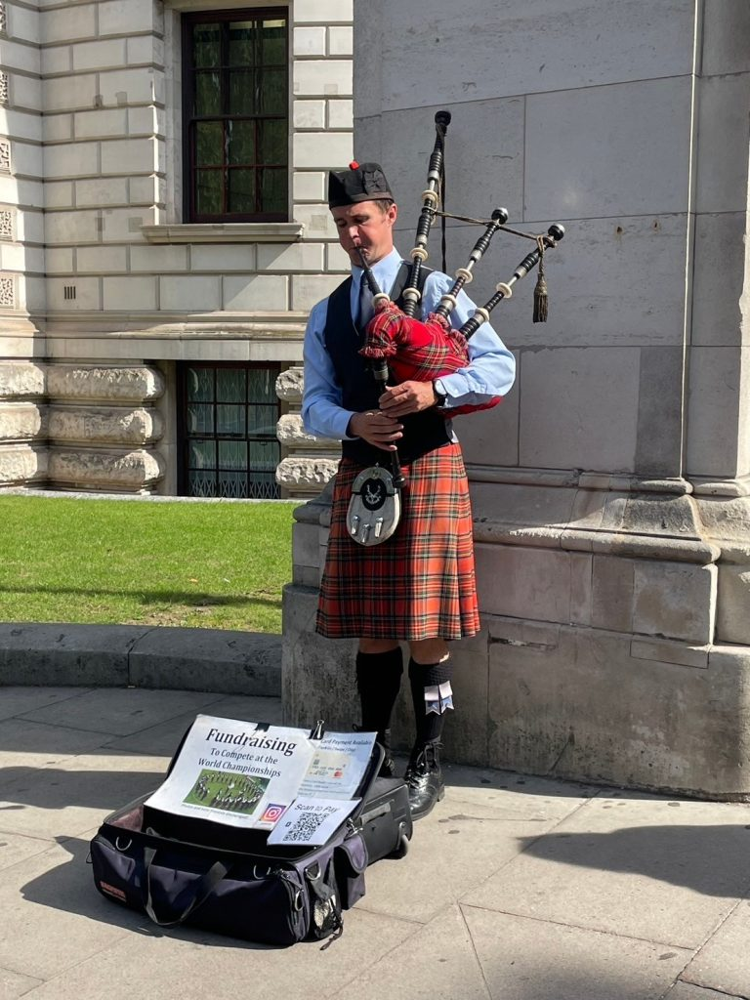](IMG_4017-768x1024.jpg)
      ](IMG_4018-768x1024.jpg)
  
バッキンガム宮殿からは歩いてビックベンへ向かいました。

公園を抜けていったのですが、歩いていて気持ち良かったのが思い出。

ビックベン眺めてウェストミンスター寺院も外観だけさらっと眺めました。

  <a rel="noopener" href="https://maps.app.goo.gl/EyCi1kYCLwZ61ocS9" title="ビッグ・ベン to バッキンガム宮殿" class="blogcard-wrap external-blogcard-wrap a-wrap cf" target="_blank">
  
  

    

      
    
<figure class="blogcard-thumbnail external-blogcard-thumbnail">
    
    
    
    <noscript>
      
    </noscript></figure>
    
    

      

        ビッグ・ベン to バッキンガム宮殿
      

      
      

      

    

    
    

      

        

          
          
          <noscript>
            
          </noscript>
        

        
        

          maps.app.goo.gl
        

      

    

  
</a>

### 14時：大英博物館　入場料無料！

    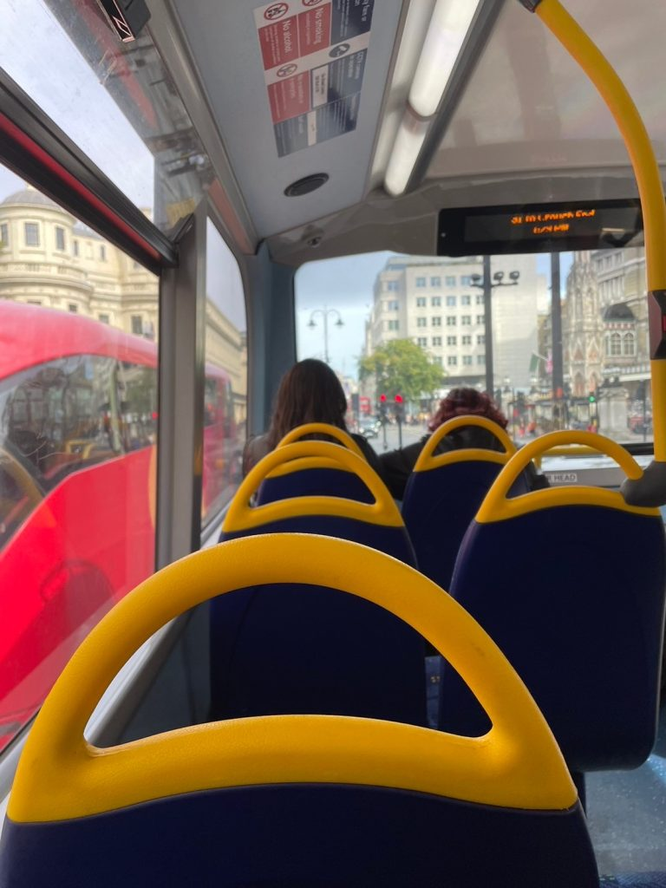](IMG_4019-768x1024.jpg)
      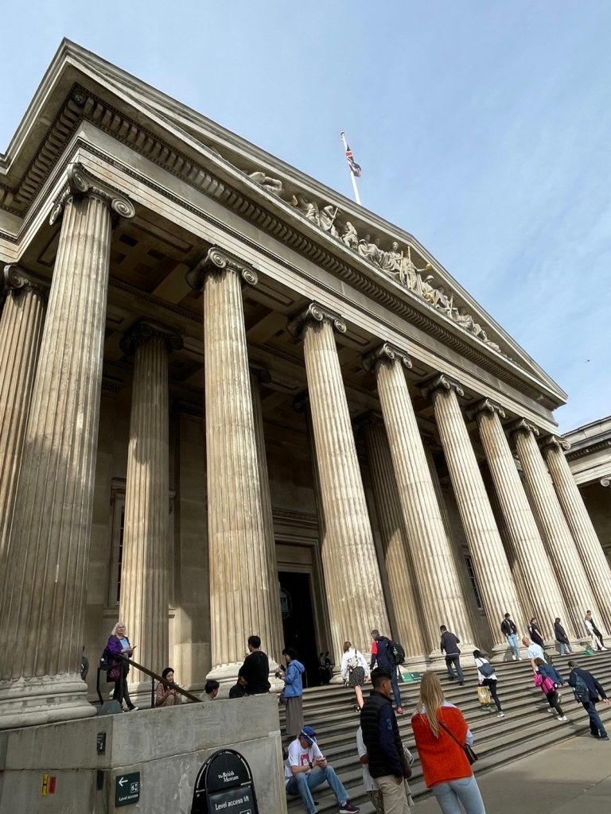](IMG_4020-768x1024.jpg)
  
２階建てバスで近くまで向かいました。**もちろん２階に乗車し**、街並みを眺めながら向かいます。

Googleマップで示されたバスの番号を見て乗るだけなので、迷うことはなかったです。

  <a rel="noopener" href="https://maps.app.goo.gl/rUeFkfq9gcXTuqc28" title="ビッグ・ベン to 大英博物館" class="blogcard-wrap external-blogcard-wrap a-wrap cf" target="_blank">
  
  

    

      
    
<figure class="blogcard-thumbnail external-blogcard-thumbnail">
    
    
    
    <noscript>
      
    </noscript></figure>
    
    

      

        ビッグ・ベン to 大英博物館
      

      
      

      

    

    
    

      

        

          
          
          <noscript>
            
          </noscript>
        

        
        

          maps.app.goo.gl
        

      

    

  
</a>

    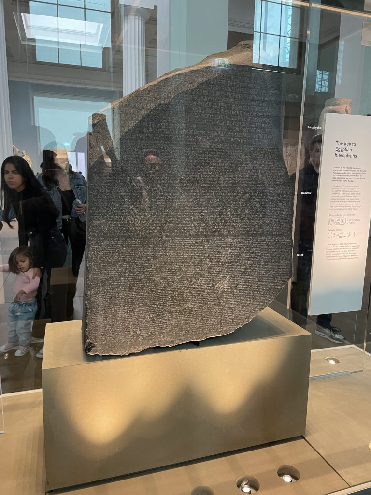](2024-09-15_14-57-08_047-768x1024.jpeg)
      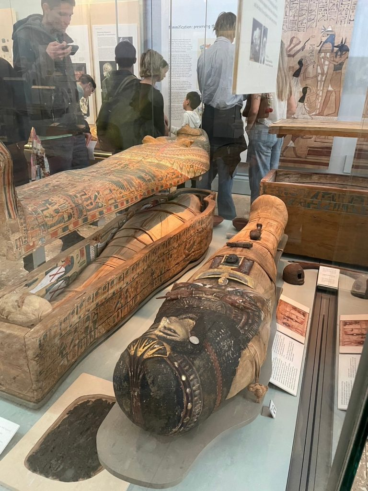](IMG_4021-768x1024.jpg)
  
とりあえず有名なやつは見ました。ロゼッタストーンとミイラ。（クリスタルスカル見てないかも・・・）

滞在時間は2時間ほどです。じっくりは見ることはできませんでした、大英博物館行ったぞ！を達成。

### 16時：パブ「Museum Tavern」でフィッシュ&チップス

    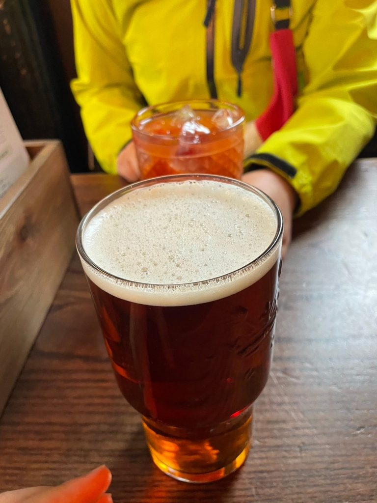](IMG_4022-768x1024.jpg)
      ](IMG_4023-768x1024.jpg)
  
ロンドンといえば**フィッシュ&チップス**ということで大英博物館近くのパブに行きました。

Googleマップを見て、口コミが良さげなお店を選択。先にカウンターで注文して料理を待つスタイルでした。

2人で一皿で十分なボリュームかつ脂っこくなくビールに合いました。32.65ポンドでした。（**6,217円**）

お店はこちら。

  <a rel="noopener" href="https://maps.app.goo.gl/bmf2cDZcqaKfqQ8k8" title="Museum Tavern · 49 Great Russell St, London WC1B 3BA イギリス" class="blogcard-wrap external-blogcard-wrap a-wrap cf" target="_blank">
  
  

    

      
    
<figure class="blogcard-thumbnail external-blogcard-thumbnail">
    
    
    
    <noscript>
      
    </noscript></figure>
    
    

      

        Museum Tavern · 49 Great Russell St, London WC1B 3BA イギリス
      

      
      

        ★★★★☆ · パブ
      

    

    
    

      

        

          
          
          <noscript>
            
          </noscript>
        

        
        

          maps.app.goo.gl
        

      

    

  
</a>

### 17時：ナショナルギャラリー・トラファルガー広場　入場料無料！

    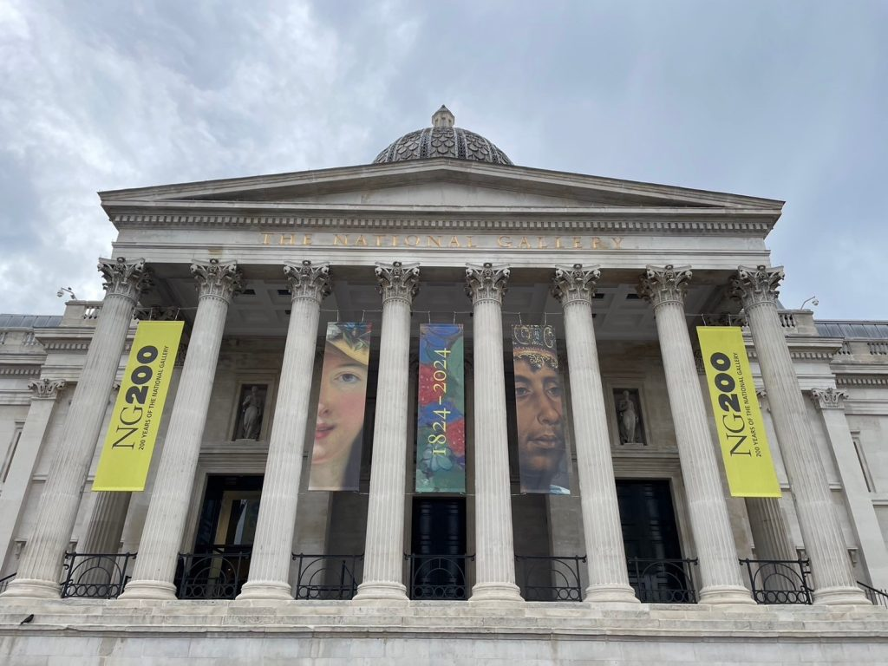](IMG_4024-1024x768.jpg)
      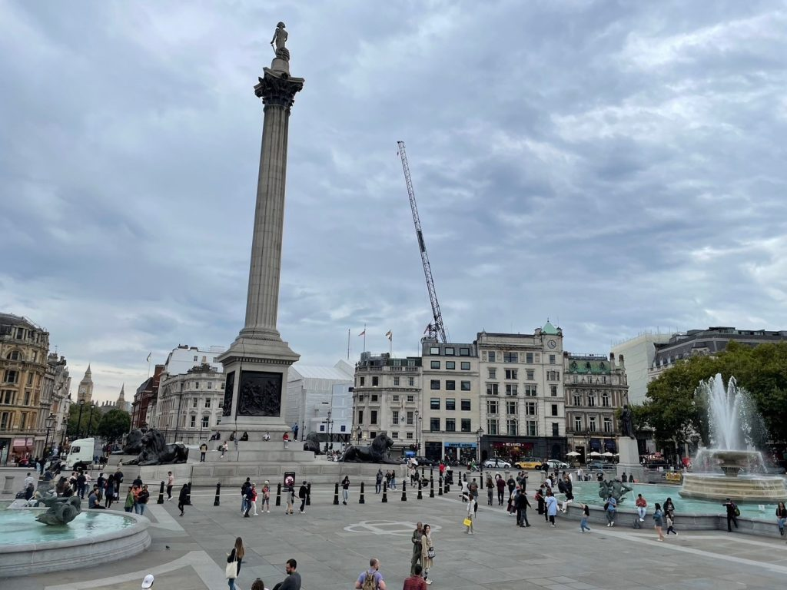](IMG_4025-1024x768.jpg)
  
バスで向かいました。バスの路線も多くロンドン市内の移動であれば**バスがおすすめ**です！景色も見れるし。

ナショナル・ギャラリーの入口前に有名なトラファルガー広場があり、観光客は多かったです。

    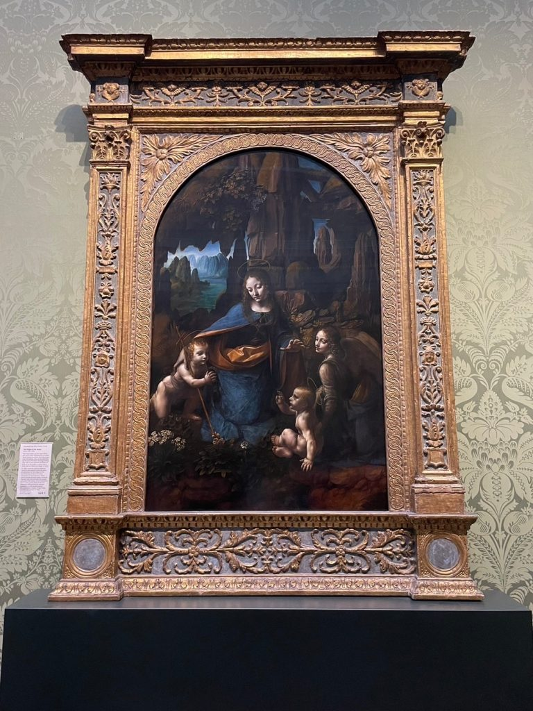](IMG_4026-768x1024.jpg)
      ](IMG_4027-768x1024.jpg)
  
ここでも有名な絵画だけをおさえて見ていきました。**岩窟の聖母と大使たち**

ここでも滞在時間は2時間ほどです。ナショナルギャラリー行ったぞ感。

### 19時：ロンドン橋・タワーブリッジ・スーパーで買い物

    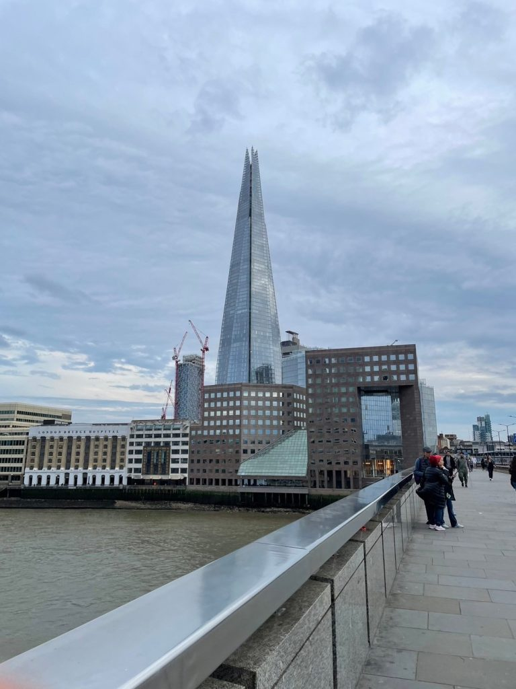](IMG_4028-768x1024.jpg)
      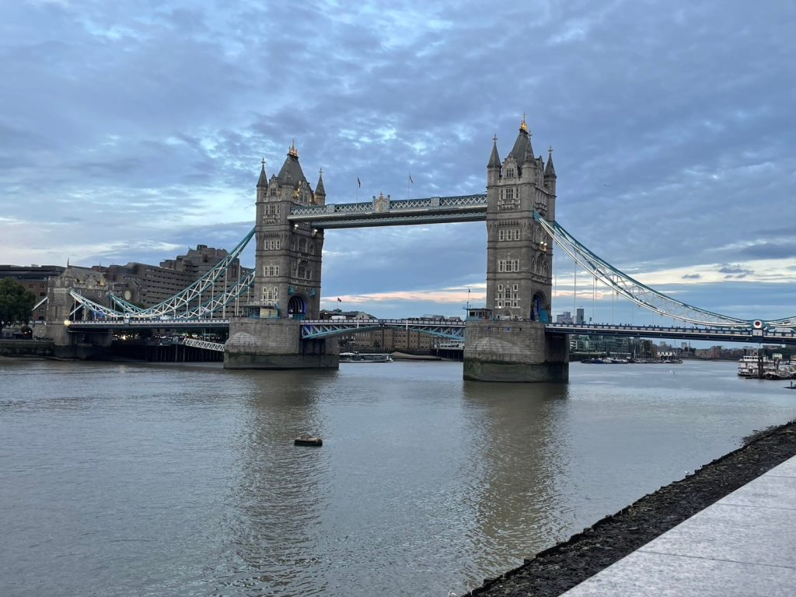](IMG_4029-1024x768.jpg)
  
日暮れが20時でもう少し行けそうだったので、タワーブリッジを見るためバスに乗車しました。

ロンドン橋の手前でバスを降りて、歩いて橋を渡りながらタワーブリッジをパシャリ。

この位置からタワーブリッジがよく見れました。

  <a rel="noopener" href="https://maps.app.goo.gl/U27gwNMhrhRCXgD4A" title="The Scoop · The Scoop at More, London SE1 2AA イギリス" class="blogcard-wrap external-blogcard-wrap a-wrap cf" target="_blank">
  
  

    

      
    
<figure class="blogcard-thumbnail external-blogcard-thumbnail">
    
    
    
    <noscript>
      
    </noscript></figure>
    
    

      

        The Scoop · The Scoop at More, London SE1 2AA イギリス
      

      
      

        ★★★★★ · 円形劇場
      

    

    
    

      

        

          
          
          <noscript>
            
          </noscript>
        

        
        

          maps.app.goo.gl
        

      

    

  
</a>

その後、近くのスーパー「M&S Simply Food」で軽食とロンドンお土産を購入し、ホテルへ帰宅しました。

セルフレジでしたが、**英語表記なので特に迷うことなく操作できました**。

行ったスーパーはこちら。

  <a rel="noopener" href="https://maps.app.goo.gl/ZrErgjnYhBBcMeoD6" title="M&S Simply Food · Unit C, The More Bridge, More London Pl, London SE1 2DA イギリス" class="blogcard-wrap external-blogcard-wrap a-wrap cf" target="_blank">
  
  

    

      
    
<figure class="blogcard-thumbnail external-blogcard-thumbnail">
    
    
    
    <noscript>
      
    </noscript></figure>
    
    

      

        M&S Simply Food · Unit C, The More Bridge, More London Pl, London SE1 2DA イギリス
      

      
      

        ★★★★☆ · コンビニエンスストア
      

    

    
    

      

        

          
          
          <noscript>
            
          </noscript>
        

        
        

          maps.app.goo.gl
        

      

    

  
</a>

### 21時：ホテル帰宅

    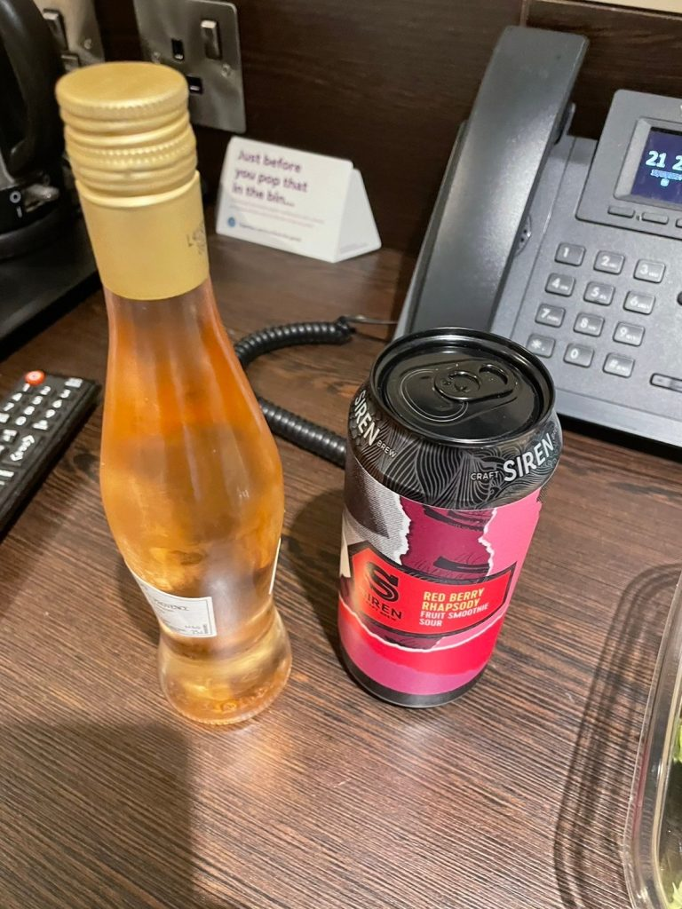](IMG_4030-1-768x1024.jpg)
      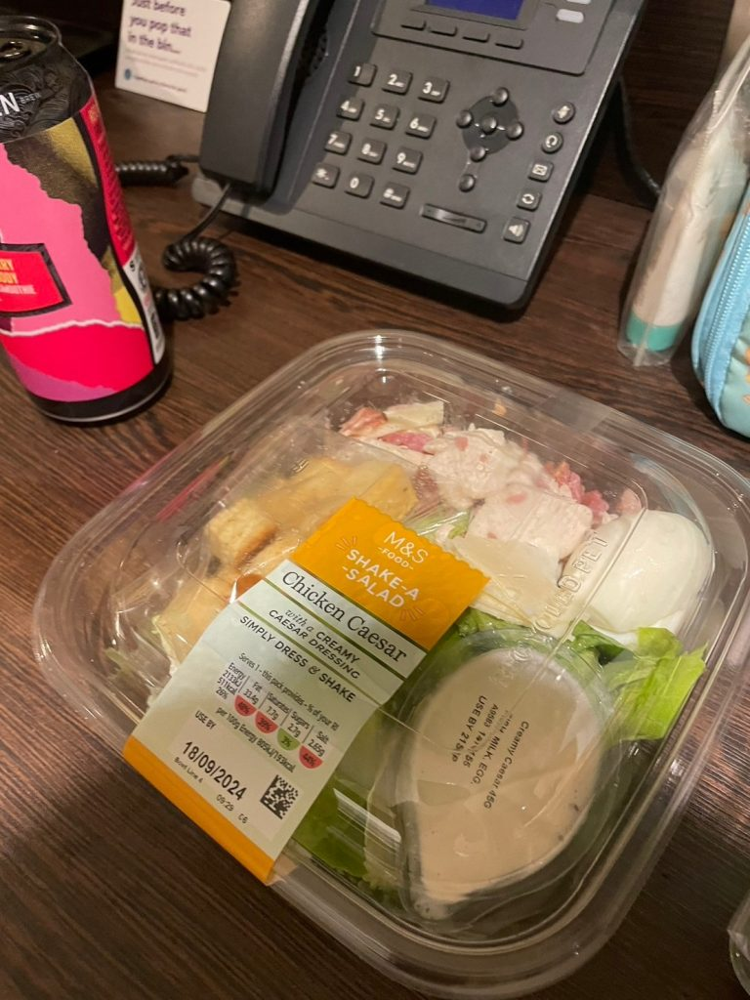](IMG_4031-1-768x1024.jpg)
      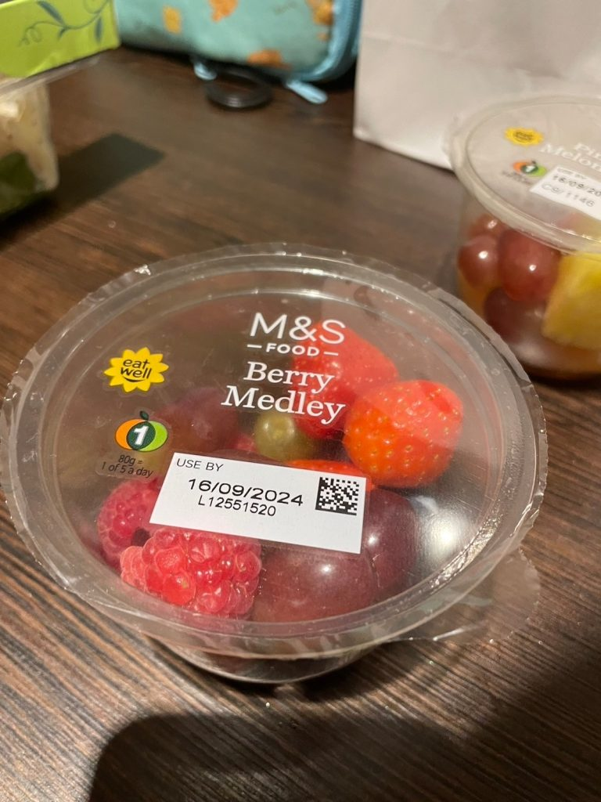](IMG_4032-1-768x1024.jpg)
  
フィッシュ&チップスが後からお腹に溜まってきたので、軽めにサラダとフルーツを食べました。

また、前日に干していた洗濯物も乾いていたのでこれを買って正解でした。

## 3日目：ブダペストへ向けて移動

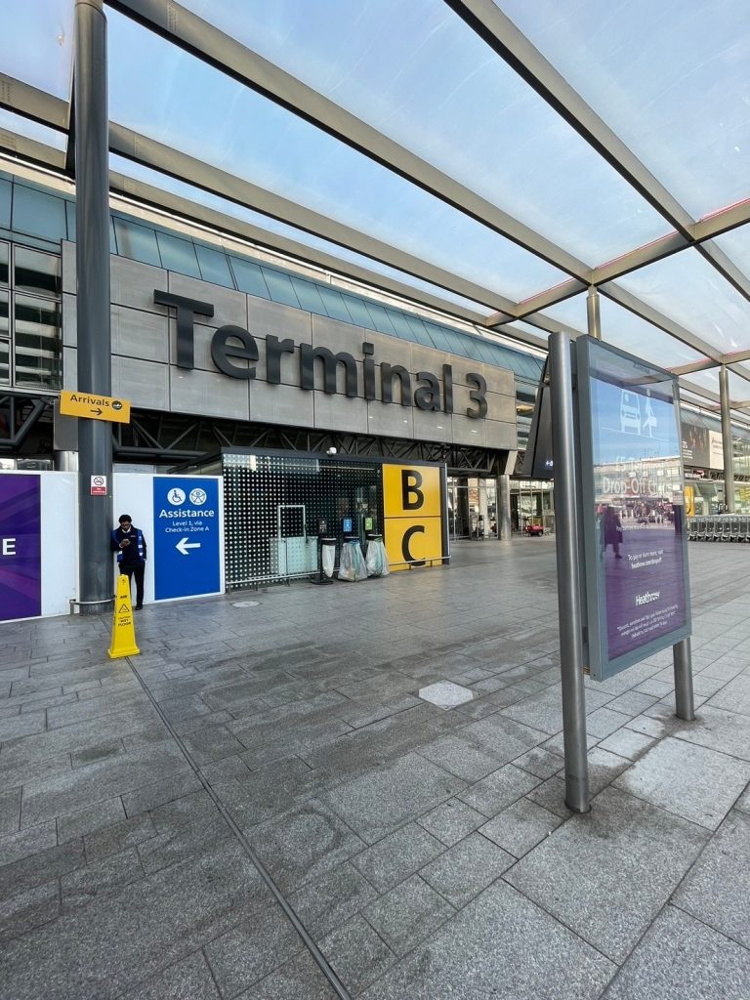](IMG_4034-768x1024.jpg) 

ターミナル4からターミナル3へと移動します。

ここまで来ると、エリザベスラインまでの道乗りと切符の買い方に迷いはなく、すぐに到着しました。

### ロンドン出発：ヒースロー空港

#### チェックイン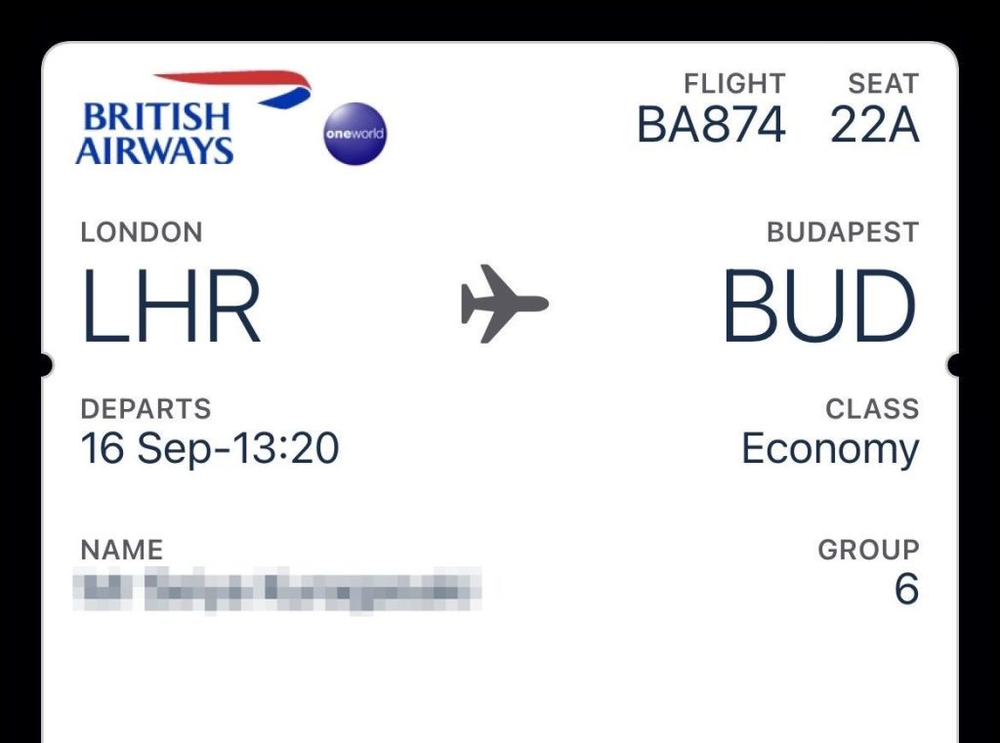](IMG_4033-1024x761.jpg) 

ブリティッシュ・エアウェイズもアプリから事前にチェックインすることができ、iOSであればウォレットにチケットを追加することができました。

  <a rel="noopener" href="https://www.britishairways.com/content/ja/jp/information/checking-in-and-boarding/ba-on-your-mobile" title="British Airways - Information Page" class="blogcard-wrap external-blogcard-wrap a-wrap cf" target="_blank">
  
  

    

      
    
<figure class="blogcard-thumbnail external-blogcard-thumbnail">
    
    
    
    <noscript>
      
    </noscript></figure>
    
    

      

        British Airways - Information Page
      

      
      

      

    

    
    

      

        

          
          
          <noscript>
            
          </noscript>
        

        
        

          www.britishairways.com
        

      

    

  
</a>

      タイ国際航空と同じく<strong>スマホでチケットも表示できる</strong>ので、ゲート通るのも楽ちんでした。
  

#### 保安検査のみで出国手続きはなし！

友人曰く、**EU域内**だからないそうです。

#### 口コミで高評価「Spuntino」でイングリッシュブレックファースト！](IMG_4035-1024x765.jpg) 

これを食べるために昨日の夕食を軽めに済ませました。**これを食べずにロンドンを去れません**。

口コミ通り美味しく、とても満足できました。

価格は空港内ということもあり2人で48ポンド！（**9,140円！**）後悔はありません。

お店はこちら　

  <a rel="noopener" href="https://maps.app.goo.gl/kWCsbyuTDL9jFhyc8" title="Spuntino - Heathrow T3 · Landside, Heathrow Airport, T3, Middlesex, Hounslow TW6 2GA イギリス" class="blogcard-wrap external-blogcard-wrap a-wrap cf" target="_blank">
  
  

    

      
    
<figure class="blogcard-thumbnail external-blogcard-thumbnail">
    
    
    
    <noscript>
      
    </noscript></figure>
    
    

      

        Spuntino - Heathrow T3 · Landside, Heathrow Airport, T3, Middlesex, Hounslow TW6 2GA イギリス
      

      
      

        ★★★★★ · レストラン
      

    

    
    

      

        

          
          
          <noscript>
            
          </noscript>
        

        
        

          maps.app.goo.gl
        

      

    

  
</a>

### ブリティッシュ・エアウェイズ：ヒースロー空港〜リスト・フェレンツ国際空港

    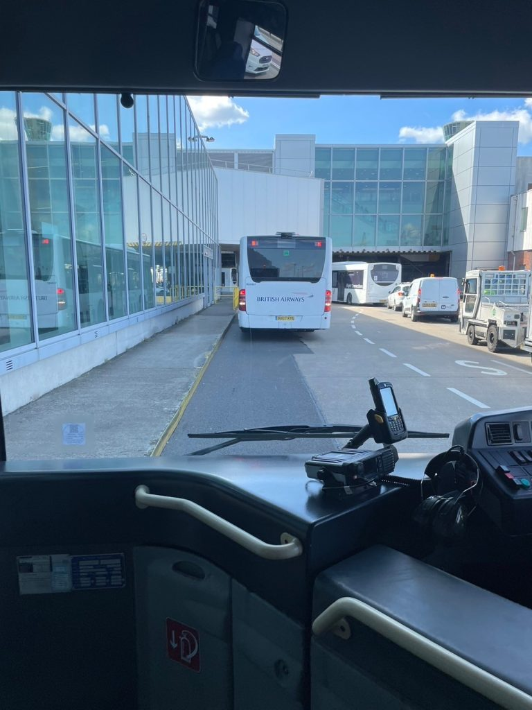](IMG_4037-768x1024.jpg)
      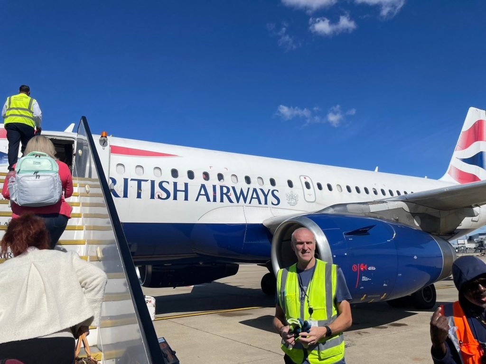](IMG_4036-1024x768.jpg)
  
飛行機まではバス移動でした。ヒースロー空港はターミナル5もあるぐらい広く、バス移動も２０分ぐらいかかりました。

ちなみにバス出発時点で定刻時間は過ぎていて**遅延確定**でした。

トリップドットコムのアプリでは定時運行率というのが表示されており、**定時運行率27%・遅延平均53分**でした。

      定時運行は日本ぐらいと思っていた方が良さそうです。
  
  
      <strong>他国の交通網は遅延が普通と思って行動する</strong>のが正解です。
  

#### 機内

    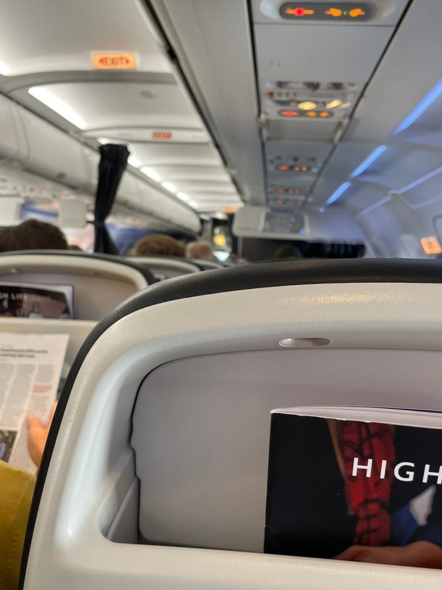](IMG_4039-768x1024.jpg)
      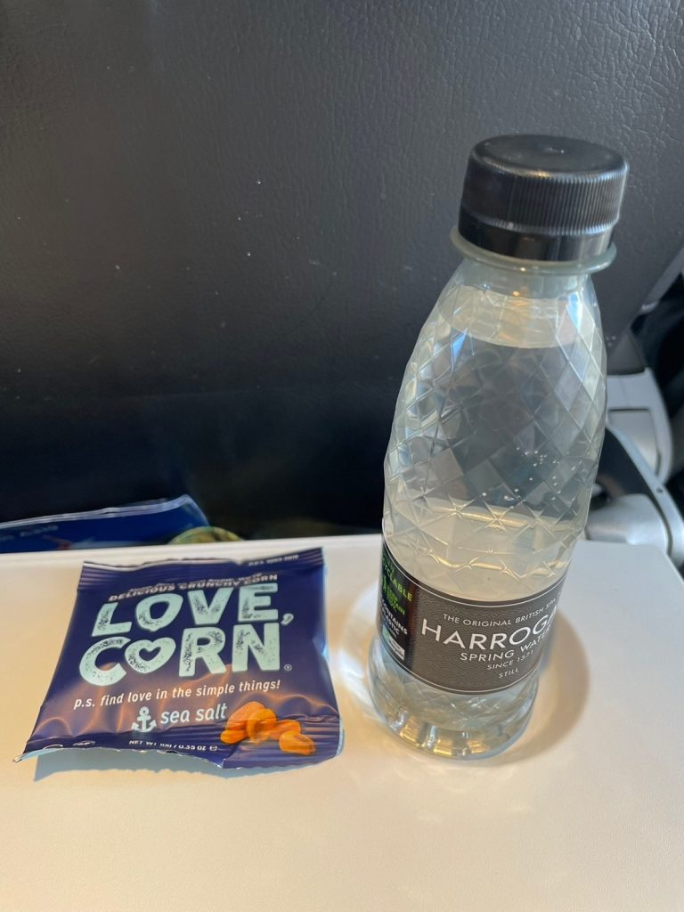](IMG_4038-768x1024.jpg)
  
機体は少し古い感じがしました。広さはそんなに狭くなくタイ国際航空と変わらないぐらいです。

3時間30分のフライトですが、水とお菓子が配られました。

## ブダペストへ

次の記事ではブダペスト観光編を紹介していきます！

  <a href="https://arukayies.com/diy/travel/europe-honeymoon-budapest-tourism-part1" title="【予算は100万円！個人手配で行くヨーロッパ新婚旅行】3泊4日のブダベスト観光 前編" class="blogcard-wrap internal-blogcard-wrap a-wrap cf" target="_blank">
  
  

    

      
    
](アイキャッチ画像-66ff37dcd4e82-160x90.jpg)
    
    

      

        【予算は100万円！個人手配で行くヨーロッパ新婚旅行】3泊4日のブダベスト観光 前編
      

      
      

        くらこんにちは！この記事を見ていただいている方、ご興味を持っていただいた方、ありがとうございます。タイトルの通りヨーロッパへ新婚旅行に行きました。くら前回は2泊3日のロンドン観光編をまとめました。くらこの記事ではブダペスト観光 前編の記録に...
      

    

    
    

      

        

          
          
          <noscript>
            
          </noscript>
        

        
        

          arukayies.com
        

      

      
      

        

          2024.10.30
        

      

    

  
</a> 
  
    <a href="https://arukayies.com/diy/travel/europe-honeymoon-budapest-tourism-part2" title="【予算は100万円！個人手配で行くヨーロッパ新婚旅行】3泊4日のブダベスト観光 後編" class="blogcard-wrap internal-blogcard-wrap a-wrap cf" target="_blank">
  
  

    

      
    
](アイキャッチ画像-67071813cc15b-160x90.jpg)
    
    

      

        【予算は100万円！個人手配で行くヨーロッパ新婚旅行】3泊4日のブダベスト観光 後編
      

      
      

        くらこんにちは！この記事を見ていただいている方、ご興味を持っていただいた方、ありがとうございます。タイトルの通りヨーロッパへ新婚旅行に行きました。くら前回はブダペスト観光 前編をまとめました。3日目：セーチェーニ温泉とフォアグラを食べにブダ...
      

    

    
    

      

        

          
          
          <noscript>
            
          </noscript>
        

        
        

          arukayies.com
        

      

      
      

        

          2024.10.30
        

      

    

  
</a>

  <a href="https://arukayies.com/diy/travel/europe-honeymoon-summary" title="【予算は100万円！個人手配で行くヨーロッパ新婚旅行】3カ国を巡った様子のまとめ" class="blogcard-wrap internal-blogcard-wrap a-wrap cf" target="_blank">
  
  

    

      
    
](アイキャッチ画像-6721c6d77511e-160x90.jpg)
    
    

      

        【予算は100万円！個人手配で行くヨーロッパ新婚旅行】3カ国を巡った様子のまとめ
      

      
      

        くらこんにちは！この記事を見ていただいている方、ご興味を持っていただいた方、ありがとうございます。タイトルの通りヨーロッパへ新婚旅行に行きました。ここまでヨーロッパ新婚旅行（ロンドン、ブダペスト、パリ）シリーズをお伝えしてきました。今回はそ...
      

    

    
    

      

        

          
          
          <noscript>
            
          </noscript>
        

        
        

          arukayies.com
        

      

      
      

        

          2024.10.30
        

      

    

  
</a>

