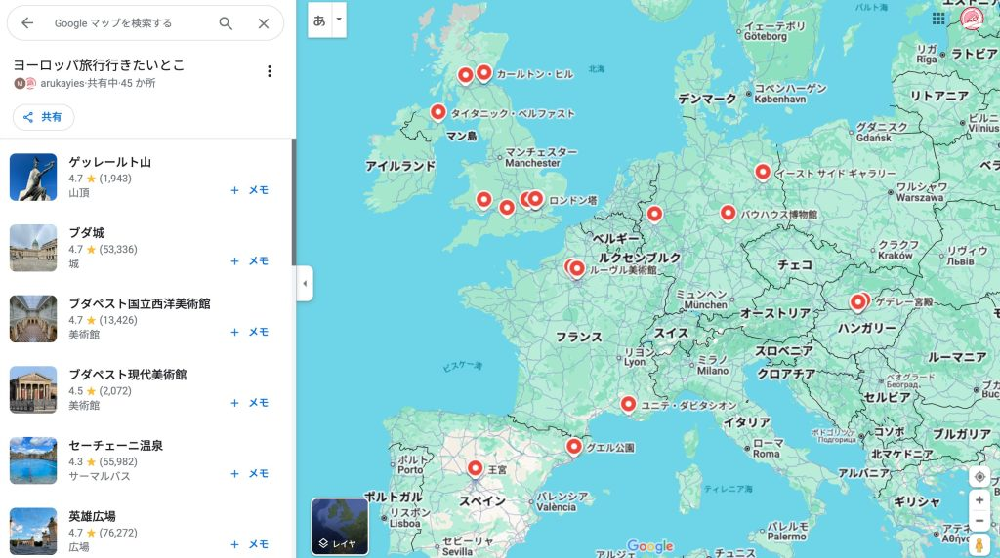
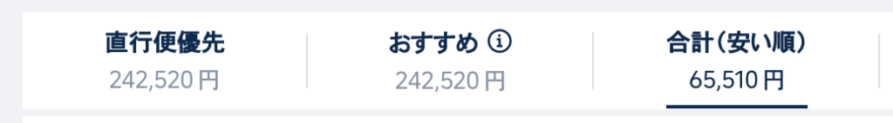
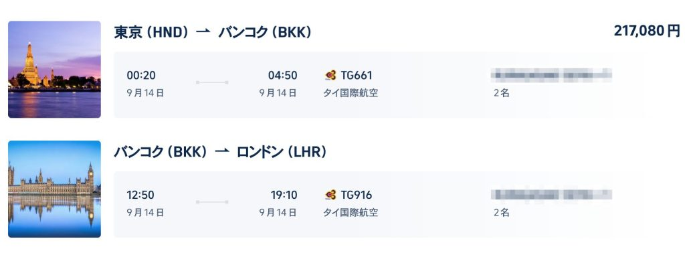
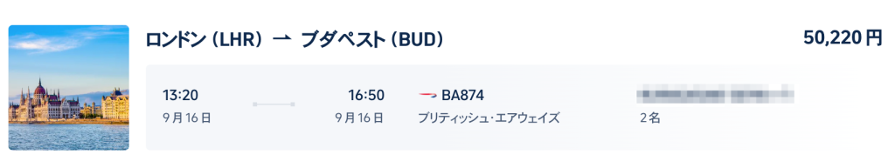
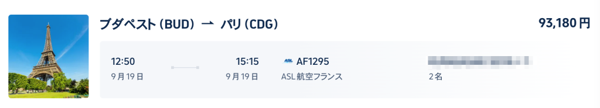
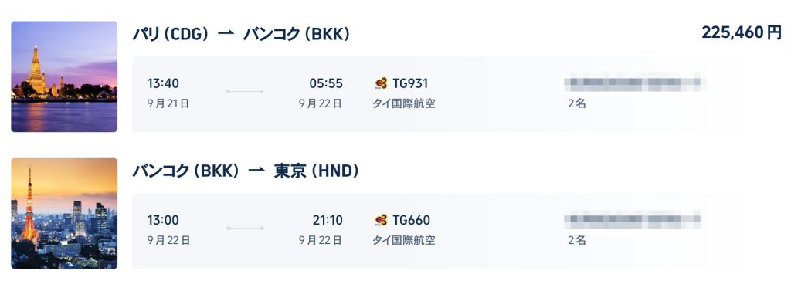
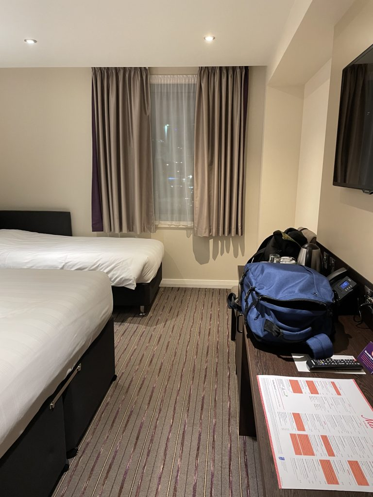
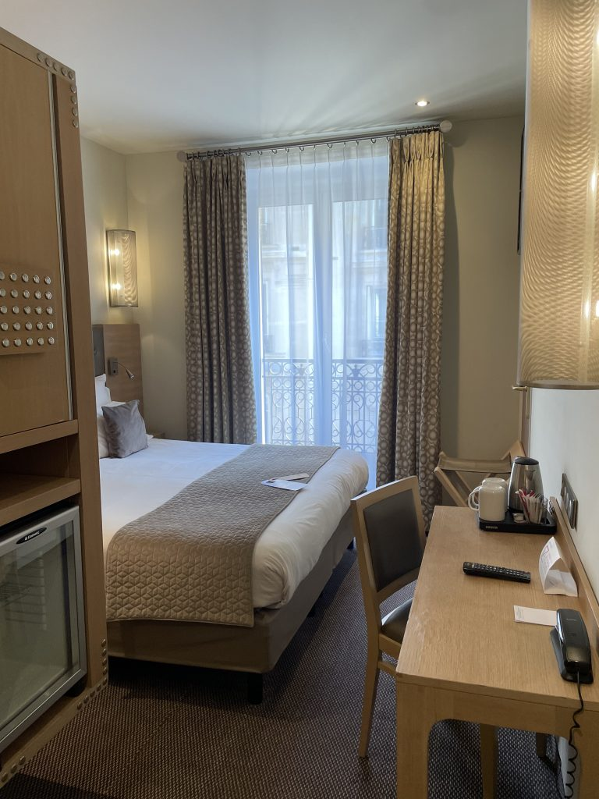
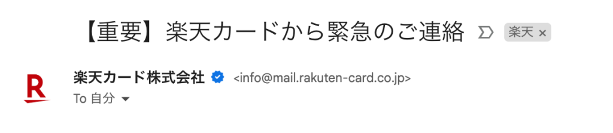

こんにちは！
この記事を見ていただいている方、ご興味を持っていただいた方、ありがとうございます。

タイトルの通りヨーロッパへ新婚旅行に行きました。

しかし、夫婦で行ったのは台湾のみと<strong>ほとんど海外旅行の経験はありません</strong>。

英語も話せず、しかも個人手配。。。

そんな慣れないふたりの新婚旅行を記録してみました📝

誰かの役に立てば嬉しいです。

この記事では事前に行った準備をまとめています！

  <a href="https://arukayies.com/diy/travel/europe-honeymoon-summary" title="【予算は100万円！個人手配で行くヨーロッパ新婚旅行】3カ国を巡った様子のまとめ" class="blogcard-wrap internal-blogcard-wrap a-wrap cf" target="_blank">
  
  

    

      
    
](アイキャッチ画像-6721c6d77511e-160x90.jpg)
    
    

      

        【予算は100万円！個人手配で行くヨーロッパ新婚旅行】3カ国を巡った様子のまとめ
      

      
      

        くらこんにちは！この記事を見ていただいている方、ご興味を持っていただいた方、ありがとうございます。タイトルの通りヨーロッパへ新婚旅行に行きました。ここまでヨーロッパ新婚旅行（ロンドン、ブダペスト、パリ）シリーズをお伝えしてきました。今回はそ...
      

    

    
    

      

        

          
          
          <noscript>
            
          </noscript>
        

        
        

          arukayies.com
        

      

      
      

        

          2024.10.30
        

      

    

  
</a>

## 持ってきて良かった持ち物3点！

持ち込んで良かったものを紹介します！

### ①洗濯用品セット

長期の旅行のため、旅先での洗濯は必須でした。

国内のホテルではコインランドリー付きが多いですが、**海外ではありません**。

洗剤も一緒に持ち込んで、ホテルで洗濯してから昼間の観光中に乾かす流れで行動していました。

### ②モバイルバッテリー

調べ物や写真を撮ったりと**いつも以上にスマホを利用する**ので必須です。

この旅行前にAnkerのモバイルバッテリーを買いました。

### ③海外用変換プラグ

ヨーロッパ3カ国とも変換は必要でした。

空港や飛行機にはUSBコンセントが備えられていたので、**ホテルで給電するのに必須**でした。

## eSIMを購入する

今やスマホなしでは海外旅行は詰みます。**楽天モバイルであれば滞在した全ての国で利用できた**ので便利でした。

妻用に購入したヨーロッパとタイのeSIMはこちら

<a rel="nofollow" href="https://px.a8.net/svt/ejp?a8mat=3ZHJ8N+1CTKDU+399O+644DT"> ](bgtaid241003175082wid001eno01mids00000015198001027000mc1.png)</a>](img_66fe290165008.gif) 

      楽天モバイルだと<strong>１か月2GBまで海外利用は無料</strong>でした。
  
  
      旅の途中で使い切りましたが、<strong>2GB 1,000円でチャージ</strong>してすぐに快適に利用できました。
  

## 行きたいところをまとめる

](image-1024x572.jpg) 

Googleマップを利用して場所のリストを作成するのが便利でした。

マップ上のピンを俯瞰して見ることで**距離感を把握**するのに利用していました。

  <a rel="noopener" href="https://support.google.com/maps/answer/7280933?hl=ja&#038;co=GENIE.Platform%3DDesktop" title="&#22580;&#25152;&#12398;&#12522;&#12473;&#12488;&#12434;&#20316;&#25104;&#12377;&#12427; - &#12497;&#12477;&#12467;&#12531; - &#12510;&#12483;&#12503; &#12504;&#12523;&#12503;" class="blogcard-wrap external-blogcard-wrap a-wrap cf" target="_blank">
  
  

    

      
    
<figure class="blogcard-thumbnail external-blogcard-thumbnail">
    
    
    
    <noscript>
      
    </noscript></figure>
    
    

      

        &#22580;&#25152;&#12398;&#12522;&#12473;&#12488;&#12434;&#20316;&#25104;&#12377;&#12427; - &#12497;&#12477;&#12467;&#12531; - &#12510;&#12483;&#12503; &#12504;&#12523;&#12503;
      

      
      

        Google マップでは、お気に入りの場所や行ってみたい場所など、特定の場所をまとめたリストを作成できます。 新しいリストを作成する パソコンで Google マップを開きます。 メニュー アイコン
      

    

    
    

      

        

          
          
          <noscript>
            
          </noscript>
        

        
        

          support.google.com
        

      

    

  
</a>

## 行きたいところを確定させる

こんな流れで決めていきました。

### 各都市で必要な滞在日数を見積もる

    ](image-1.png)
      ](image-2.png)
  
精度は気にせず、各都市の観光サイトを見てざっくり見積もりました。

### 各都市間の交通手段と移動時間を調べる

それぞれの都市間の交通手段・移動時間を調べました。

といっても選択肢と挙げられそうなのは飛行機 or 列車のみ。

寝台列車は惹かれましたが、移動時間が掛かるためパスしました。

### スケジュールを決める

](image-5.png) 

**この時点**で決まったスケジュールはこちら。

ブダペストをメインにして、ロンドン・パリは経由する際に1日だけ観光するようなプランを作りました。

パリ→ブダペスト・ブダペスト→ロンドンは移動時間の短い飛行機で行く予定。

## 飛行機を予約する

同じ日程・航空会社で他の予約サイトとも比較しましたが、**トリップドットコム**が最安値でした。

  <a rel="noopener" href="https://jp.trip.com/?locale=ja-JP&#038;curr=JPY" title="トリップドットコム 公式サイト｜航空券・ホテル・列車予約ならTrip.com" class="blogcard-wrap external-blogcard-wrap a-wrap cf" target="_blank">
  
  

    

      
    
<figure class="blogcard-thumbnail external-blogcard-thumbnail">
    
    
    
    <noscript>
      
    </noscript></figure>
    
    

      

        トリップドットコム 公式サイト｜航空券・ホテル・列車予約ならTrip.com
      

      
      

        Trip.com（トリップドットコム）は世界最大級のオンライン旅行会社。航空券、ホテル、列車、現地ツアーなど豊富な旅行商品をワンストップでお得に予約できます。国内旅行、海外旅行、出張や社員旅行にも、安心の日本語カスタマーサービスで旅をサポー...
      

    

    
    

      

        

          
          
          <noscript>
            
          </noscript>
        

        
        

          jp.trip.com
        

      

    

  
</a>

また直行便よりも**乗り継ぎ便が安い**ことが分かり、**スケジュールを再検討**しました。<figure class="wp-block-image size-large">

](image-6-1024x142.png) <figcaption class="wp-element-caption">最安値は乗り継ぎありで6.5万、直行便だと24万と乗り継ぎ便を利用することで半額以下に！</figcaption></figure> 

実際に予約した飛行機代↓

### 羽田〜バンコク〜ロンドン：217,080円

成田空港は遠いので、羽田空港発かつ機内食が美味しいと評判なタイ国際航空を選択。

しっかりと寝ることは出来ませんでしたが、機内食は全て美味しくお酒も飲めて快適でした。](2024-09-30_午後4_19_31-1-1024x378.jpg) 

### ロンドン〜ブダペスト：50,220円

LCCは不安だったので、フラッグ・キャリアを選択。

軽食も出て快適でしたが、1時間くらいの遅延で到着しました。](スクリーンショット_2024-09-30_午後4_19_39-1024x193.png) 

### ブダペスト〜パリ：93,180円

こちらも同じくフラッグ・キャリアを選択。

軽食も出て快適でしたが、こちらも遅延しての到着。海外だと通常運転なのかな。](スクリーンショット_2024-09-30_午後4_19_46-1024x185.png) 

### パリ〜バンコク〜羽田：225,460円

帰国も行きと同じくタイ国際航空を選択。

パリ発のためか機内食はヨーロッパ料理もあって、最後まで快適でした。](2024-09-30_午後4_19_53-1024x364.jpg) 

      飛行機のチケットは直行便よりも<strong>乗り継ぎ便が安かった！</strong>
  

しかしデメリットも・・・

      格安航空券のためか、<strong>フライトマイルの事後登録で「対象外」</strong>となりました😭
  

### タイ国際航空の座席指定は無料！

](image-7.png) 

予約時にオプションで座席指定できそうだったので課金しましたが、おそらく**払わなくても座席指定できることが分かりました。**（なぜか行きの便だけオプションがあって、帰りの便はオプションが表示されず😇）

帰りの便は**タイ国際航空の公式ページから無料で座席指定できました。**

やり方は簡単です。

公式ページの予約管理から予約番号と苗字でログインする。

  <a rel="noopener" href="https://www.thaiairways.com/ja_JP/manage/my_booking.page" title="ERROR: The request could not be satisfied" class="blogcard-wrap external-blogcard-wrap a-wrap cf" target="_blank">
  
  

    

      
    
<figure class="blogcard-thumbnail external-blogcard-thumbnail">
    
    
    
    <noscript>
      
    </noscript></figure>
    
    

      

        ERROR: The request could not be satisfied
      

      
      

      

    

    
    

      

        

          
          
          <noscript>
            
          </noscript>
        

        
        

          www.thaiairways.com
        

      

    

  
</a>

](image-8-1024x448.jpg) 

次の画面で「旅客情報を修正」ボタンを押し、名前とパスポート情報を登録します。

この**旅客情報を登録することで初めて座席指定できる**ようになります。](スクリーンショット_2024-09-30_午後5_15_01-1024x410.png) 

      タイ国際航空の公式ページで<strong>パスポート情報を登録することで無料で座席指定できる。</strong>
  

### ブリティッシュ・エアウェイズとエールフランスの座席指定は有料！

公式ホームページやアプリ経由と試してみましが、どちらの航空会社も座席指定は有料のため諦めました。

      結果的には夫婦隣同士で座ることは出来たのでラッキーでした👍
  

## ホテルを予約する

同じ日程で他の予約サイトとも比較しましたが、**アゴダ**が最安値でした。

  <a rel="noopener" href="https://www.agoda.com/ja-jp" title="https://www.agoda.com/ja-jp" class="blogcard-wrap external-blogcard-wrap a-wrap cf" target="_blank">
  
  

    

      
    
<figure class="blogcard-thumbnail external-blogcard-thumbnail">
    
    
    
    <noscript>
      
    </noscript></figure>
    
    

      

        https://www.agoda.com/ja-jp
      

      
      

      

    

    
    

      

        

          
          
          <noscript>
            
          </noscript>
        

        
        

          www.agoda.com
        

      

    

  
</a>

### ロンドン2泊：30,609円

](2024-09-14_21-38-18_514-1-768x1024.jpeg) 

空港着が19時ということもあり、空港直結の「<a rel="noopener" href="https://www.agoda.com/ja-jp/premier-inn-heathrow-airport-terminal-4/hotel/london-gb.html" target="_blank" title="">プレミア イン ヒースロー エアポート ターミナル 4 (Premier Inn Heathrow Airport Terminal 4)</a>」というホテルを予約しました。

結果的にはターミナル移動の地下鉄が遅延して、ホテル着は21時と近くて正解でした。

  <a rel="noopener" href="https://www.agoda.com/ja-jp/premier-inn-heathrow-airport-terminal-4/hotel/london-gb.html" title="https://www.agoda.com/ja-jp/premier-inn-heathrow-airport-terminal-4/hotel/london-gb.html" class="blogcard-wrap external-blogcard-wrap a-wrap cf" target="_blank">
  
  

    

      
    
<figure class="blogcard-thumbnail external-blogcard-thumbnail">
    
    
    
    <noscript>
      
    </noscript></figure>
    
    

      

        https://www.agoda.com/ja-jp/premier-inn-heathrow-airport-terminal-4/hotel/london-gb.html
      

      
      

      

    

    
    

      

        

          
          
          <noscript>
            
          </noscript>
        

        
        

          www.agoda.com
        

      

    

  
</a>

### ブダペスト3泊：67,811円

](2024-09-16_22-15-10_862-1024x768.jpeg) 

ドナウ川からの夜景が綺麗という口コミを見て「<a rel="noopener" href="https://www.agoda.com/ja-jp/boutique-hotel-victoria-budapest/hotel/budapest-hu.html" target="_blank" title="">ブティック ホテル ヴィクトリア ブタペスト (Boutique Hotel Victoria Budapest)</a>」というホテルを予約しました。

口コミ通りのロケーションで、サービスも良かったです。

  <a rel="noopener" href="https://www.agoda.com/ja-jp/boutique-hotel-victoria-budapest/hotel/budapest-hu.html" title="https://www.agoda.com/ja-jp/boutique-hotel-victoria-budapest/hotel/budapest-hu.html" class="blogcard-wrap external-blogcard-wrap a-wrap cf" target="_blank">
  
  

    

      
    
<figure class="blogcard-thumbnail external-blogcard-thumbnail">
    
    
    
    <noscript>
      
    </noscript></figure>
    
    

      

        https://www.agoda.com/ja-jp/boutique-hotel-victoria-budapest/hotel/budapest-hu.html
      

      
      

      

    

    
    

      

        

          
          
          <noscript>
            
          </noscript>
        

        
        

          www.agoda.com
        

      

    

  
</a>

### パリ2泊：51,860円

](2024-09-19_17-13-55_281-768x1024.jpeg) 

最後まで悩んだパリの宿泊地。治安が良い地区を選ぶと予算オーバーだったため、口コミを参考に「<a rel="noopener" href="https://www.agoda.com/ja-jp/hotel-le-cardinal/hotel/paris-fr.html" target="_blank" title="">ホテル ル カルディナル (Hotel Le Cardinal)</a>」というホテルを予約しました。

空港から乗り継ぎ1回で1時間程度でホテルに着き、治安面も不安なところは一切なかったです。

  <a rel="noopener" href="https://www.agoda.com/ja-jp/hotel-le-cardinal/hotel/paris-fr.html" title="https://www.agoda.com/ja-jp/hotel-le-cardinal/hotel/paris-fr.html" class="blogcard-wrap external-blogcard-wrap a-wrap cf" target="_blank">
  
  

    

      
    
<figure class="blogcard-thumbnail external-blogcard-thumbnail">
    
    
    
    <noscript>
      
    </noscript></figure>
    
    

      

        https://www.agoda.com/ja-jp/hotel-le-cardinal/hotel/paris-fr.html
      

      
      

      

    

    
    

      

        

          
          
          <noscript>
            
          </noscript>
        

        
        

          www.agoda.com
        

      

    

  
</a>

      立地と<strong>日本人の口コミ</strong>を参考にホテルを選びました。
  

## カード会社に海外利用の事前通知を行う

](image-1024x224.png) 

海外の航空券を購入するタイミングで**カードの不正利用**というメールを受信しました。

どうやら過去の利用パターンと異なった決済があると、一時的に止める措置のようです。

すぐにサポートへ連絡することで解除されましたが、これが海外旅行途中で起きると困ります。

楽天カードであれば、チャットサポートから**事前に利用通知を行う**ことができます。

  <a rel="noopener" href="https://support.rakuten-card.jp/faq/show/15343?site_domain=guest" title="&#39640;&#38989;&#12394;&#12372;&#21033;&#29992;&#12420;&#28023;&#22806;&#12391;&#12398;&#12372;&#21033;&#29992;&#20104;&#23450;&#12364;&#12354;&#12427;&#22580;&#21512;&#12289;&#20107;&#21069;&#12395;&#12459;&#12540;&#12489;&#20250;&#31038;&#12408;&#36899;&#32097;&#12375;&#12383;&#12411;&#12358;&#12364;&#12356;&#12356;&#12363;&#30693;&#12426;&#12383;&#12356; | &#12424;&#12367;&#12354;&#12427;&#12372;&#36074;&#21839;&#65372;&#27005;&#22825;&#12459;&#12540;&#12489;" class="blogcard-wrap external-blogcard-wrap a-wrap cf" target="_blank">
  
  

    

      
    
<figure class="blogcard-thumbnail external-blogcard-thumbnail">
    
    
    
    <noscript>
      
    </noscript></figure>
    
    

      

        &#39640;&#38989;&#12394;&#12372;&#21033;&#29992;&#12420;&#28023;&#22806;&#12391;&#12398;&#12372;&#21033;&#29992;&#20104;&#23450;&#12364;&#12354;&#12427;&#22580;&#21512;&#12289;&#20107;&#21069;&#12395;&#12459;&#12540;&#12489;&#20250;&#31038;&#12408;&#36899;&#32097;&#12375;&#12383;&#12411;&#12358;&#12364;&#12356;&#12356;&#12363;&#30693;&#12426;&#12383;&#12356; | &#12424;&#12367;&#12354;&#12427;&#12372;&#36074;&#21839;&#65372;&#27005;&#22825;&#12459;&#12540;&#12489;
      

      
      

        弊社では、カード番号の悪用、紛失盗難カードや偽造カードの不正利用を未然に防止することを目的とし、不正検知システムを導入しております。安心してカードをご利用いただくために、会員様のカードのご利用が過去
      

    

    
    

      

        

          
          
          <noscript>
            
          </noscript>
        

        
        

          support.rakuten-card.jp
        

      

    

  
</a>

      普段海外での利用を行っていないと、カードの不正利用検知に引っかかる場合があります。
  
  
      私は<strong>海外の航空券を購入するタイミングで不正利用と判断されてしまいました</strong>。
  
  
      <strong>事前に利用通知を行うことで回避</strong>できます。
  

## 海外旅行保険を申し込む

**持病があってもネットから申し込める保険**を選択しました。あまり選択肢は多くなくその中でも保険内容と費用を比較した結果SBI損保の海外旅行保険に。

保険料は8,800円。

  <a rel="noopener" href="https://www.sbisonpo.co.jp/travel/" title="&#28023;&#22806;&#26053;&#34892;&#20445;&#38522;&#12394;&#12425;SBI&#25613;&#20445; | &#12362;&#23458;&#12373;&#12414;&#28288;&#36275;&#24230;95.2%" class="blogcard-wrap external-blogcard-wrap a-wrap cf" target="_blank">
  
  

    

      
    
<figure class="blogcard-thumbnail external-blogcard-thumbnail">
    
    
    
    <noscript>
      
    </noscript></figure>
    
    

      

        &#28023;&#22806;&#26053;&#34892;&#20445;&#38522;&#12394;&#12425;SBI&#25613;&#20445; | &#12362;&#23458;&#12373;&#12414;&#28288;&#36275;&#24230;95.2%
      

      
      

        海外旅行保険ならSBI損保。SBI損保の海外旅行保険は、韓国3日間870円、ハワイ5日間2,050円からご契約可能！海外旅行出発当日までネット完結でお手続きいただけます！
      

    

    
    

      

        

          
          
          <noscript>
            
          </noscript>
        

        
        

          www.sbisonpo.co.jp
        

      

    

  
</a>

## そして出発へ！

次の記事ではトランジット8時間でタイ観光編を紹介していきます！

  <a href="https://arukayies.com/other/europe-honeymoon-thailand-tourism" title="【予算は100万円！個人手配で行くヨーロッパ新婚旅行】トランジット8時間でタイ観光編" class="blogcard-wrap internal-blogcard-wrap a-wrap cf" target="_blank">
  
  

    

      
    
](1-160x90.jpg)
    
    

      

        【予算は100万円！個人手配で行くヨーロッパ新婚旅行】トランジット8時間でタイ観光編
      

      
      

        くらこんにちは！この記事を見ていただいている方、ご興味を持っていただいた方、ありがとうございます。タイトルの通りヨーロッパへ新婚旅行に行きました。くら前回は事前に行った準備をまとめました。くらこの記事ではトランジットで訪れたタイで観光した記...
      

    

    
    

      

        

          
          
          <noscript>
            
          </noscript>
        

        
        

          arukayies.com
        

      

      
      

        

          2024.10.30
        

      

    

  
</a>

  <a href="https://arukayies.com/diy/travel/europe-honeymoon-summary" title="【予算は100万円！個人手配で行くヨーロッパ新婚旅行】3カ国を巡った様子のまとめ" class="blogcard-wrap internal-blogcard-wrap a-wrap cf" target="_blank">
  
  

    

      
    
](アイキャッチ画像-6721c6d77511e-160x90.jpg)
    
    

      

        【予算は100万円！個人手配で行くヨーロッパ新婚旅行】3カ国を巡った様子のまとめ
      

      
      

        くらこんにちは！この記事を見ていただいている方、ご興味を持っていただいた方、ありがとうございます。タイトルの通りヨーロッパへ新婚旅行に行きました。ここまでヨーロッパ新婚旅行（ロンドン、ブダペスト、パリ）シリーズをお伝えしてきました。今回はそ...
      

    

    
    

      

        

          
          
          <noscript>
            
          </noscript>
        

        
        

          arukayies.com
        

      

      
      

        

          2024.10.30
        

      

    

  
</a>

