こんにちは！
この記事を見ていただいている方、ご興味を持っていただいた方、ありがとうございます。

タイトルの通りヨーロッパへ新婚旅行に行きました。

前回は事前に行った準備をまとめました。

  <a href="https://arukayies.com/diy/travel/europe-honeymoon-preparation" title="【予算は100万円！個人手配で行くヨーロッパ新婚旅行】事前準備編" class="blogcard-wrap internal-blogcard-wrap a-wrap cf" target="_blank">
  
  

    

      
    
](アイキャッチ画像-66fb8c4ad58b7-160x90.jpg)
    
    

      

        【予算は100万円！個人手配で行くヨーロッパ新婚旅行】事前準備編
      

      
      

        くらこんにちは！この記事を見ていただいている方、ご興味を持っていただいた方、ありがとうございます。タイトルの通りヨーロッパへ新婚旅行に行きました。くらしかし、夫婦で行ったのは台湾のみとほとんど海外旅行の経験はありません。英語も話せず、しかも...
      

    

    
    

      

        

          
          
          <noscript>
            
          </noscript>
        

        
        

          arukayies.com
        

      

      
      

        

          2024.10.30
        

      

    

  
</a>

  <a href="https://arukayies.com/diy/travel/europe-honeymoon-summary" title="【予算は100万円！個人手配で行くヨーロッパ新婚旅行】3カ国を巡った様子のまとめ" class="blogcard-wrap internal-blogcard-wrap a-wrap cf" target="_blank">
  
  

    

      
    
](アイキャッチ画像-6721c6d77511e-160x90.jpg)
    
    

      

        【予算は100万円！個人手配で行くヨーロッパ新婚旅行】3カ国を巡った様子のまとめ
      

      
      

        くらこんにちは！この記事を見ていただいている方、ご興味を持っていただいた方、ありがとうございます。タイトルの通りヨーロッパへ新婚旅行に行きました。ここまでヨーロッパ新婚旅行（ロンドン、ブダペスト、パリ）シリーズをお伝えしてきました。今回はそ...
      

    

    
    

      

        

          
          
          <noscript>
            
          </noscript>
        

        
        

          arukayies.com
        

      

      
      

        

          2024.10.30
        

      

    

  
</a>

この記事ではトランジットで訪れたタイで観光した記録になります。

## 日本出発：羽田空港

羽田空港での記録です。

### タイ国際航空のチェックイン

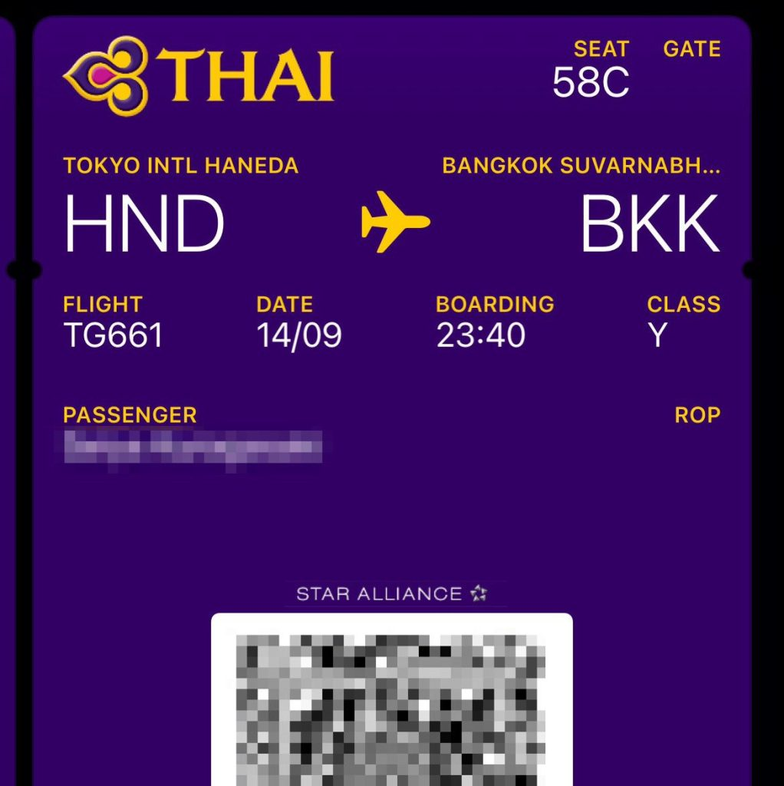](IMG_3955-1022x1024.jpg) 

アプリから事前にチェックインすることができ、iOSであればウォレットにチケットを追加することができました。

チェックイン方法はこちら

  <a rel="noopener" href="https://www.thaiairways.com/ja_JP/travelinfo/airport/i_check_in_GuideJP.page" title="ERROR: The request could not be satisfied" class="blogcard-wrap external-blogcard-wrap a-wrap cf" target="_blank">
  
  

    

      
    
<figure class="blogcard-thumbnail external-blogcard-thumbnail">
    
    
    
    <noscript>
      
    </noscript></figure>
    
    

      

        ERROR: The request could not be satisfied
      

      
      

      

    

    
    

      

        

          
          
          <noscript>
            
          </noscript>
        

        
        

          www.thaiairways.com
        

      

    

  
</a>

バックパックスタイルのため預け入れ荷物もなく、直接保安検査場へと向かえてとてもスムーズでした。

      <strong>スマホでチケットも表示できる</strong>ので、ゲート通るのも楽ちんでした。
  

### 出国審査

久々の出国審査ということでドキドキしましたが、機械にパスポートを読み取らせて顔写真を撮影するだけととても簡単でした。

  <a rel="noopener" href="https://www.moj.go.jp/isa/immigration/resources/nyuukokukanri07_00168.html" title="&#38996;&#35469;&#35388;&#12466;&#12540;&#12488;&#12398;&#26356;&#12394;&#12427;&#27963;&#29992;&#12395;&#12388;&#12356;&#12390;&#65288;&#12362;&#30693;&#12425;&#12379;&#65289; | &#20986;&#20837;&#22269;&#22312;&#30041;&#31649;&#29702;&#24193;" class="blogcard-wrap external-blogcard-wrap a-wrap cf" target="_blank">
  
  

    

      
    
<figure class="blogcard-thumbnail external-blogcard-thumbnail">
    
    
    
    <noscript>
      
    </noscript></figure>
    
    

      

        &#38996;&#35469;&#35388;&#12466;&#12540;&#12488;&#12398;&#26356;&#12394;&#12427;&#27963;&#29992;&#12395;&#12388;&#12356;&#12390;&#65288;&#12362;&#30693;&#12425;&#12379;&#65289; | &#20986;&#20837;&#22269;&#22312;&#30041;&#31649;&#29702;&#24193;
      

      
      

      

    

    
    

      

        

          
          
          <noscript>
            
          </noscript>
        

        
        

          www.moj.go.jp
        

      

    

  
</a>

### 夕食

    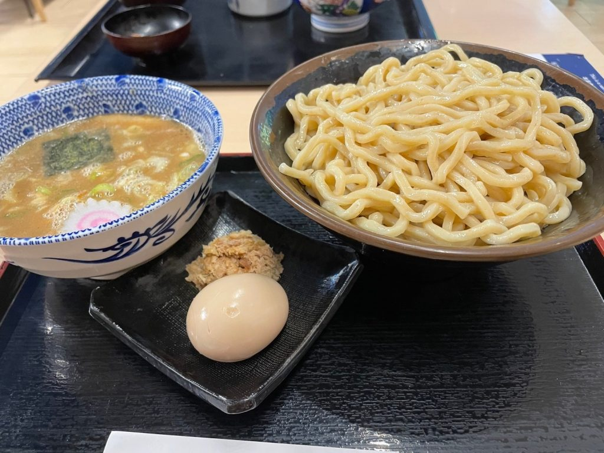](IMG_3956-1024x768.jpg)
      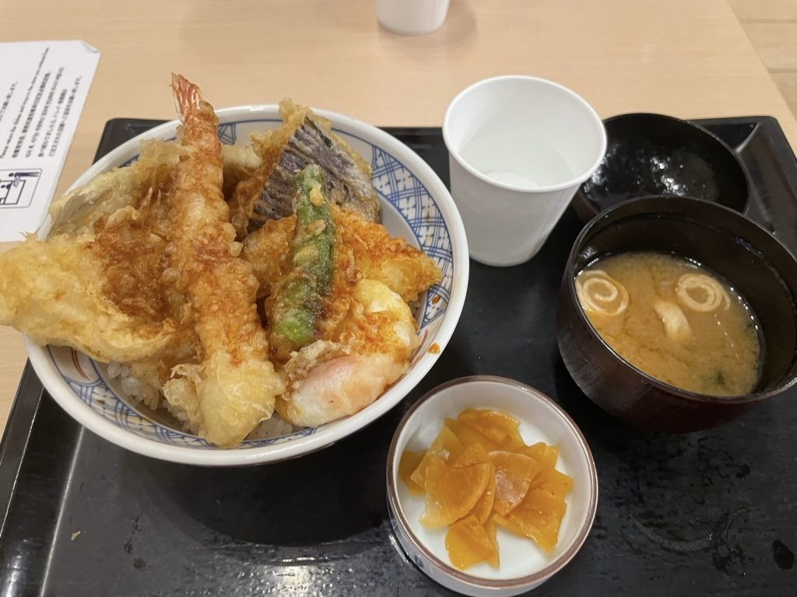](IMG_3957-1024x768.jpg)
  
出国後エリアにて食事しました。

行ったのは「<a rel="noopener" href="https://tokyo-haneda.com/shop_and_dine/detail/tenant_00088.html" target="_blank" title="">六厘舎</a>」と「<a rel="noopener" href="https://tokyo-haneda.com/shop_and_dine/detail/tenant_00077.html" target="_blank" title="">天ぷら　さき亭</a>」。しばらく日本食とはお別れです。

  <a rel="noopener" href="https://tokyo-haneda.com/shop_and_dine/detail/tenant_00088.html" title="六厘舎 | レストラン | レストラン＆ショップ | 羽田空港旅客ターミナル" class="blogcard-wrap external-blogcard-wrap a-wrap cf" target="_blank">
  
  

    

      
    
<figure class="blogcard-thumbnail external-blogcard-thumbnail">
    
    
    
    <noscript>
      
    </noscript></figure>
    
    

      

        六厘舎 | レストラン | レストラン＆ショップ | 羽田空港旅客ターミナル
      

      
      

        六厘舎をご紹介します。羽田空港旅客ターミナル公式サイトです。
      

    

    
    

      

        

          
          
          <noscript>
            
          </noscript>
        

        
        

          tokyo-haneda.com
        

      

    

  
</a>

  <a rel="noopener" href="https://tokyo-haneda.com/shop_and_dine/detail/tenant_00077.html" title="天ぷら　さき亭 | レストラン | レストラン＆ショップ | 羽田空港旅客ターミナル" class="blogcard-wrap external-blogcard-wrap a-wrap cf" target="_blank">
  
  

    

      
    
<figure class="blogcard-thumbnail external-blogcard-thumbnail">
    
    
    
    <noscript>
      
    </noscript></figure>
    
    

      

        天ぷら　さき亭 | レストラン | レストラン＆ショップ | 羽田空港旅客ターミナル
      

      
      

        天ぷら　さき亭をご紹介します。羽田空港旅客ターミナル公式サイトです。
      

    

    
    

      

        

          
          
          <noscript>
            
          </noscript>
        

        
        

          tokyo-haneda.com
        

      

    

  
</a>

## タイ国際航空：羽田空港〜スワンナプーム空港

](IMG_3958-1024x768.jpg) 

飛行機内での記録です。

### 機内

    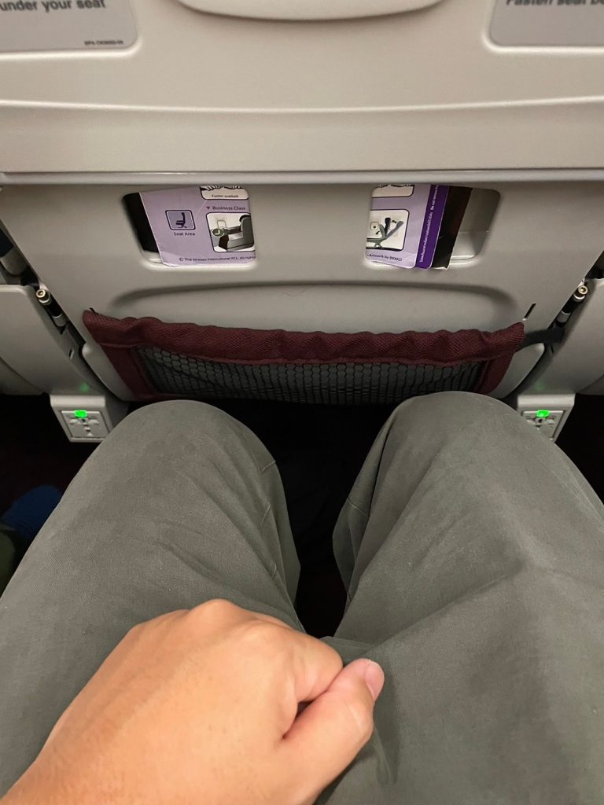](IMG_3959-768x1024.jpg)
      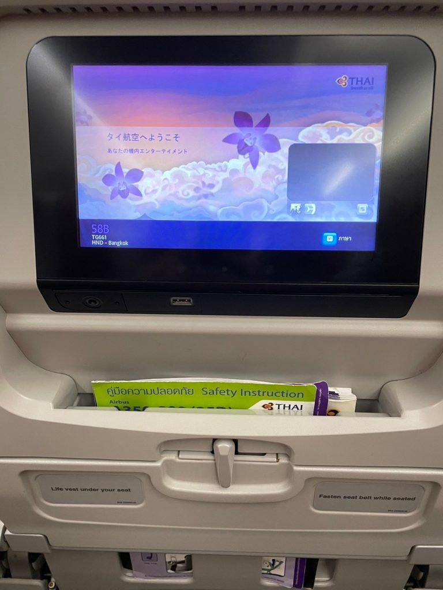](IMG_3960-768x1024.jpg)
  
座席はエコノミーであまり余裕はない感じでした。

モニターでは有名な映画であれば日本語翻訳で見れるのがいくつかありましが、ほとんど英語でした。

### 機内食

    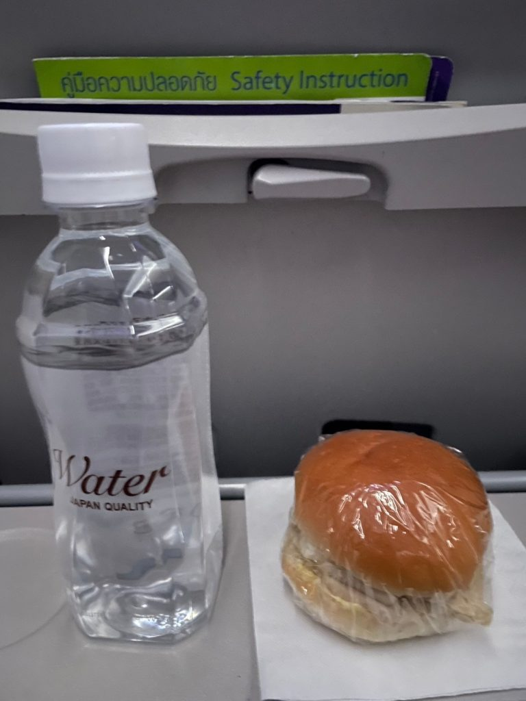](IMG_3962-768x1024.jpg)
      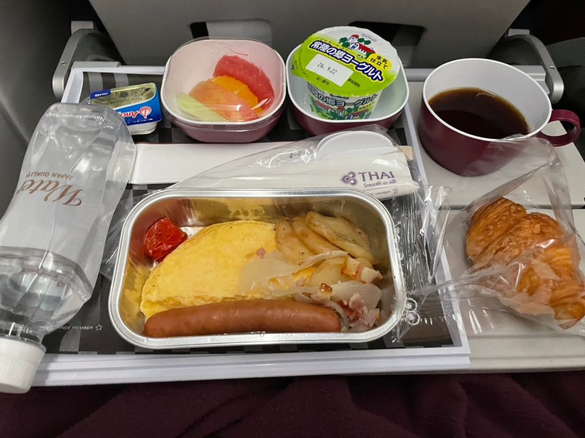](IMG_3961-1024x768.jpg)
  
出発してすぐに水と軽食が来ました。時刻は0時55分。眠れないのでひとまず食べる。

そして4時間後には朝食が来ました。どれも美味しくいただけました。

## タイ到着：スワンナプーム空港

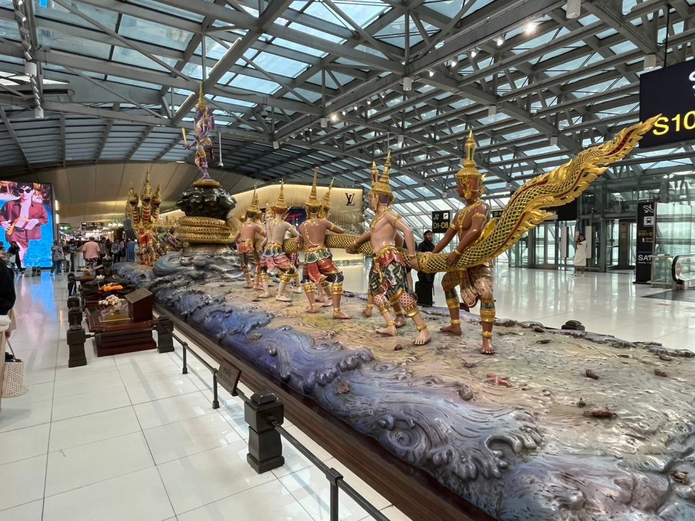](IMG_3964-1024x768.jpg) 

遅延して6時間弱のフライトでタイへ到着。

事前に購入したeSIMも楽天モバイルも問題なく使えました。

<a rel="nofollow" href="https://px.a8.net/svt/ejp?a8mat=3ZHJ8N+1CTKDU+399O+644DT"> ](1_bgtaid241003175082wid001eno01mids00000015198001027000mc1.png)</a>](img_66fe293eaf559.gif) 

### 入国審査

こんな流れでした。

<ul class="wp-block-list">
  <li>
    パスポートを渡す
  </li>
  <li>
    顔写真と指紋を取る
  </li>
  <li>
    質問は<strong>日本語でした</strong>！ <ul class="wp-block-list">
      <li>
        何人できた？　＞　2人
      </li>
      <li>
        いつ帰る？　＞　今日
      </li>
      <li>
        トランジット？　＞　Yes
      </li>
      <li>
        行き先どこ？　＞　ロンドン
      </li>
    </ul>
  </li>
  
  <li>
    あとはスタンプが押され、無事入国
  </li>
</ul>

顔写真と指紋をスキャンする機械はこんなやつでした。

  <a rel="noopener" href="https://thai-miya.net/airport/" title="タイの空港で生体認証システムが導入されました。" class="blogcard-wrap external-blogcard-wrap a-wrap cf" target="_blank">
  
  

    

      
    
<figure class="blogcard-thumbnail external-blogcard-thumbnail">
    
    
    
    <noscript>
      
    </noscript></figure>
    
    

      

        タイの空港で生体認証システムが導入されました。
      

      
      

        タイの空港で生体認証システムが５月末頃から導入されました。生体認証システムはアメリカ合衆国が世界で最初に始めました。イミグレ審査の前に指紋認証システムの機械が設置されています。右手の指4本、左手の指4本、両手の親指と順に機械にかざして指紋を...
      

    

    
    

      

        

          
          
          <noscript>
            
          </noscript>
        

        
        

          thai-miya.net
        

      

    

  
</a>

### 荷物預け：SmileLugg

当日klookにて予約して、メールで送られてくるQRコードを見せたらスムーズでした。

荷物を預けたら返却時に必要なレシートをもらうので、無くさないように持っておきます。

  <a rel="noopener" href="https://www.klook.com/ja/activity/77919-bangkok-luggage-storage-smilelugg/" title="klook.com" class="blogcard-wrap external-blogcard-wrap a-wrap cf" target="_blank">
  
  

    

      
    
<figure class="blogcard-thumbnail external-blogcard-thumbnail">
    
    
    
    <noscript>
      
    </noscript></figure>
    
    

      

        klook.com
      

      
      

      

    

    
    

      

        

          
          
          <noscript>
            
          </noscript>
        

        
        

          www.klook.com
        

      

    

  
</a>

場所は空港地下でエアポートレイルリンク乗り場のすぐ近くです。近くに両替所もあったのでそこでバーツも手に入れました。

2個の預け入れで846円でした。事前に以下のブログを見ていたのでお店の場所・やり取りが事前に知れて良かったです。

  <a rel="noopener" href="https://pattayalife.net/archives/65091" title="&#12473;&#12527;&#12531;&#12490;&#12503;&#12540;&#12512;&#31354;&#28207;&#12398;&#33655;&#29289;&#38928;&#12363;&#12426;&#25152; 24&#26178;&#38291;&#21942;&#26989;1&#26085;100&#12496;&#12540;&#12484; - &#12497;&#12479;&#12516;&#21315;&#22812;&#19968;&#22812;" class="blogcard-wrap external-blogcard-wrap a-wrap cf" target="_blank">
  
  

    

      
    
<figure class="blogcard-thumbnail external-blogcard-thumbnail">
    
    
    
    <noscript>
      
    </noscript></figure>
    
    

      

        &#12473;&#12527;&#12531;&#12490;&#12503;&#12540;&#12512;&#31354;&#28207;&#12398;&#33655;&#29289;&#38928;&#12363;&#12426;&#25152; 24&#26178;&#38291;&#21942;&#26989;1&#26085;100&#12496;&#12540;&#12484; - &#12497;&#12479;&#12516;&#21315;&#22812;&#19968;&#22812;
      

      
      

      

    

    
    

      

        

          
          
          <noscript>
            
          </noscript>
        

        
        

          pattayalife.net
        

      

    

  
</a>

      しかし、預け場所が汚かったのか<strong>バックパックの底が汚れていました</strong>。。。
  
  
      スーツケースだとタイヤがあるから目立たないかも。
  

## タイ観光：ワット・アルンとワット・ポー

    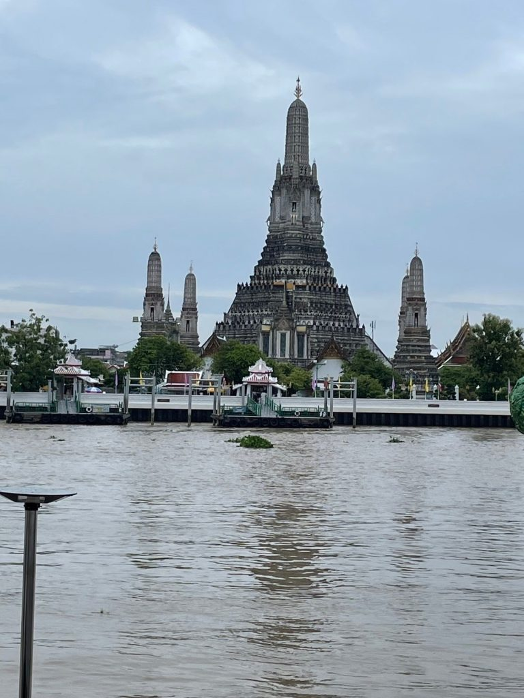](IMG_3970-768x1024.jpg)
      ](IMG_3976-768x1024.jpg)
  
ワット・アルンを川挟んで眺めてから、ワット・ポーまで行きました。

### スワンナプーム空港からワット・ポーまでの行き方

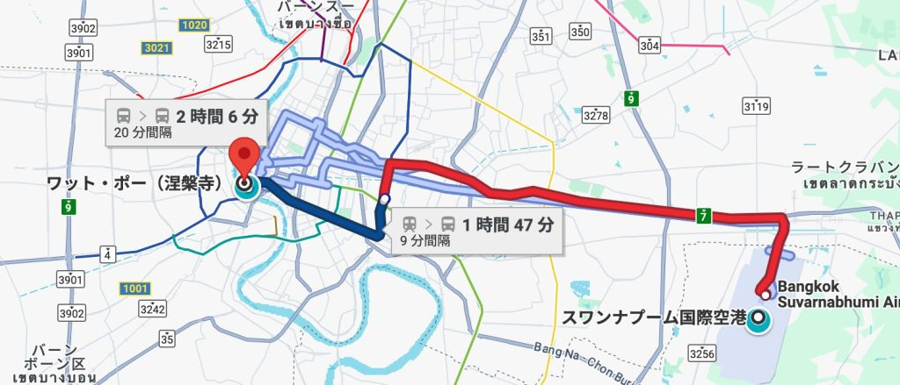](image-1-1024x439.jpg) 

空港からマッカサン駅までエアポートレイルリンクで向かい、マッカサン駅からは地下鉄 MRTブルーラインに乗り換えてサナームチャイ駅まで行きました。

Googleマップ上だと何故か空港をぐるぐる歩いてる距離が足されているのですが、ワット・ポー最寄駅までは1時間もかからなかったです。

  <a rel="noopener" href="https://maps.app.goo.gl/VKcSzJ6wCoY9frpr6" title="スワンナプーム国際空港 to ワット・ポー（涅槃寺）" class="blogcard-wrap external-blogcard-wrap a-wrap cf" target="_blank">
  
  

    

      
    
<figure class="blogcard-thumbnail external-blogcard-thumbnail">
    
    
    
    <noscript>
      
    </noscript></figure>
    
    

      

        スワンナプーム国際空港 to ワット・ポー（涅槃寺）
      

      
      

      

    

    
    

      

        

          
          
          <noscript>
            
          </noscript>
        

        
        

          maps.app.goo.gl
        

      

    

  
</a>

### バンコクの電車

    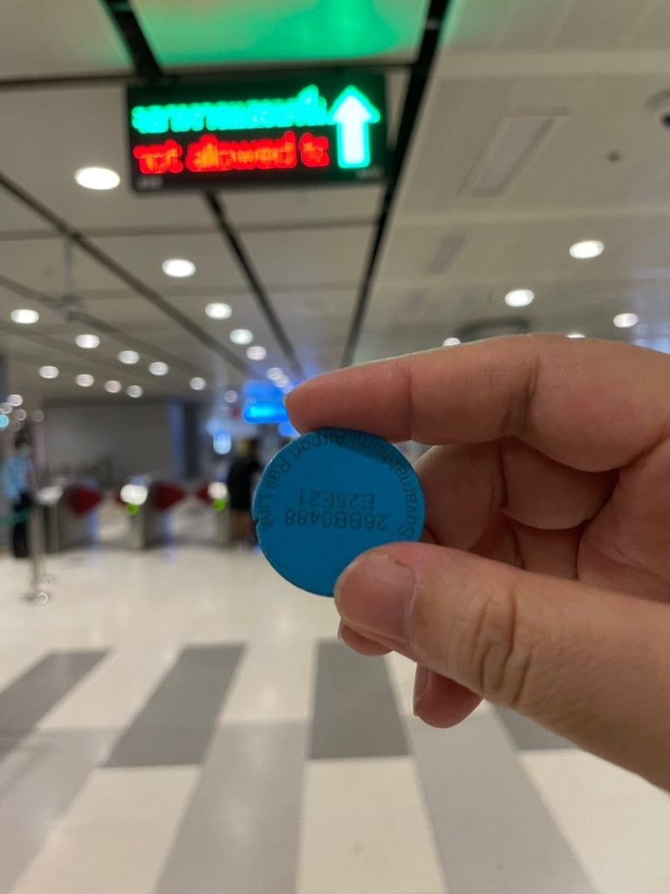](IMG_3965-768x1024.jpg)
      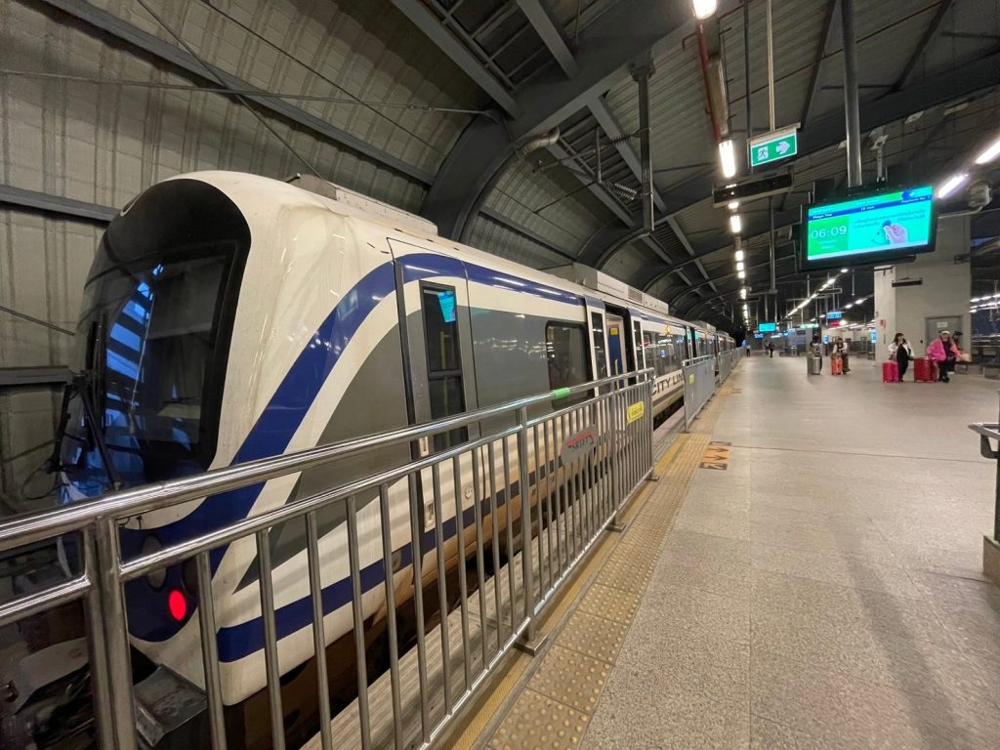](IMG_3967-1024x768.jpg)
  
切符は現金で購入し、おもちゃのコインみたいなのを改札に通します。

電車の座席はスタジアムの椅子のように固く、快適ではなかったです。

### バンコクのトイレ事情

着いてから知ったのですが、バンコクの駅にはトイレがないようです。

少し焦りましたが、**駅員さんに聞いたらトイレを借りることができました！**カードキーで開く扉の向こうにあったので駅員さんに聞いて、開けてもらわなきゃ辿り着けません。コップンカー。コップンカー。

事前に各国のトイレ事情は調べておくべきですね。

      バンコクでは<strong>駅にトイレがないのがほとんど</strong>！　
  
  
      駅では「トイレに行きたい方は駅員に！」という案内があるぐらいです。
  
  
      「トイレはどこですか？」 ＝ 「<strong>ホーンナーム　ユー　ティナイ？</strong>」で乗り越えましょう。
  

### ワット・アルンを眺めに

    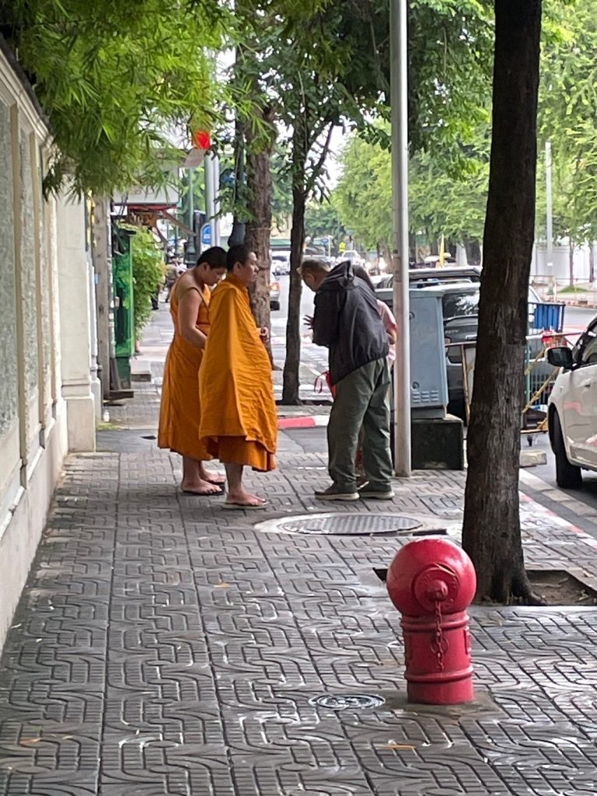](IMG_3969-768x1024.jpg)
      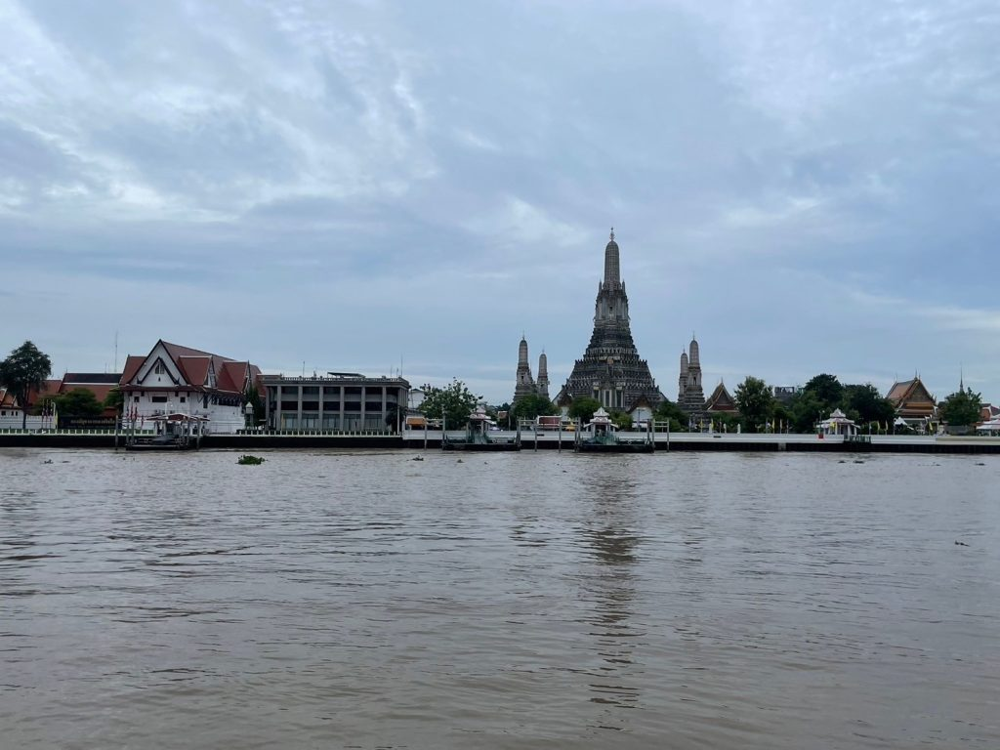](IMG_3990-1024x768.jpg)
  
時刻は7時前後。最寄駅から歩いてワット・アルンが見える川沿いまで向かいます。

道中ではお供え物をお坊さんに渡す様子が見れました。

ワット・アルンを見れたので、ワット・ポーへと向かいます。

ワット・アルンを眺めた場所はここです。

  <a rel="noopener" href="https://maps.app.goo.gl/ijXDSA11fdqD7yNVA" title="Public View Point · 44 Maha Rat Rd, Phra Borom Maha Ratchawang, Phra Nakhon, Bangkok 10200 タイ" class="blogcard-wrap external-blogcard-wrap a-wrap cf" target="_blank">
  
  

    

      
    
<figure class="blogcard-thumbnail external-blogcard-thumbnail">
    
    
    
    <noscript>
      
    </noscript></figure>
    
    

      

        Public View Point · 44 Maha Rat Rd, Phra Borom Maha Ratchawang, Phra Nakhon, Bangkok 10200 タイ
      

      
      

        ★★★★★ · 景勝地
      

    

    
    

      

        

          
          
          <noscript>
            
          </noscript>
        

        
        

          maps.app.goo.gl
        

      

    

  
</a>

### 猫がいっぱい。ワット・ポーへ

    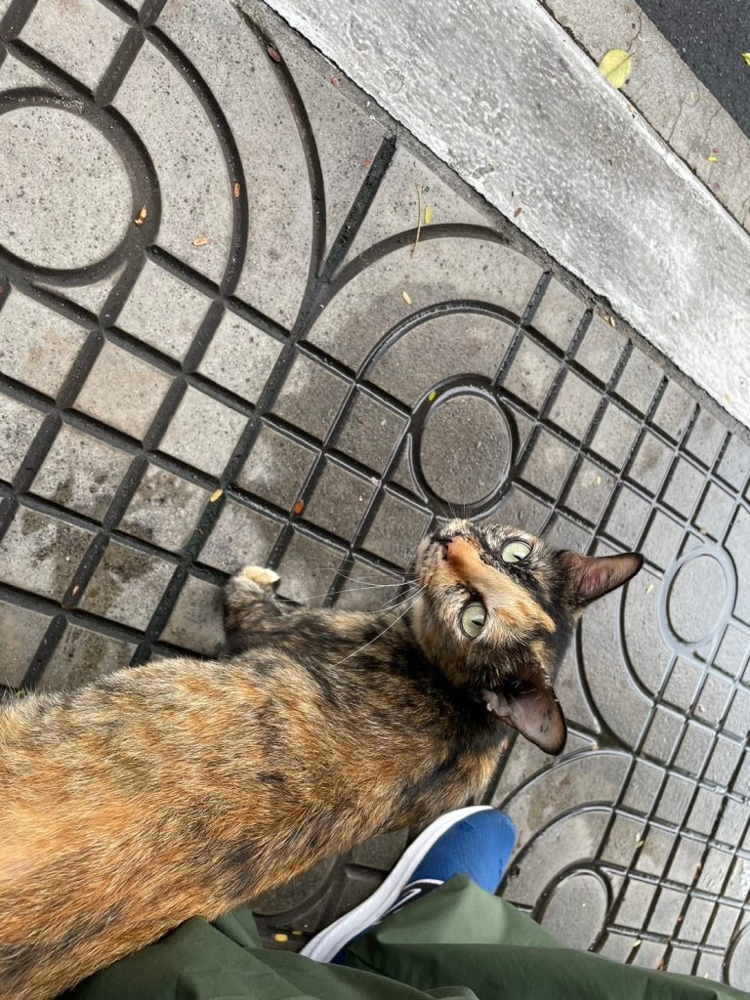](IMG_3991-768x1024.jpg)
      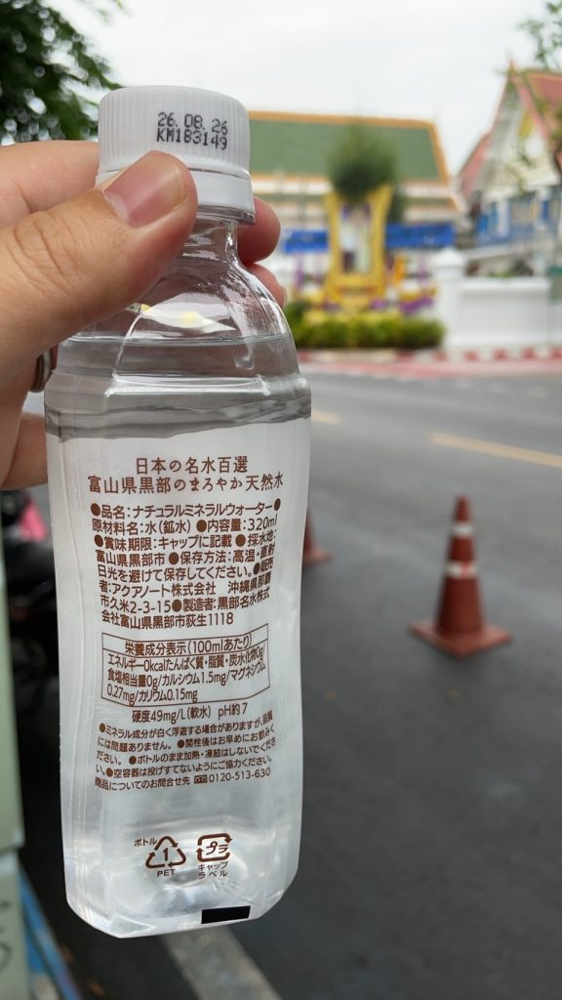](IMG_3992-576x1024.jpg)
  
開店前に着いてしまったので、入口近くのベンチで休憩。野良猫が寄ってきました。

早朝でも湿度が高く、ここまで歩いただけで汗だくのため水は必須です。（機内でもらった水）

モバイルバッテリーを持ってきたので休憩中にスマホを充電できて便利でした。

ワット・ポーは2人で入場料 300バーツと108の壺で40バーツを支払いました。（2,808円）

入口入って、左手の受付で支払います。開店と同時だったので、空いててほぼ貸切状態。

    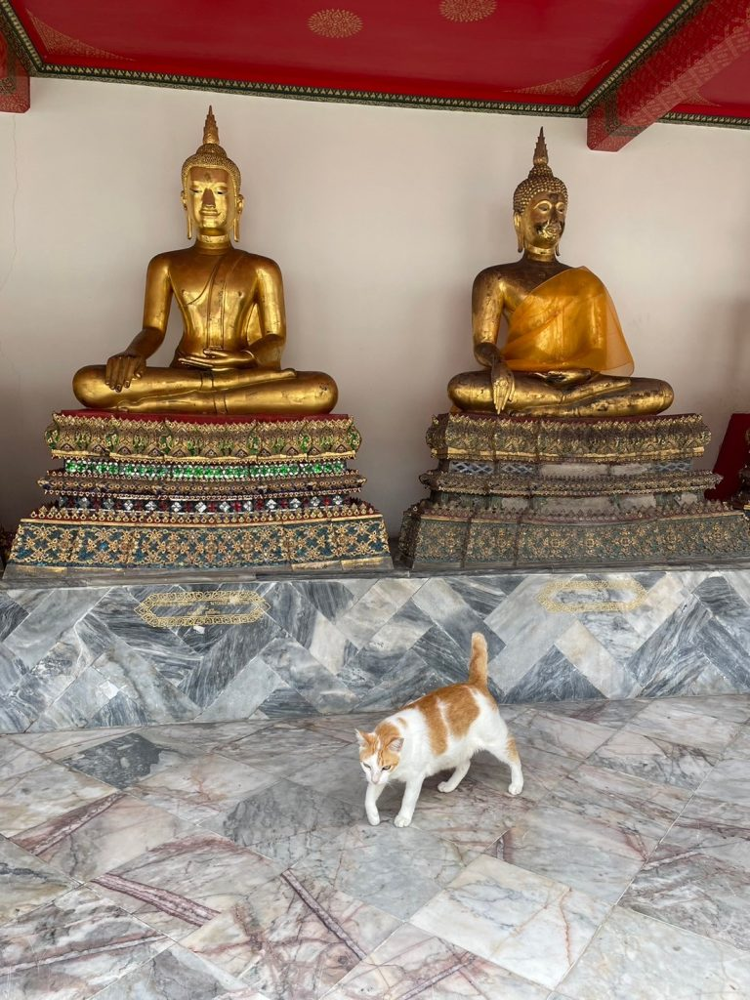](IMG_3973-768x1024.jpg)
      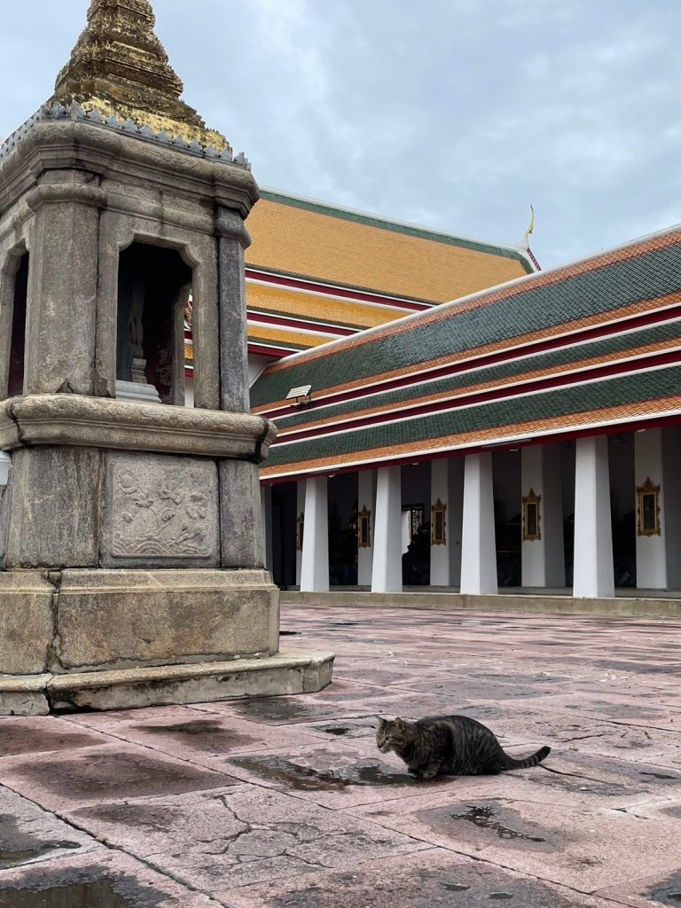](IMG_3974-768x1024.jpg)
      ](IMG_3975-768x1024.jpg)
  
敷地内には猫がいっぱい。

    ](IMG_3972-768x1024.jpg)
      ](IMG_3976-768x1024.jpg)
      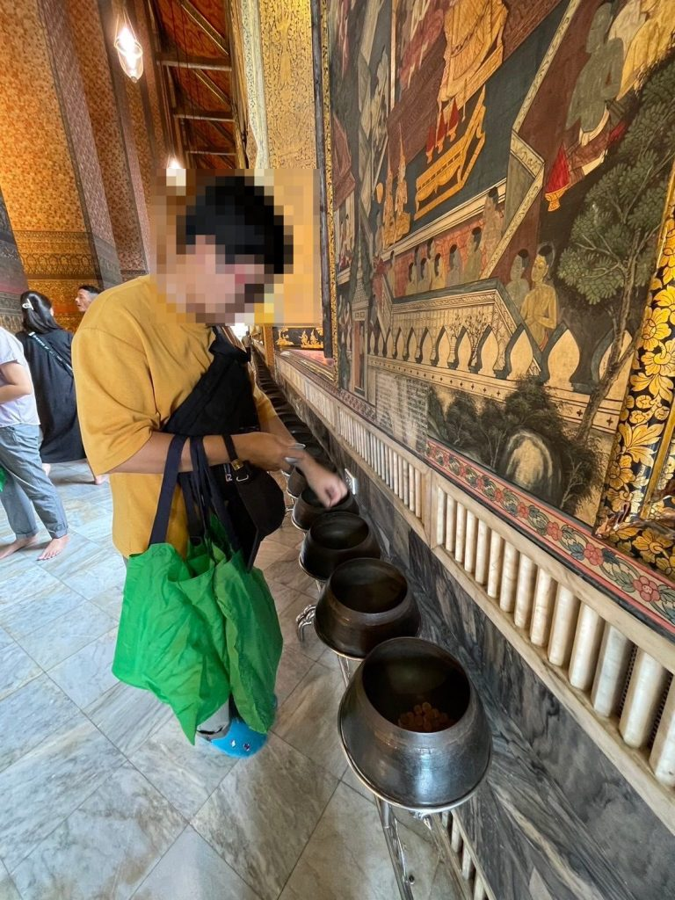](IMG_3977-768x1024.jpg)
  
108の壺にお金を入れると煩悩を捨てられるらしい。

2時間ほど観光し、空港に戻りました。

      ワット・ポーには<strong>冷房の効いた綺麗なトイレ</strong>があります。ここでトイレを済ませることをおすすめします。
  

## タイ出発：スワンナプーム空港

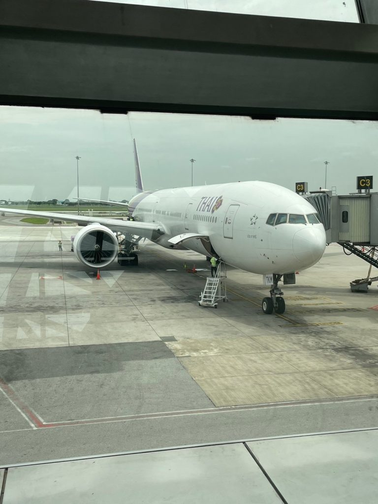](IMG_3983-768x1024.jpg) 

空港に着いたら荷物を預けたSmileLuggに向かい、荷物を受け取ります。

レシートを渡すだけで、荷物を渡してくれます。コップンカー。

### 出国審査

入国審査は質問もあって少しドキドキしましたが、出国はパスポートを機械にかざして、顔認証するだけでした。

スムーズ！こんな機械でした。

  <a rel="noopener" href="https://www.wisebk.com/news/231212/" title="https://www.wisebk.com/news/231212/" class="blogcard-wrap external-blogcard-wrap a-wrap cf" target="_blank">
  
  

    

      
    
<figure class="blogcard-thumbnail external-blogcard-thumbnail">
    
    
    
    <noscript>
      
    </noscript></figure>
    
    

      

        https://www.wisebk.com/news/231212/
      

      
      

      

    

    
    

      

        

          
          
          <noscript>
            
          </noscript>
        

        
        

          www.wisebk.com
        

      

    

  
</a>

### 昼食

    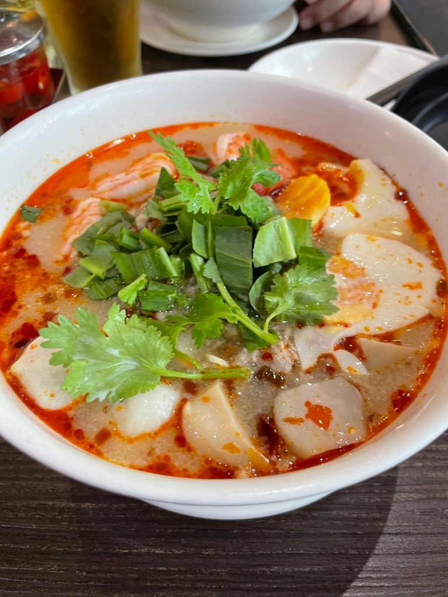](IMG_3980-768x1024.jpg)
      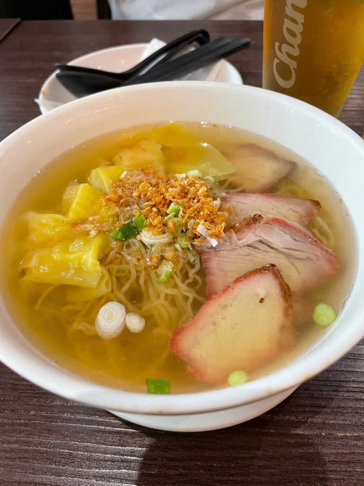](IMG_3981-768x1024.jpg)
      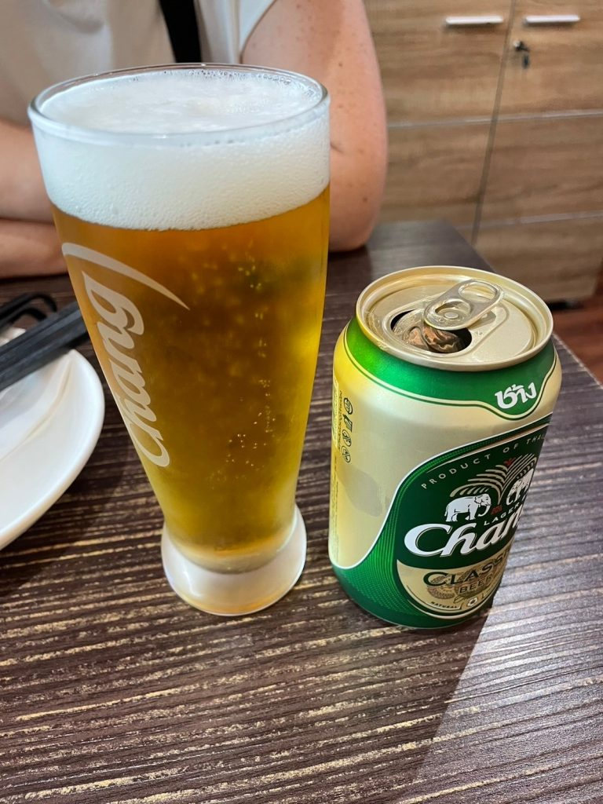](IMG_3982-768x1024.jpg)
  
タイに来て初めての食事です。出発エリアのレストラン「<a rel="noopener" href="https://maps.app.goo.gl/DNRwU5yZG9P9jXJA7" target="_blank" title="">Aroi</a>」でヌードルとビールをいただきました。

独特の香りがするスープでタイを感じれました。全部で825バーツと空港価格のようです。（3,611円）

  <a rel="noopener" href="https://maps.app.goo.gl/DNRwU5yZG9P9jXJA7" title="Aroi · 999 หมู่ 1 ถนน ท่าอากาศยาน สุวรรณภูมิ 3, Nong Prue, Bang Phli District, Samut Prakan 10540 タイ" class="blogcard-wrap external-blogcard-wrap a-wrap cf" target="_blank">
  
  

    

      
    
<figure class="blogcard-thumbnail external-blogcard-thumbnail">
    
    
    
    <noscript>
      
    </noscript></figure>
    
    

      

        Aroi · 999 หมู่ 1 ถนน ท่าอากาศยาน สุวรรณภูมิ 3, Nong Prue, Bang Phli District, Samut Prakan 10540 タイ
      

      
      

        ★★★☆☆ · アジア料理店
      

    

    
    

      

        

          
          
          <noscript>
            
          </noscript>
        

        
        

          maps.app.goo.gl
        

      

    

  
</a>

## タイ国際航空：スワンナプーム空港〜ヒースロー空港

**12時間**とこの旅最長フライトの記録です。（帰りも同じ時間のフライトあり）

### 機内

    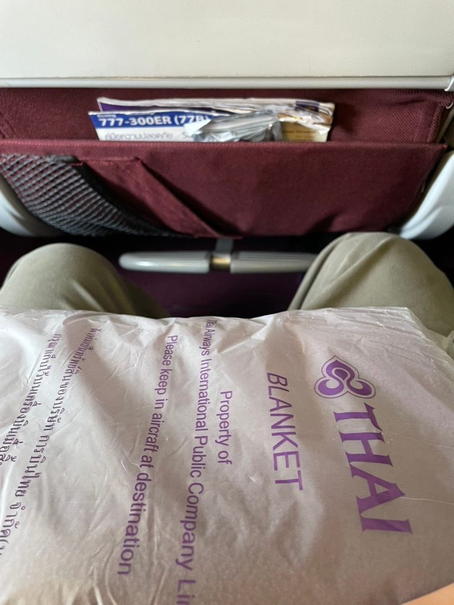](IMG_3984-768x1024.jpg)
      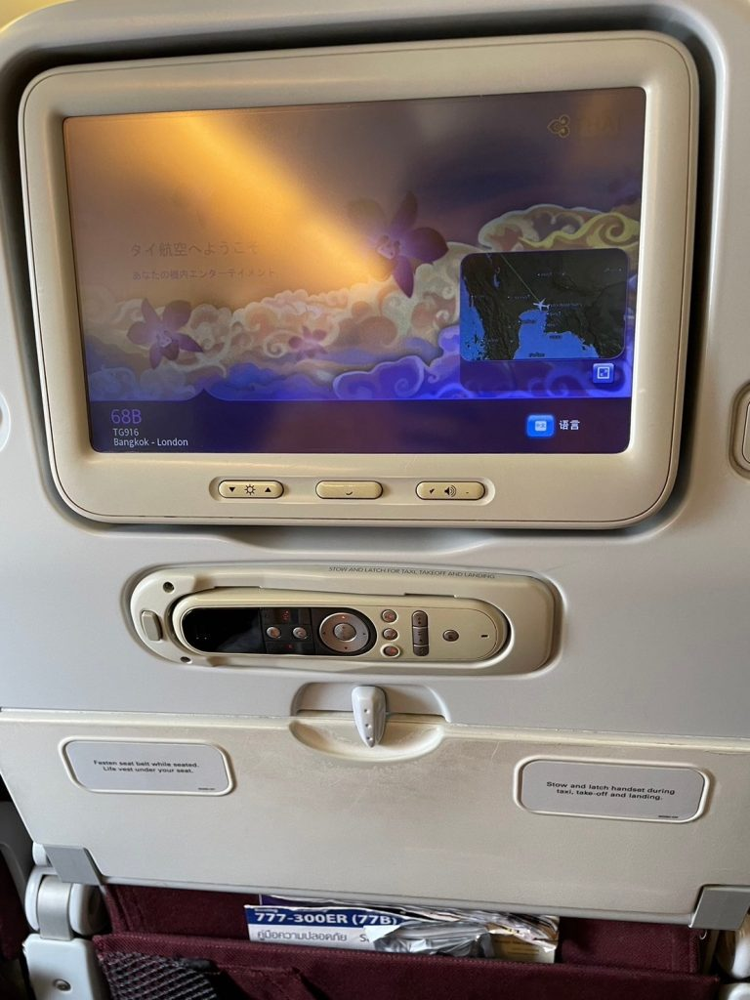](IMG_3985-768x1024.jpg)
  
モニターは機種が古いものとなっていました。映画のラインナップは一緒でした。

シートの広さは日本から乗ってきた機体と変わらず。

### 機内食：昼

乗ってから2時間ほどで機内食が配られました。

洋食だったので飲み物は白ワインを選択。その後ビールも飲みました。サラダの謎肉以外は美味しかったです。

    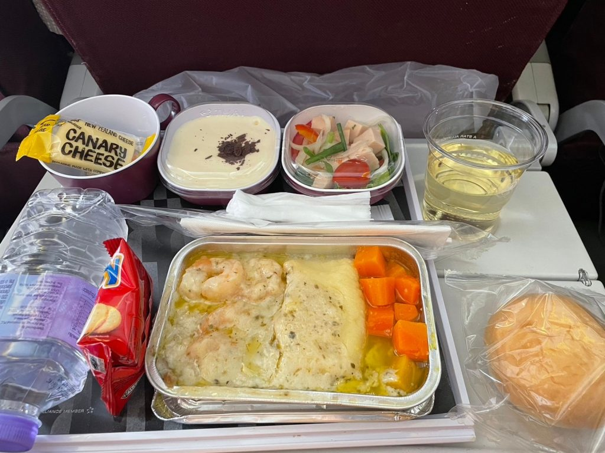](IMG_3986-1024x768.jpg)
      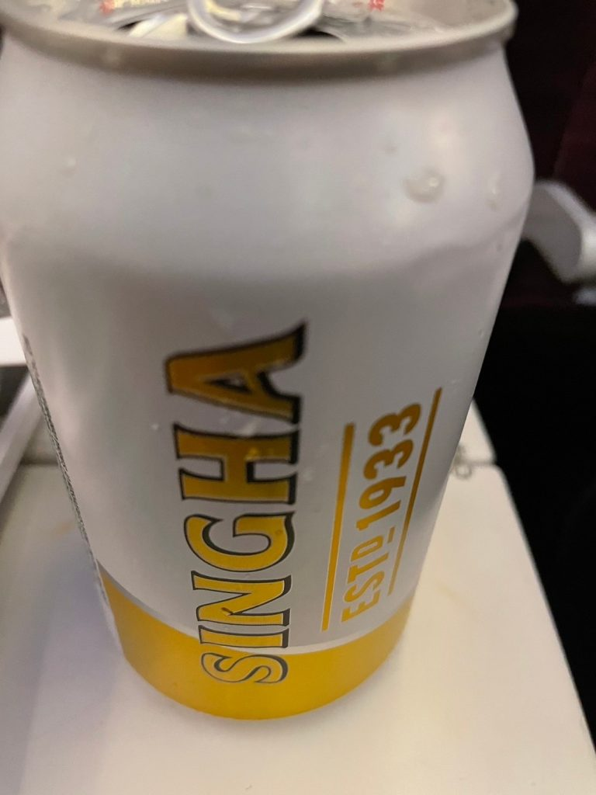](IMG_3989-768x1024.jpg)
  
### 機内食：夜

    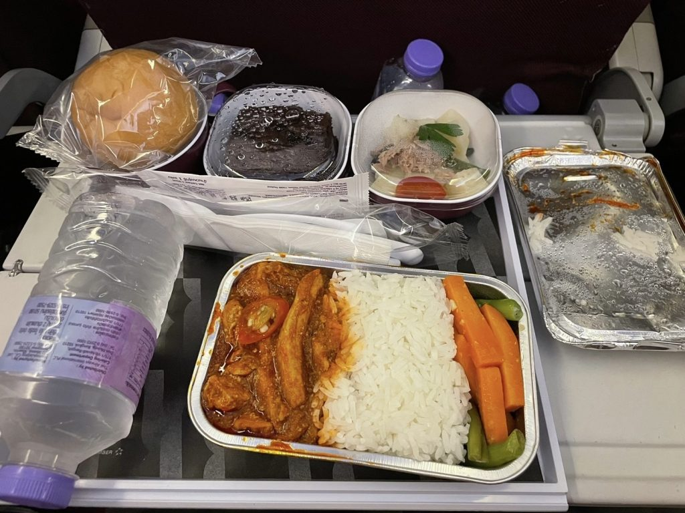](IMG_3987-1024x768.jpg)
      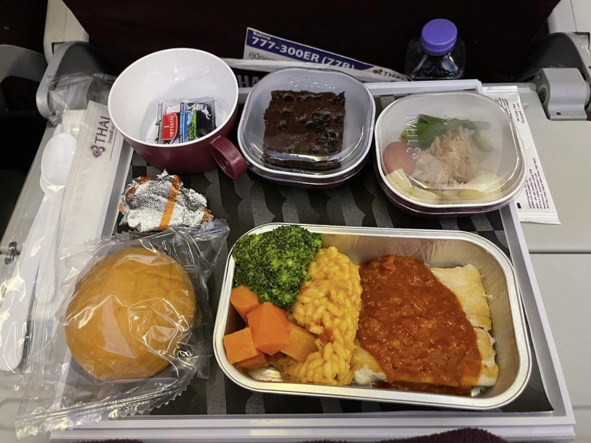](IMG_3988-1024x768.jpg)
  
最初の機内食から5時間後ぐらいに2回目の機内食が配られました。

ふたりで別々のメニューを選択。どちらも美味しく。カレーは辛旨でした。

初の長時間フライトということもあり、退屈せずに過ごすことができました。

ぐっすり寝るにはビジネスクラスぐらいじゃないと寝れないかなーという感想です。

## ロンドンへ

次の記事では2泊3日のロンドン観光を紹介していきます！

  <a href="https://arukayies.com/diy/travel/europe-honeymoon-london-tourism" title="【予算は100万円！個人手配で行くヨーロッパ新婚旅行】2泊3日のロンドン観光編" class="blogcard-wrap internal-blogcard-wrap a-wrap cf" target="_blank">
  
  

    

      
    
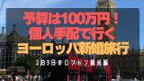](アイキャッチ画像-66fdf1103f7bf-160x90.jpg)
    
    

      

        【予算は100万円！個人手配で行くヨーロッパ新婚旅行】2泊3日のロンドン観光編
      

      
      

        くらこんにちは！この記事を見ていただいている方、ご興味を持っていただいた方、ありがとうございます。タイトルの通りヨーロッパへ新婚旅行に行きました。くら前回はトランジット8時間でタイ観光編をまとめました。くらこの記事ではロンドン観光の記録にな...
      

    

    
    

      

        

          
          
          <noscript>
            
          </noscript>
        

        
        

          arukayies.com
        

      

      
      

        

          2024.10.30
        

      

    

  
</a>

  <a href="https://arukayies.com/diy/travel/europe-honeymoon-summary" title="【予算は100万円！個人手配で行くヨーロッパ新婚旅行】3カ国を巡った様子のまとめ" class="blogcard-wrap internal-blogcard-wrap a-wrap cf" target="_blank">
  
  

    

      
    
](アイキャッチ画像-6721c6d77511e-160x90.jpg)
    
    

      

        【予算は100万円！個人手配で行くヨーロッパ新婚旅行】3カ国を巡った様子のまとめ
      

      
      

        くらこんにちは！この記事を見ていただいている方、ご興味を持っていただいた方、ありがとうございます。タイトルの通りヨーロッパへ新婚旅行に行きました。ここまでヨーロッパ新婚旅行（ロンドン、ブダペスト、パリ）シリーズをお伝えしてきました。今回はそ...
      

    

    
    

      

        

          
          
          <noscript>
            
          </noscript>
        

        
        

          arukayies.com
        

      

      
      

        

          2024.10.30
        

      

    

  
</a>

