こんにちは！
この記事を見ていただいている方、ご興味を持っていただいた方、ありがとうございます。

タイトルの通りヨーロッパへ新婚旅行に行きました。

前回は2泊3日のロンドン観光編をまとめました。

  <a href="https://arukayies.com/diy/travel/europe-honeymoon-london-tourism" title="【予算は100万円！個人手配で行くヨーロッパ新婚旅行】2泊3日のロンドン観光編" class="blogcard-wrap internal-blogcard-wrap a-wrap cf" target="_blank">
  
  

    

      
    
](アイキャッチ画像-66fdf1103f7bf-160x90.jpg)
    
    

      

        【予算は100万円！個人手配で行くヨーロッパ新婚旅行】2泊3日のロンドン観光編
      

      
      

        くらこんにちは！この記事を見ていただいている方、ご興味を持っていただいた方、ありがとうございます。タイトルの通りヨーロッパへ新婚旅行に行きました。くら前回はトランジット8時間でタイ観光編をまとめました。くらこの記事ではロンドン観光の記録にな...
      

    

    
    

      

        

          
          
          <noscript>
            
          </noscript>
        

        
        

          arukayies.com
        

      

      
      

        

          2024.10.30
        

      

    

  
</a>

この記事ではブダペスト観光 前編の記録になります。

後編はこちら

  <a href="https://arukayies.com/diy/travel/europe-honeymoon-budapest-tourism-part2" title="【予算は100万円！個人手配で行くヨーロッパ新婚旅行】3泊4日のブダベスト観光 後編" class="blogcard-wrap internal-blogcard-wrap a-wrap cf" target="_blank">
  
  

    

      
    
](アイキャッチ画像-67071813cc15b-160x90.jpg)
    
    

      

        【予算は100万円！個人手配で行くヨーロッパ新婚旅行】3泊4日のブダベスト観光 後編
      

      
      

        くらこんにちは！この記事を見ていただいている方、ご興味を持っていただいた方、ありがとうございます。タイトルの通りヨーロッパへ新婚旅行に行きました。くら前回はブダペスト観光 前編をまとめました。3日目：セーチェーニ温泉とフォアグラを食べにブダ...
      

    

    
    

      

        

          
          
          <noscript>
            
          </noscript>
        

        
        

          arukayies.com
        

      

      
      

        

          2024.10.30
        

      

    

  
</a>

  <a href="https://arukayies.com/diy/travel/europe-honeymoon-summary" title="【予算は100万円！個人手配で行くヨーロッパ新婚旅行】3カ国を巡った様子のまとめ" class="blogcard-wrap internal-blogcard-wrap a-wrap cf" target="_blank">
  
  

    

      
    
](アイキャッチ画像-6721c6d77511e-160x90.jpg)
    
    

      

        【予算は100万円！個人手配で行くヨーロッパ新婚旅行】3カ国を巡った様子のまとめ
      

      
      

        くらこんにちは！この記事を見ていただいている方、ご興味を持っていただいた方、ありがとうございます。タイトルの通りヨーロッパへ新婚旅行に行きました。ここまでヨーロッパ新婚旅行（ロンドン、ブダペスト、パリ）シリーズをお伝えしてきました。今回はそ...
      

    

    
    

      

        

          
          
          <noscript>
            
          </noscript>
        

        
        

          arukayies.com
        

      

      
      

        

          2024.10.30
        

      

    

  
</a>

## 1日目：リスト・フェレンツ国際空港〜ホテルへ

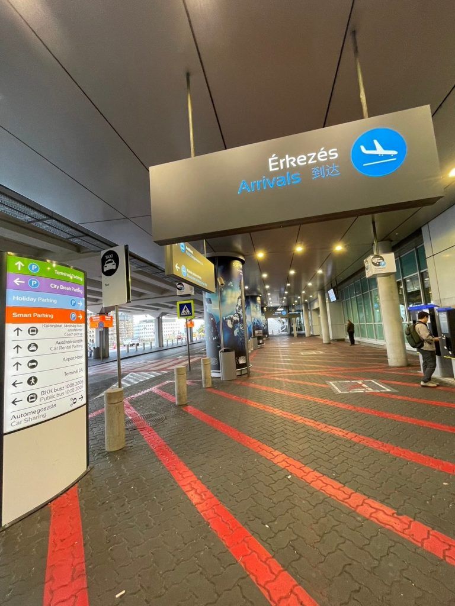](IMG_4814-768x1024.jpg) 

定刻から1時間ほど遅れてリスト・フェレンツ国際空港到着です。

ハンガリーでも事前に購入したeSIMも楽天モバイルも問題なく使えました。

<a rel="nofollow" href="https://px.a8.net/svt/ejp?a8mat=3ZHJ8N+1CTKDU+399O+644DT"> ](31_bgtaid241003175082wid001eno01mids00000015198001027000mc1.png)</a>](img_66fe59b996a7f.gif) 

### 17時：リスト・フェレンツ国際空港到着・入国手続き・ホテルへ移動

入国審査は**パスポート渡すだけで済みました**。

この後は100Eバスでホテルへと移動しますが、**切符を購入するときにトラブル発生**！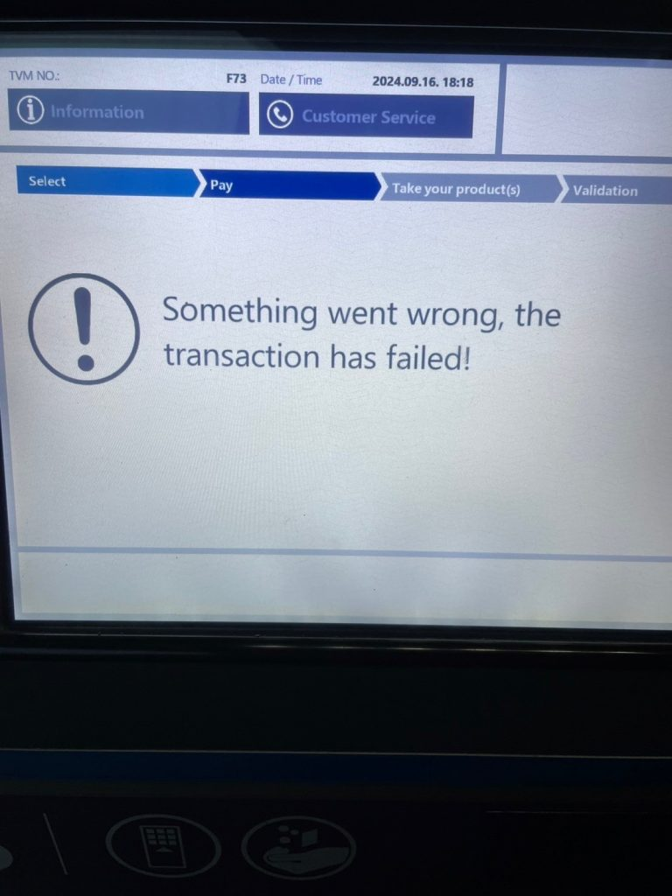](IMG_4815-768x1024.jpg) 

何度試しても**クレジットカードの決済に失敗**し、バスの切符が買えません。

現金があれば買えそうだったのですが、空港内に戻ったらチケットカウンターを見つけたので**そこではクレジットカードで購入できました！**

※バス車内でも入るとクレカタッチで乗れそうだったのでそこで買えば良かったかもしれません。

この旅行中に**3回クレジットカードの決済に失敗する場面**があったのですが、**有効だった解決方法は3Dセキュアの設定を切り替えるでした！**

      事前準備編でも書きましたが、<strong>クレジットカード会社への海外利用通知は行った方が良いです！</strong>
  
  
  

    <a href="https://arukayies.com/diy/travel/europe-honeymoon-preparation#toc22" title="【予算は100万円！個人手配で行くヨーロッパ新婚旅行】事前準備編" class="blogcard-wrap internal-blogcard-wrap a-wrap cf" target="_blank">
    
    

      

        
      
](アイキャッチ画像-66fb8c4ad58b7-160x90.jpg)
      
      

        

          【予算は100万円！個人手配で行くヨーロッパ新婚旅行】事前準備編
        

        
        

          くらこんにちは！この記事を見ていただいている方、ご興味を持っていただいた方、ありがとうございます。タイトルの通りヨーロッパへ新婚旅行に行きました。くらしかし、夫婦で行ったのは台湾のみとほとんど海外旅行の経験はありません。英語も話せず、しかも...
        

      

      
      

        

          

            
            
            <noscript>
              
            </noscript>
          

          
          

            arukayies.com
          

        

        
        

          

            2024.10.30
          

        

      

    
</a>
  

  
      それでも決済エラーとなった場合に有効だった解決方法は、 <strong>3Dセキュア設定を一時的に無効にする</strong> でした！
  
  
      BudapestGOというアプリで決済を行う時は <strong>3Dセキュア設定を無効にする</strong> ことで使えるようになり、
  
  
      この後のルーブル美術館の予約では <strong>3Dセキュア設定を有効に戻す</strong> 必要がありました！
  

](IMG_4816-768x1024.jpg) 

無事バスに乗車でき、ブダペスト市内に向かいます。降りるのは終点なので楽ちんです。

空港からの移動方法などはこちらが参考になりました！

  <a rel="noopener" href="https://maps.app.goo.gl/S4BsNyeP64keS3Zq7" title="リスト・フェレンツ国際空港 to Deák Ferenc tér M" class="blogcard-wrap external-blogcard-wrap a-wrap cf" target="_blank">
  
  

    

      
    
<figure class="blogcard-thumbnail external-blogcard-thumbnail">
    
    
    
    <noscript>
      
    </noscript></figure>
    
    

      

        リスト・フェレンツ国際空港 to Deák Ferenc tér M
      

      
      

      

    

    
    

      

        

          
          
          <noscript>
            
          </noscript>
        

        
        

          maps.app.goo.gl
        

      

    

  
</a>

  <a rel="noopener" href="https://www.hungary-travel-living.org/liszt-ferenc-airport-access/#index_id2" title="【徹底案内】ブダペスト空港⇔市内へのアクセス5選　現地在住者がおすすめ度も紹介 | 旅して暮らすハンガリー" class="blogcard-wrap external-blogcard-wrap a-wrap cf" target="_blank">
  
  

    

      
    
<figure class="blogcard-thumbnail external-blogcard-thumbnail">
    
    
    
    <noscript>
      
    </noscript></figure>
    
    

      

        【徹底案内】ブダペスト空港⇔市内へのアクセス5選　現地在住者がおすすめ度も紹介 | 旅して暮らすハンガリー
      

      
      

        このページでは、ブダペスト空港（リスト・フェレンツ国際空港）⇔ブダペスト市内間の移動方法5選をご案内します。 2017年にブダペスト空港と市内を結ぶ空港バスの運行が（やっと！！）開始されて以来、だいぶ移動しやすくなりました。  街の中心（ブ
      

    

    
    

      

        

          
          
          <noscript>
            
          </noscript>
        

        
        

          www.hungary-travel-living.org
        

      

    

  
</a>

### 18時：バス停から夜景を見ながら歩いてホテルへ

    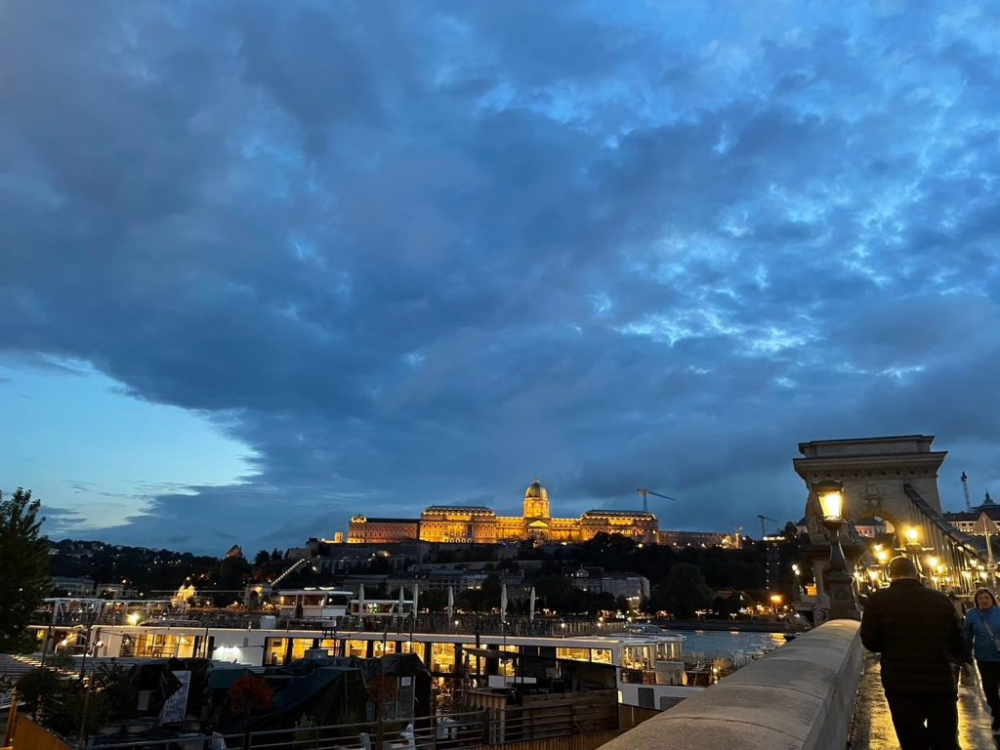](IMG_4818-2-1024x768.jpg)
      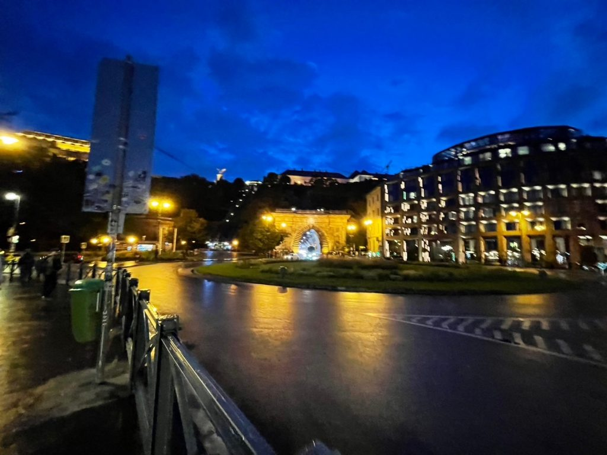](IMG_4819-1-1024x768.jpg)
  
バスから降りるとちょうど街がライトアップされていて、ヨーロッパ2カ国目のブダペストが迎えてくれました。

鎖橋からはライトアップされたブダ城が見え、たくさんの観光客が撮影していました。

  <a rel="noopener" href="https://maps.app.goo.gl/ztkGm4weDqBSRe2b6" title="Deák Ferenc tér M to ブティック ホテル ヴィクトリア ブタペスト" class="blogcard-wrap external-blogcard-wrap a-wrap cf" target="_blank">
  
  

    

      
    
<figure class="blogcard-thumbnail external-blogcard-thumbnail">
    
    
    
    <noscript>
      
    </noscript></figure>
    
    

      

        Deák Ferenc tér M to ブティック ホテル ヴィクトリア ブタペスト
      

      
      

      

    

    
    

      

        

          
          
          <noscript>
            
          </noscript>
        

        
        

          maps.app.goo.gl
        

      

    

  
</a>

### 19時：ブティック ホテル ヴィクトリア ブタペスト (Boutique Hotel Victoria Budapest)へチェックイン

    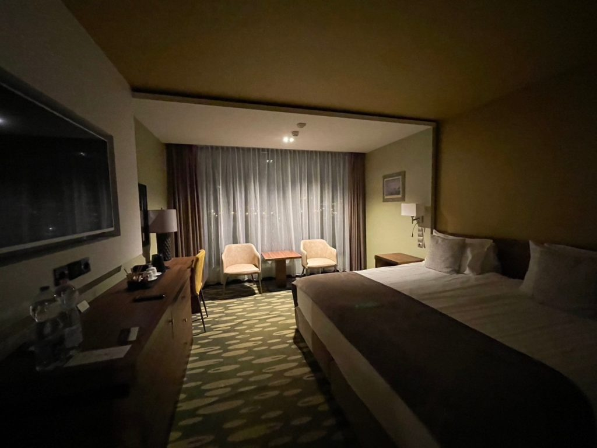](IMG_4821-1024x768.jpg)
      ](IMG_4820-768x1024.jpg)
  
ホテルへ到着すると受付の人にパスポートを渡してチェックインできました。

**英語が不慣れなことが分かるとゆっくりと話しかけてくれてとても親切な方**でした。

ドナウ川からの夜景を目当てにちょっとだけ良い部屋を予約したので、さっそく**夜景チェック**🌉です。

    ](IMG_4822-1024x768.jpg)
      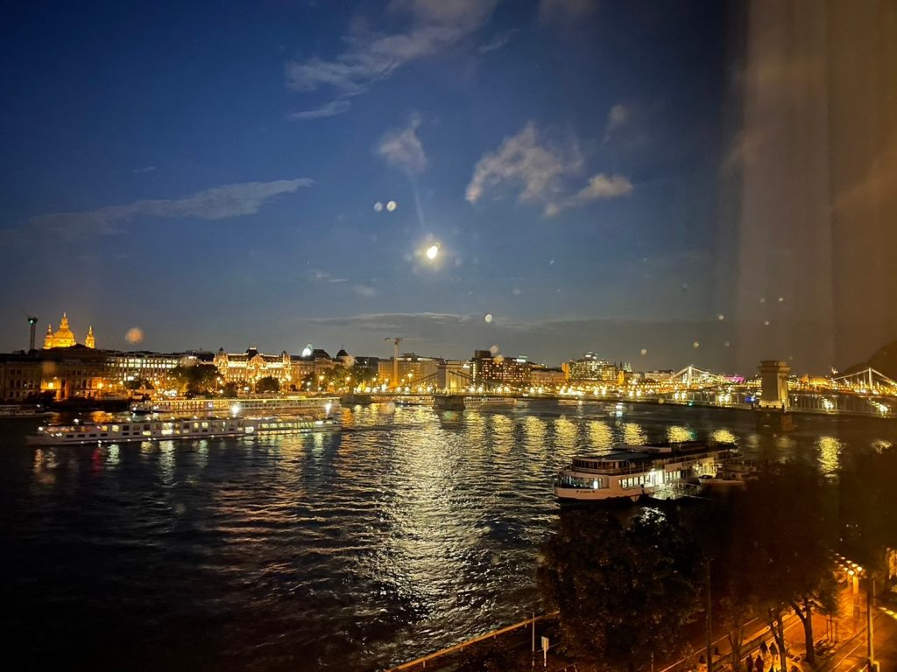](IMG_4823-1024x768.jpg)
  
窓からはライトアップされている国会議事堂と鎖橋を眺めることができ、近くに椅子とテーブルもあるので夜景を見ながら過ごすことができました！

泊まったホテルはこちら

  <a rel="noopener" href="https://www.agoda.com/ja-jp/boutique-hotel-victoria-budapest/hotel/budapest-hu.html" title="https://www.agoda.com/ja-jp/boutique-hotel-victoria-budapest/hotel/budapest-hu.html" class="blogcard-wrap external-blogcard-wrap a-wrap cf" target="_blank">
  
  

    

      
    
<figure class="blogcard-thumbnail external-blogcard-thumbnail">
    
    
    
    <noscript>
      
    </noscript></figure>
    
    

      

        https://www.agoda.com/ja-jp/boutique-hotel-victoria-budapest/hotel/budapest-hu.html
      

      
      

      

    

    
    

      

        

          
          
          <noscript>
            
          </noscript>
        

        
        

          www.agoda.com
        

      

    

  
</a>

### 20時：SPAR Supermarketへ夕飯の買い物へ

    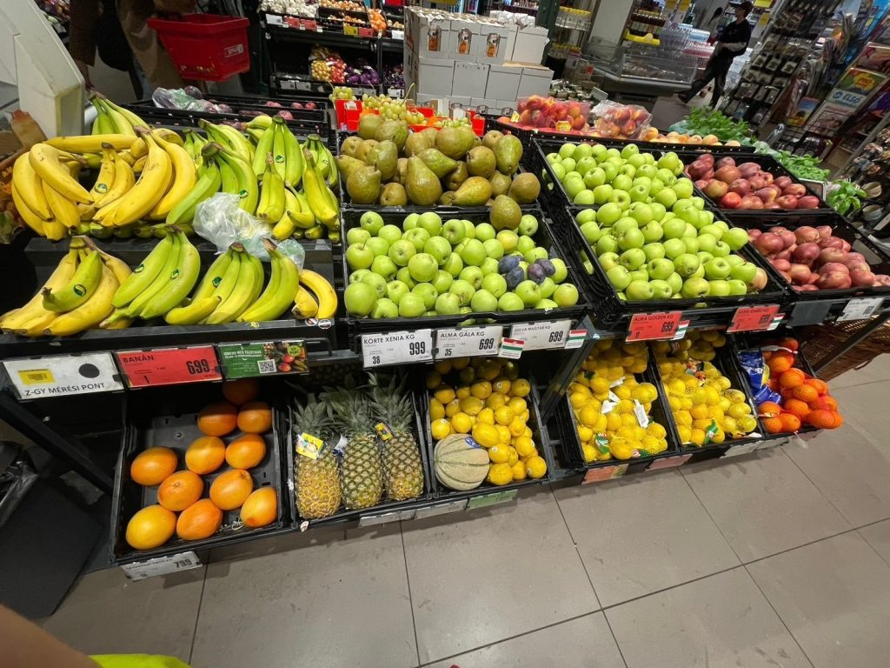](IMG_4828-1024x768.jpg)
      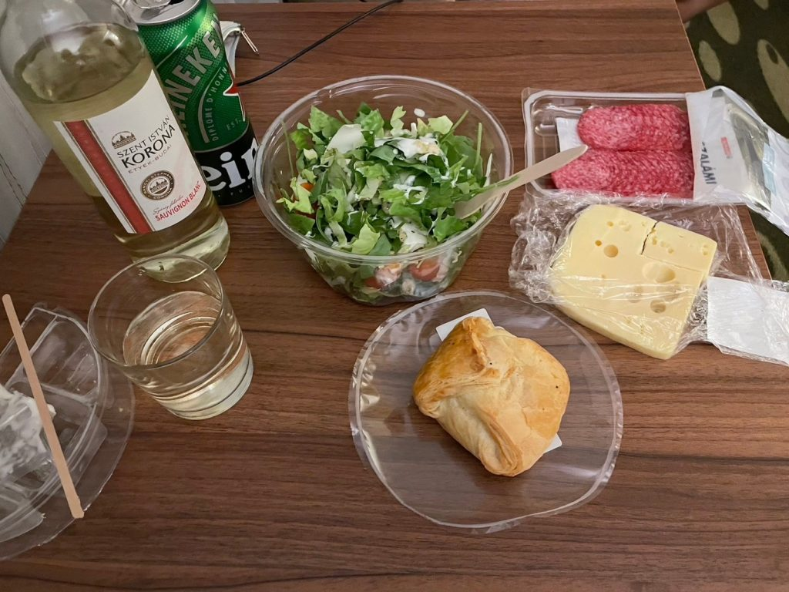](IMG_4826-1024x768.jpg)
  
昼前にロンドン食べた「<a href="https://arukayies.com/diy/travel/europe-honeymoon-london-tourism#toc15" target="_blank" title="">イングリッシュブレックファースト</a>」がなかなか重かったので、軽めの夕食を買いに近くのスーパーへ。

  <a href="https://arukayies.com/diy/travel/europe-honeymoon-london-tourism#toc15" title="【予算は100万円！個人手配で行くヨーロッパ新婚旅行】2泊3日のロンドン観光編" class="blogcard-wrap internal-blogcard-wrap a-wrap cf" target="_blank">
  
  

    

      
    
](アイキャッチ画像-66fdf1103f7bf-160x90.jpg)
    
    

      

        【予算は100万円！個人手配で行くヨーロッパ新婚旅行】2泊3日のロンドン観光編
      

      
      

        くらこんにちは！この記事を見ていただいている方、ご興味を持っていただいた方、ありがとうございます。タイトルの通りヨーロッパへ新婚旅行に行きました。くら前回はトランジット8時間でタイ観光編をまとめました。くらこの記事ではロンドン観光の記録にな...
      

    

    
    

      

        

          
          
          <noscript>
            
          </noscript>
        

        
        

          arukayies.com
        

      

      
      

        

          2024.10.30
        

      

    

  
</a>

ロンドンでもスーパーへ行きましたが、旅先でスーパーに行くのは日本では定番だったので海外もチャレンジ。

**生鮮食品とパンの購入方法に戸惑ったので、買い方をまとめました**。レジはロンドンと同じくセルフレジでした。

戸惑っていると現地の人が助けてくれました。クゥスヌム。クゥスヌム。

      どちらもタッチパネルの専用機械でバーコードシールを払い出す必要がありました！
  
  
      <strong>生鮮食品は量り売りスタイル</strong>です。
  
  
  <ol class="wp-block-list">
    <li>
      量りに食品を乗せる
    </li>
    <li>
      食品を選びタッチする
    </li>
    <li>
      個数を入力しタッチする
    </li>
    <li>
      袋の有無をタッチする
    </li>
    <li>
      シールを印刷する
    </li>
  </ol>
  
      パンは値札の番号か商品名を入力する必要があったので、<strong>どれを袋に入れたか覚えておく必要がありました</strong>！
  
  
  <ol class="wp-block-list">
    <li>
      パンをカテゴリ or 番号から選びタッチする
    </li>
    <li>
      個数を入力しタッチする
    </li>
    <li>
      シールを印刷する
    </li>
  </ol>

スーパーではサラダとパン、そしてお酒とおつまみにサラミとチーズを購入しました。どれも美味しく値段も日本より安かったです。

行ったスーパーはこちら

  <a rel="noopener" href="https://maps.app.goo.gl/vbpyNfJMZyCSSmxF7" title="SPAR Supermarket · Budapest, Batthyány tér 5-6, 1011 ハンガリー" class="blogcard-wrap external-blogcard-wrap a-wrap cf" target="_blank">
  
  

    

      
    
<figure class="blogcard-thumbnail external-blogcard-thumbnail">
    
    
    
    <noscript>
      
    </noscript></figure>
    
    

      

        SPAR Supermarket · Budapest, Batthyány tér 5-6, 1011 ハンガリー
      

      
      

        ★★★★☆ · スーパーマーケット
      

    

    
    

      

        

          
          
          <noscript>
            
          </noscript>
        

        
        

          maps.app.goo.gl
        

      

    

  
</a>

## 2日目：ブダペストの主要な観光施設を巡る

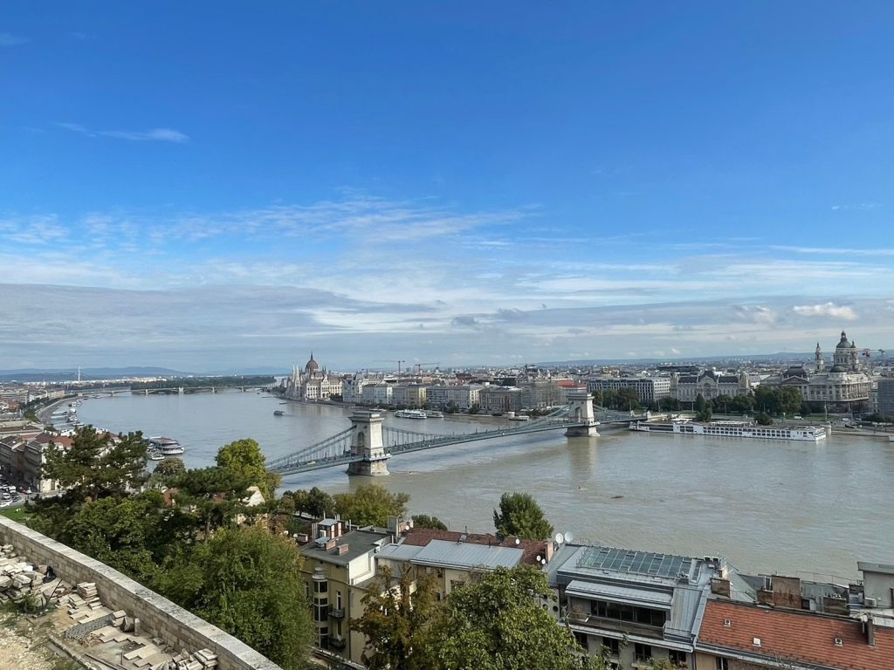](IMG_4837-1024x768.jpg) 

### ブダペストの交通事情〜BudapestGOの設定方法〜

ブダペストでは**BudapestGo**というアプリを使えばトラム・地下鉄・バスがスマホタッチで乗れるということなので、前日にアプリをインストールしました。

  <a rel="noopener" href="https://apps.apple.com/us/app/budapestgo/id916193835" title="‎BudapestGO" class="blogcard-wrap external-blogcard-wrap a-wrap cf" target="_blank">
  
  

    

      
    
<figure class="blogcard-thumbnail external-blogcard-thumbnail">
    
    
    
    <noscript>
      
    </noscript></figure>
    
    

      

        ‎BudapestGO
      

      
      

        ‎The FUTÁR application by BKK Centre for Budapest Transport has been renewed under the name BudapestGO, which, in additi...
      

    

    
    

      

        

          
          
          <noscript>
            
          </noscript>
        

        
        

          apps.apple.com
        

      

    

  
</a> 
  
    <a rel="noopener" href="https://play.google.com/store/apps/details?id=hu.webvalto.bkkfutar&#038;hl=ja" title="BudapestGO - Google Play のアプリ" class="blogcard-wrap external-blogcard-wrap a-wrap cf" target="_blank">
  
  

    

      
    
<figure class="blogcard-thumbnail external-blogcard-thumbnail">
    
    
    
    <noscript>
      
    </noscript></figure>
    
    

      

        BudapestGO - Google Play のアプリ
      

      
      

        BKKの公式統合旅行プランナーとチケット購入の適用
      

    

    
    

      

        

          
          
          <noscript>
            
          </noscript>
        

        
        

          play.google.com
        

      

    

  
</a>

まずはアカウント情報を登録します。

    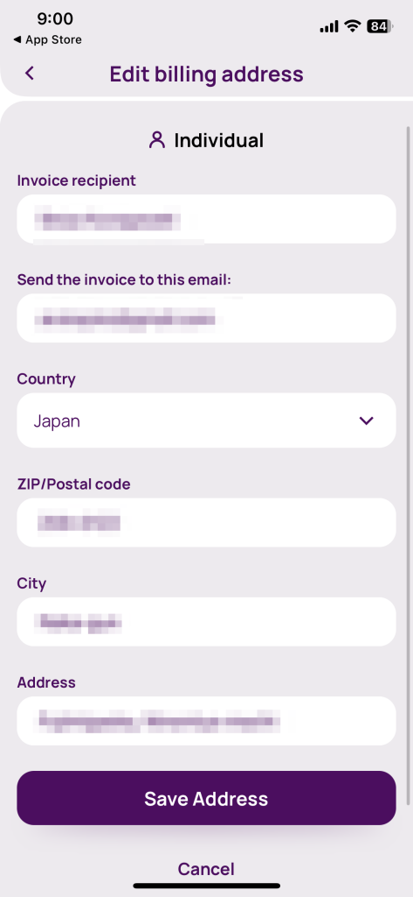](IMG_4830-3-473x1024.png)
            Googleアカウント連携が行えたので、それで登録を進めました。
    
    
          そのまま連携すると<strong>日本語の住所が反映されるので、英語表記に直す必要</strong>がありました。
    
    
        
  
次に支払い情報を追加します。

    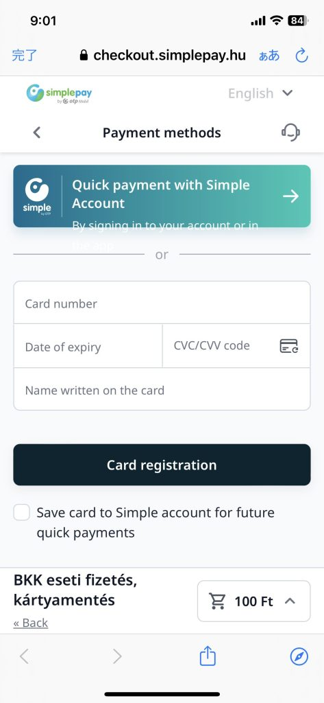](IMG_4834-473x1024.jpg)
            画面を進めるとクレジットカード情報を入力する画面が出てくるので、登録を進めます。
    
    
          しかし、何度試しても登録に失敗します。
    
    
          エラーメッセージやメールを見ると「<strong>3ds process error</strong>」という文字がありました。
    
    
          3Dセキュアのことを指してると気づき、<strong>有効だった設定を無効に切り替えることで支払い情報を追加することができました</strong>。
    
  
これで切符を購入する準備ができたので、あとは購入するだけです。

    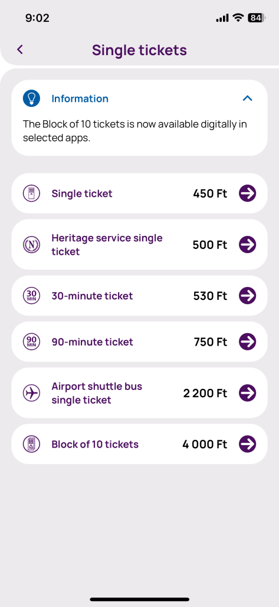](IMG_4836-473x1024.png)
            ブダペストでは1回のチケットで降りるまでが固定料金となっていました。
    
    
          Single ticket 450Ft（184円）と<strong>安い！</strong>
    
    
          その他にも30分、90分乗り放題や空港連絡バス100Eのチケットもこのアプリで購入することができます。
    
    
          また、１日乗り放題などの観光施設がお得に入れるチケットもこのアプリで購入できるようでした。
    
    
    

      <a rel="noopener" href="https://www.hungary-travel-living.org/budapest-transport-services/" title="【徹底案内】ブダペスト公共交通機関の利用方法！チケット購入から乗車まで | 旅して暮らすハンガリー" class="blogcard-wrap external-blogcard-wrap a-wrap cf" target="_blank">
      
      

        

          
        
<figure class="blogcard-thumbnail external-blogcard-thumbnail">
        
        
        
        <noscript>
          
        </noscript></figure>
        
        

          

            【徹底案内】ブダペスト公共交通機関の利用方法！チケット購入から乗車まで | 旅して暮らすハンガリー
          

          
          

            ブダペストは地下鉄・トラム・バス・トロリーバスの路線が網羅されていて、とても移動しやすい街です。 公共交通機関はBKK（ブダペスト交通センター）が運営しており、BKKの定期券や切符があればどのサービスでも利用できるのが嬉しいところ。 旅行者
          

        

        
        

          

            

              
              
              <noscript>
                
              </noscript>
            

            
            

              www.hungary-travel-living.org
            

          

        

      
</a>
    

  

      ①<strong>アカウント情報には「日本語」を含めないようにする</strong>！
  
  
  <ul class="wp-block-list">
    <li>
      設定でエラーとなります。
    </li>
    <li>
      エラーも英語でどこが間違っているかは教えてくれません。
    </li>
  </ul>
  
      ②<strong>クレジットカードの3Dセキュアは無効にする</strong>
  
  
  <ul class="wp-block-list">
    <li>
      カード会社によって変わるかもしれませんが、<strong>楽天カードでは無効にすることで決済できるようになりました</strong>。
    </li>
  </ul>

### 8時：ホテルで新鮮な食材の朝食

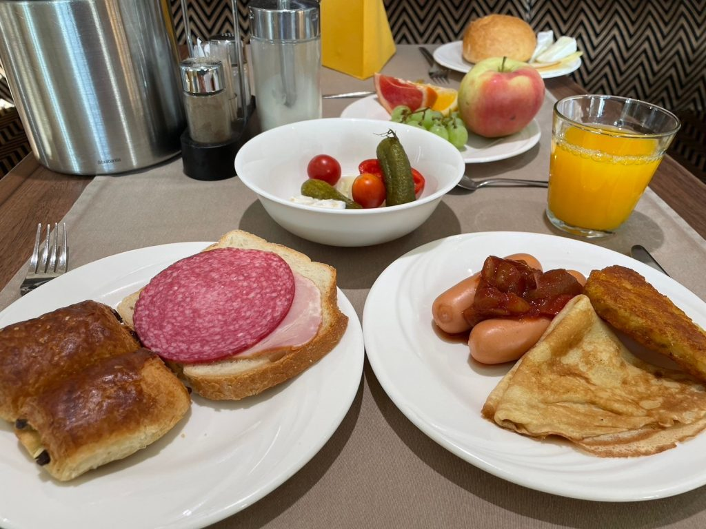](IMG_4838-1024x768.jpg) 

朝食付きなので朝はホテルで食べました。

サラダやフルーツとどれも美味しく、特に昨晩から食べた「**サラミ**」が美味しいのが思い出です。

### 11時：ブダ城から眺めるドナウ川の景色

    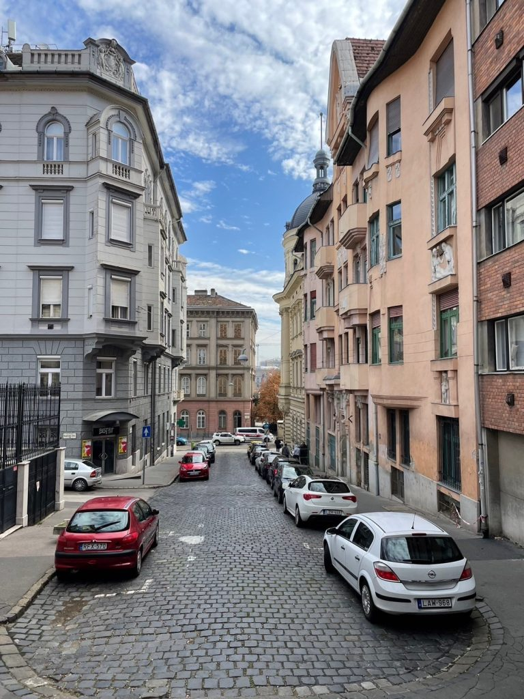](IMG_4839-768x1024.jpg)
      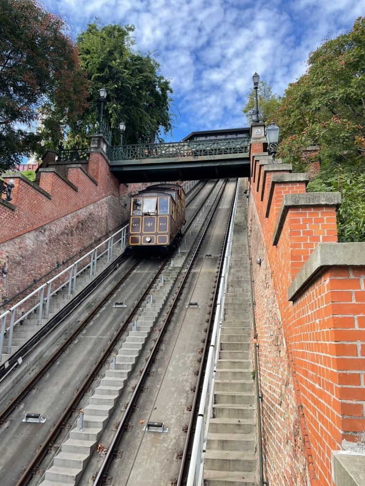](IMG_4840-768x1024.jpg)
  
ホテルからブダ城までは散歩しながら向かいました。丘の上まではケーブルカーでも行けるようです。

歩くだけで楽しいので、街並み見ながら向かいました。

ルートはこちら

  <a rel="noopener" href="https://maps.app.goo.gl/BS4fzvQkCroBZtmr7" title="ブティック ホテル ヴィクトリア ブタペスト to ブダ城" class="blogcard-wrap external-blogcard-wrap a-wrap cf" target="_blank">
  
  

    

      
    
<figure class="blogcard-thumbnail external-blogcard-thumbnail">
    
    
    
    <noscript>
      
    </noscript></figure>
    
    

      

        ブティック ホテル ヴィクトリア ブタペスト to ブダ城
      

      
      

      

    

    
    

      

        

          
          
          <noscript>
            
          </noscript>
        

        
        

          maps.app.goo.gl
        

      

    

  
</a>

    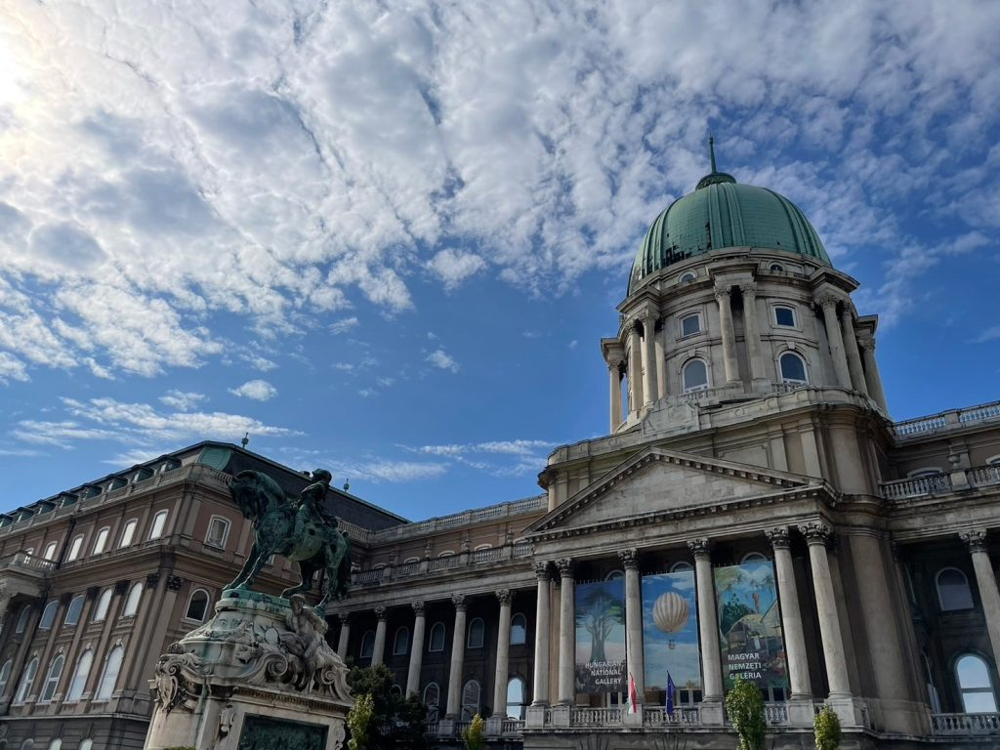](IMG_4841-1024x768.jpg)
      ](IMG_4842-1024x768.jpg)
  
天気良かったので、見晴らし最高でした！

    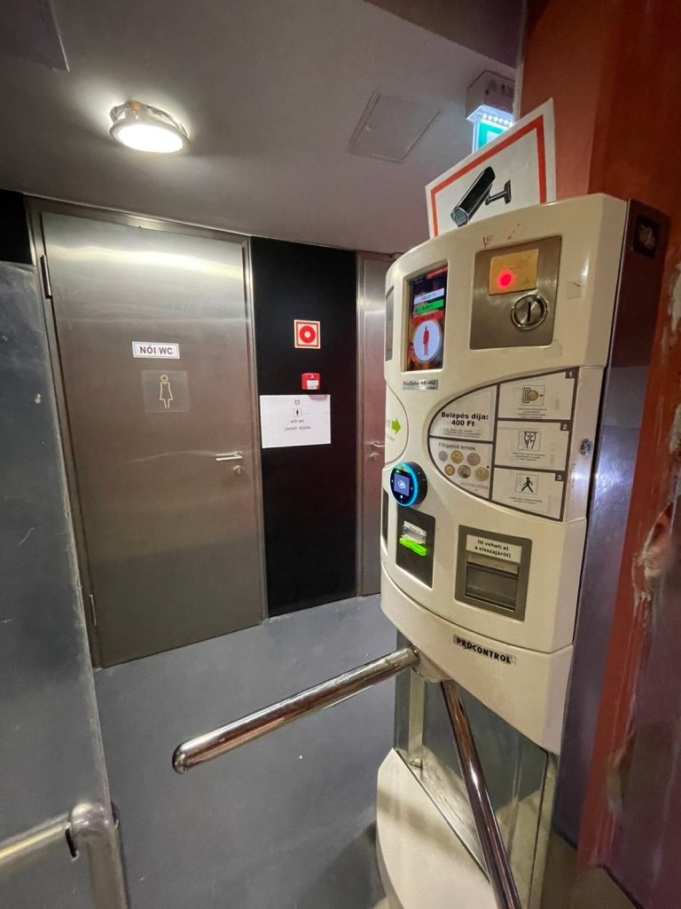](IMG_4843-768x1024.jpg)
      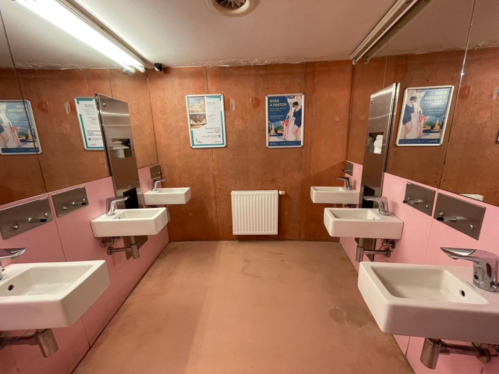](IMG_4844-1024x768.jpg)
  
ちなみにブダ城のトイレは有料で400Ft（164円）でした。クレカタッチで使用しました。

歩いてお腹も空いたので、次は市場に向かいました。

### 12時：トラムでブダペスト中央市場

    ](IMG_4845-768x1024.jpg)
      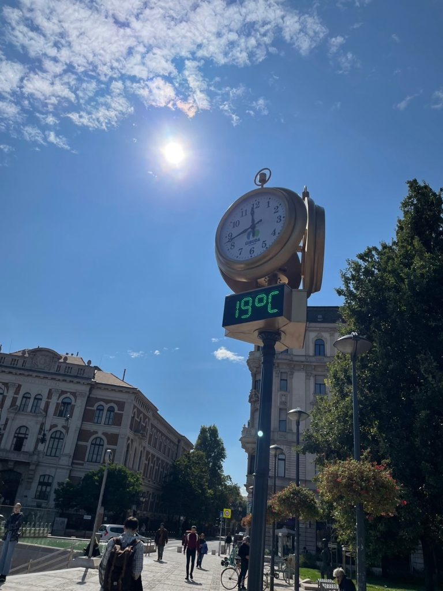](IMG_4846-768x1024.jpg)
  
気温は19度と散歩日和の中、初めてのトラム乗車です。日本の市電のような乗り物でした。

ルートはこちら

  <a rel="noopener" href="https://maps.app.goo.gl/JkM2YMsb33ztAnnq5" title="ブダ城 to ブダペスト中央市場" class="blogcard-wrap external-blogcard-wrap a-wrap cf" target="_blank">
  
  

    

      
    
<figure class="blogcard-thumbnail external-blogcard-thumbnail">
    
    
    
    <noscript>
      
    </noscript></figure>
    
    

      

        ブダ城 to ブダペスト中央市場
      

      
      

      

    

    
    

      

        

          
          
          <noscript>
            
          </noscript>
        

        
        

          maps.app.goo.gl
        

      

    

  
</a>

### 12時：市場でグヤーシュスープ

    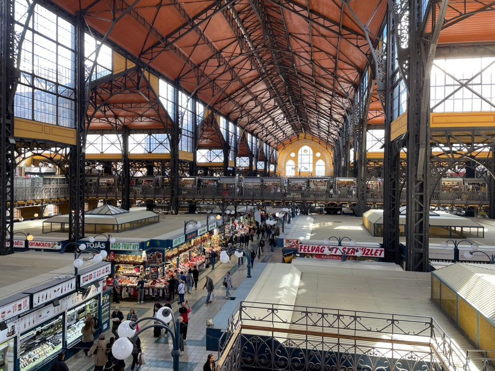](IMG_4847-1024x768.jpg)
      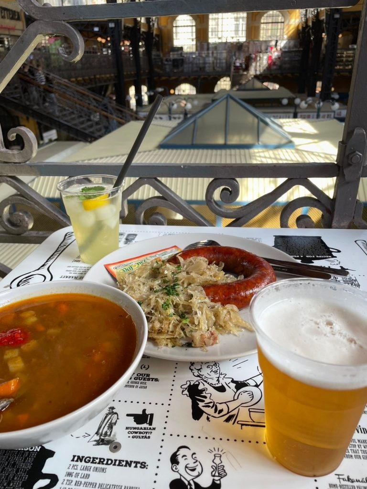](IMG_4848-768x1024.jpg)
  
市場の1階はワイン・フォアグラ・お肉・野菜などが並び、2階の4分の1がレストランでそれ以外はお土産屋さんという作りでした。

ここではハンガリー料理「グヤーシュスープ」と粗挽きソーセージにビールを注文し、市場を眺めながらランチしました。合計：7300Ft（2,978円）

お店はこちら

  <a rel="noopener" href="https://maps.app.goo.gl/yriBVfzP2FFsJKwVA" title="Panoráma Ételbár · Budapest, Vámház krt. 1-3, 1093 ハンガリー" class="blogcard-wrap external-blogcard-wrap a-wrap cf" target="_blank">
  
  

    

      
    
<figure class="blogcard-thumbnail external-blogcard-thumbnail">
    
    
    
    <noscript>
      
    </noscript></figure>
    
    

      

        Panoráma Ételbár · Budapest, Vámház krt. 1-3, 1093 ハンガリー
      

      
      

        ★★★★☆ · ビュッフェ レストラン
      

    

    
    

      

        

          
          
          <noscript>
            
          </noscript>
        

        
        

          maps.app.goo.gl
        

      

    

  
</a>

### 13時：国立博物館は外観だけでも楽しめる

    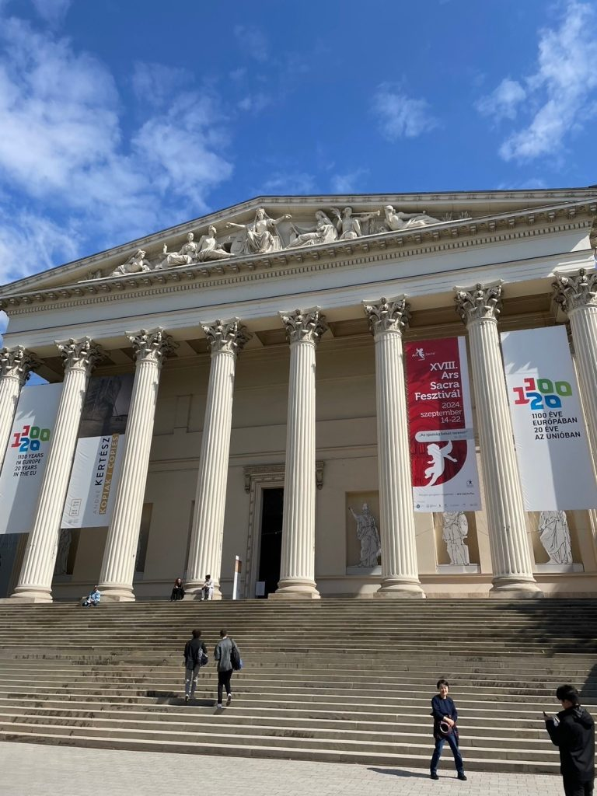](IMG_4852-768x1024.jpg)
      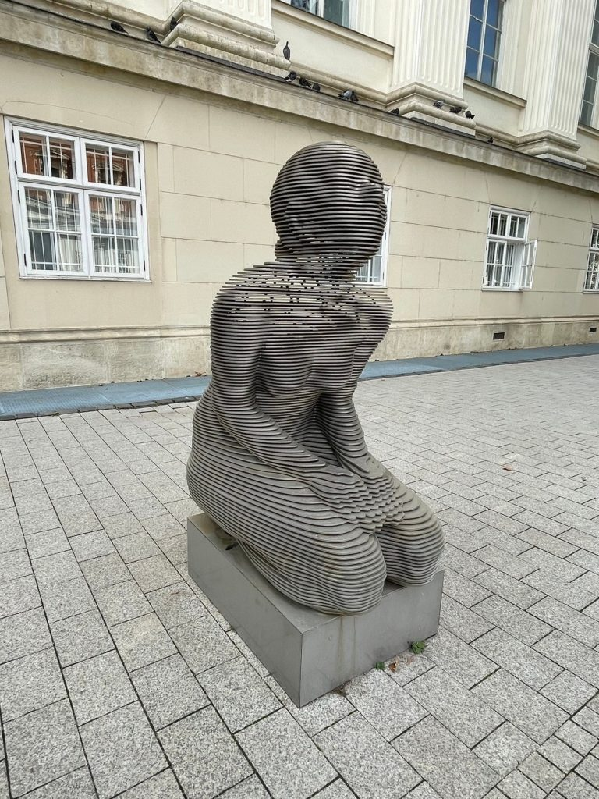](IMG_4849-768x1024.jpg)
  
市場から歩いてハンガリー国立博物館へとやってきました。中は見る時間なさそうなので、外観をぐるりと一周。

外観だけでもいくつもの銅像があり、見応えありでした！ちなみに**博物館の中のトイレは綺麗で無料でした**！

ルートはこちら

  <a rel="noopener" href="https://maps.app.goo.gl/Sr5s9JXJ64H4tPRi9" title="ハンガリー国立博物館 to Panoráma Ételbár" class="blogcard-wrap external-blogcard-wrap a-wrap cf" target="_blank">
  
  

    

      
    
<figure class="blogcard-thumbnail external-blogcard-thumbnail">
    
    
    
    <noscript>
      
    </noscript></figure>
    
    

      

        ハンガリー国立博物館 to Panoráma Ételbár
      

      
      

      

    

    
    

      

        

          
          
          <noscript>
            
          </noscript>
        

        
        

          maps.app.goo.gl
        

      

    

  
</a>

### 14時：聖イシュトヴァーン大聖堂

    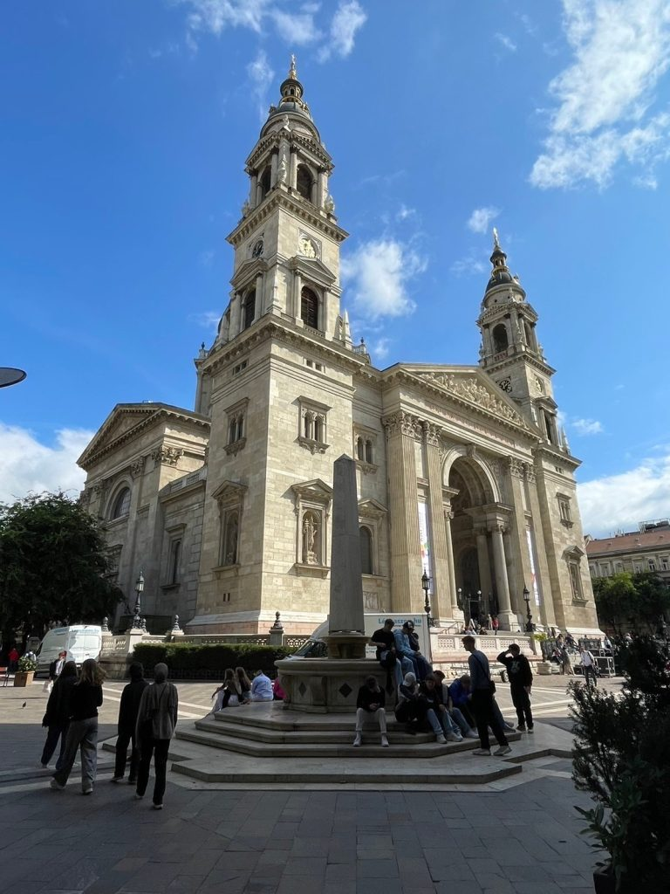](IMG_4850-768x1024.jpg)
      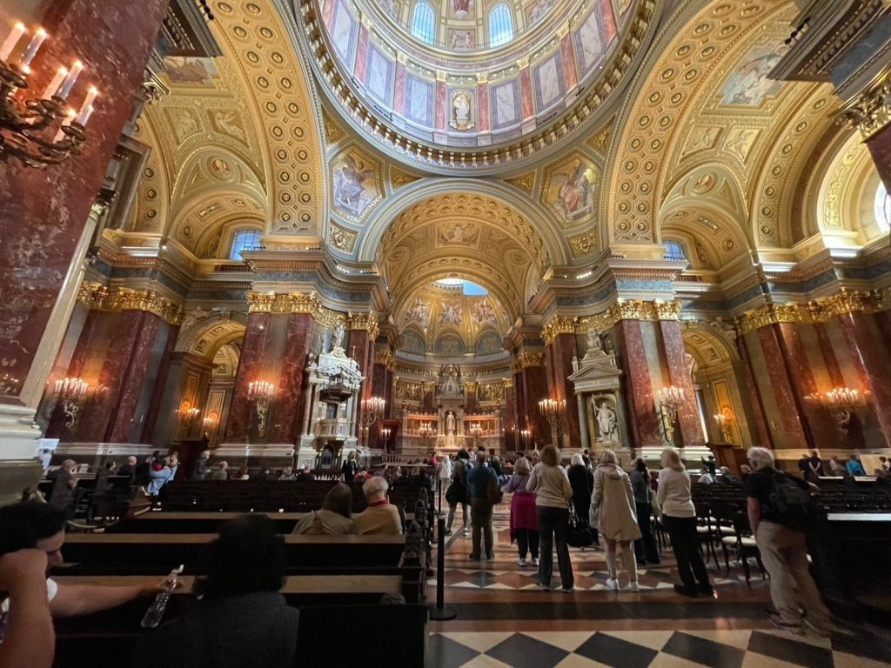](IMG_4851-1024x768.jpg)
  
国立博物館からバスで10分ほど移動し、聖イシュトヴァーン大聖堂へ向かいました。

入場チケットが必要で別な建物で売っていました。案内通りに進めば建物も迷うことはなかったです。

入場料は2300Ft（938円）でした。

ルートはこちら

  <a rel="noopener" href="https://maps.app.goo.gl/9zTVqGxdq2mdPukc8" title="ハンガリー国立博物館 to 聖イシュトヴァーン大聖堂" class="blogcard-wrap external-blogcard-wrap a-wrap cf" target="_blank">
  
  

    

      
    
<figure class="blogcard-thumbnail external-blogcard-thumbnail">
    
    
    
    <noscript>
      
    </noscript></figure>
    
    

      

        ハンガリー国立博物館 to 聖イシュトヴァーン大聖堂
      

      
      

      

    

    
    

      

        

          
          
          <noscript>
            
          </noscript>
        

        
        

          maps.app.goo.gl
        

      

    

  
</a>

### 15時：ハンガリーで最も有名なケーキ「ドボシュトルタ」

    ](IMG_4853-768x1024.jpg)
      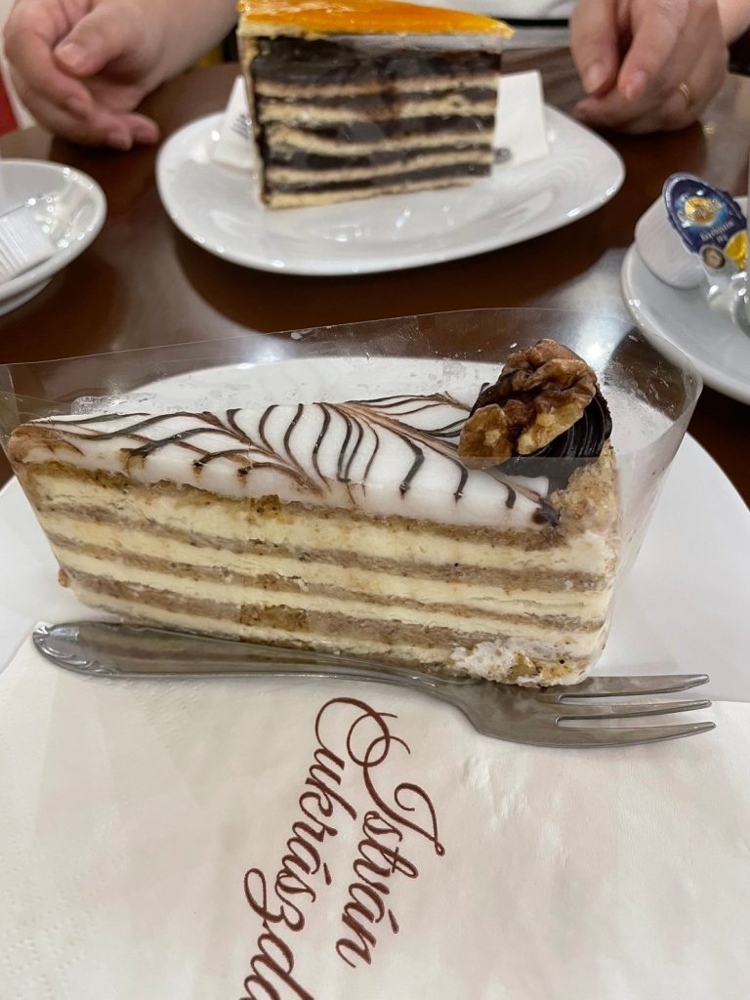](IMG_4854-768x1024.jpg)
  
ハンガリーで有名なケーキ「**ドボシュトルタ**」を食べるためGoogleマップで調べた「Stephen Confectionery」へ向かいます。

お店1階でケーキを買い、2階でいただきました。我々含めて3組だけとゆったりと過ごせました。

ただ、ケーキは甘すぎてあまり口に合わずコーヒーがもっとほしくなる感じでした。

ケーキが2種類とコーヒー2つで4280Ft（1,747円）でした。

  <a rel="noopener" href="https://maps.app.goo.gl/8W2PYwb6GwmzEyky6" title="聖イシュトヴァーン大聖堂 to Stephen Confectionery" class="blogcard-wrap external-blogcard-wrap a-wrap cf" target="_blank">
  
  

    

      
    
<figure class="blogcard-thumbnail external-blogcard-thumbnail">
    
    
    
    <noscript>
      
    </noscript></figure>
    
    

      

        聖イシュトヴァーン大聖堂 to Stephen Confectionery
      

      
      

      

    

    
    

      

        

          
          
          <noscript>
            
          </noscript>
        

        
        

          maps.app.goo.gl
        

      

    

  
</a>

### 16時：ソビエト英雄記念碑

    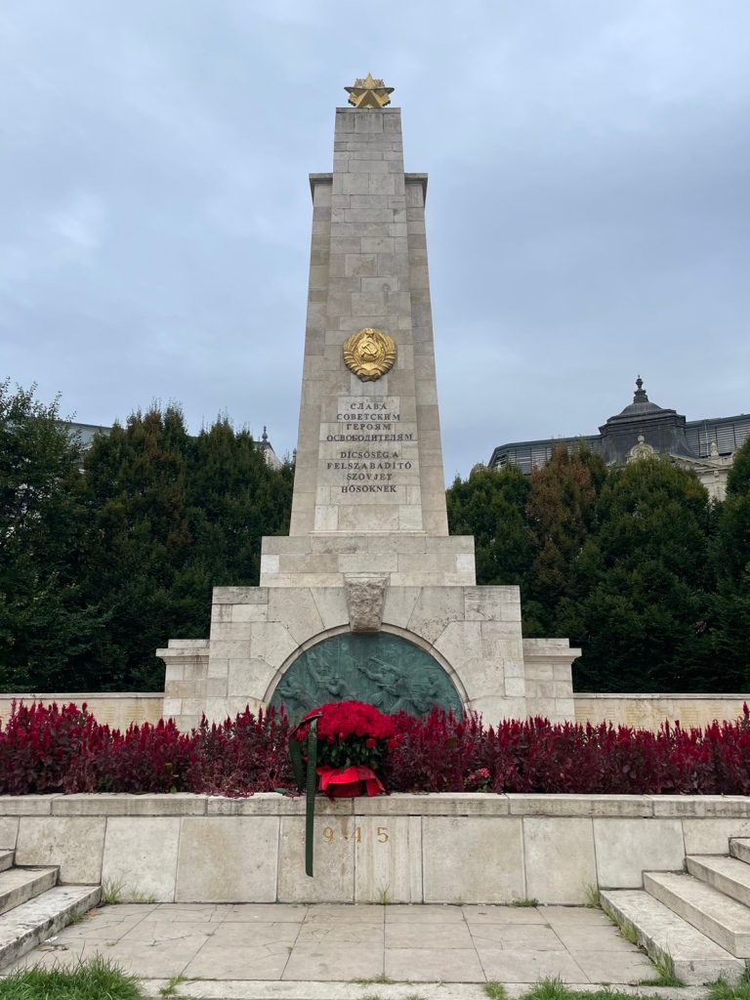](IMG_4859-768x1024.jpg)
      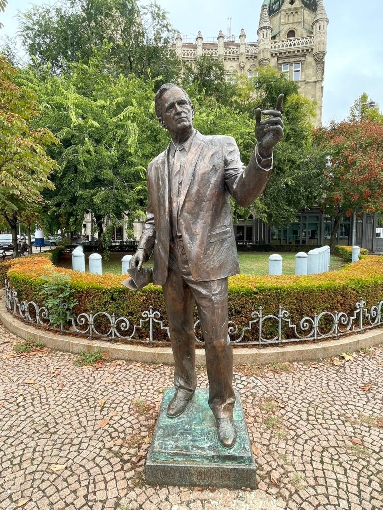](IMG_4860-768x1024.jpg)
  
近隣のスポットを歩きました。至る所にモニュメントや銅像が立っていました。

ルートはこちら

  <a rel="noopener" href="https://maps.app.goo.gl/y95G37PdPWnx3W418" title="Stephen Confectionery to ソビエト英雄記念碑" class="blogcard-wrap external-blogcard-wrap a-wrap cf" target="_blank">
  
  

    

      
    
<figure class="blogcard-thumbnail external-blogcard-thumbnail">
    
    
    
    <noscript>
      
    </noscript></figure>
    
    

      

        Stephen Confectionery to ソビエト英雄記念碑
      

      
      

      

    

    
    

      

        

          
          
          <noscript>
            
          </noscript>
        

        
        

          maps.app.goo.gl
        

      

    

  
</a>

### 16時30分：国会議事堂

    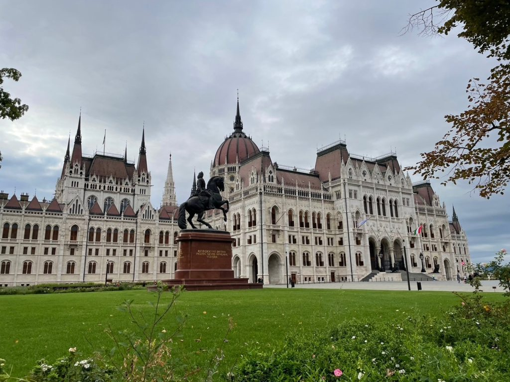](IMG_4857-1024x768.jpg)
      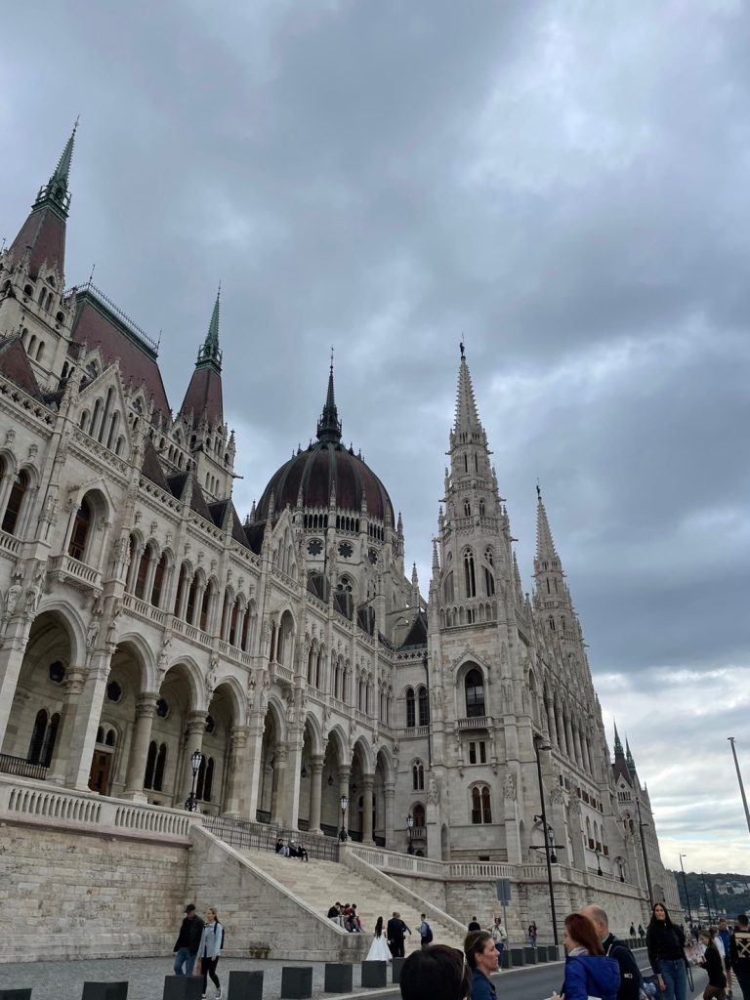](IMG_4858-768x1024.jpg)
  
部屋からライトアップして見えた国会議事堂の玄関とドナウ川から見える景色です。

ルートはこちら

  <a rel="noopener" href="https://maps.app.goo.gl/tcFf54FVbrgVashZ8" title="ソビエト英雄記念碑 to 国会議事堂" class="blogcard-wrap external-blogcard-wrap a-wrap cf" target="_blank">
  
  

    

      
    
<figure class="blogcard-thumbnail external-blogcard-thumbnail">
    
    
    
    <noscript>
      
    </noscript></figure>
    
    

      

        ソビエト英雄記念碑 to 国会議事堂
      

      
      

      

    

    
    

      

        

          
          
          <noscript>
            
          </noscript>
        

        
        

          maps.app.goo.gl
        

      

    

  
</a>

### 17時：ドナウ川遊歩道の靴

    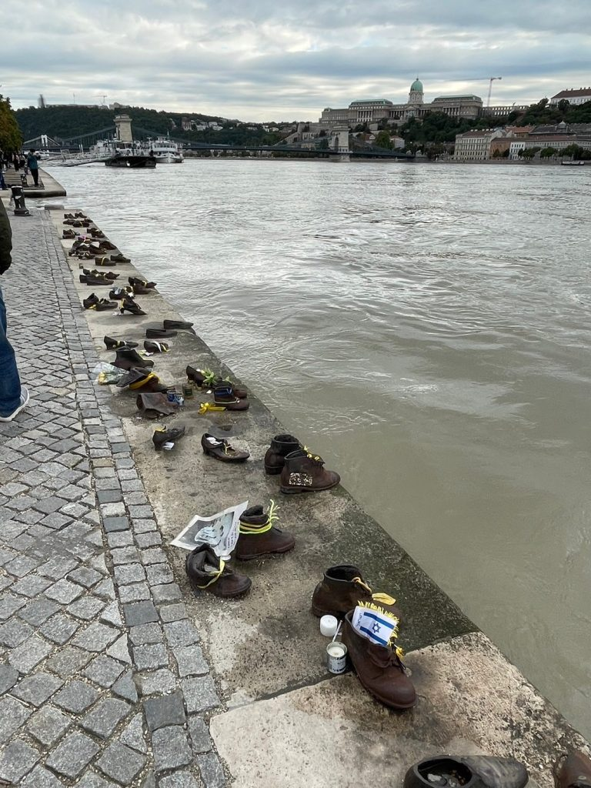](IMG_4861-768x1024.jpg)
      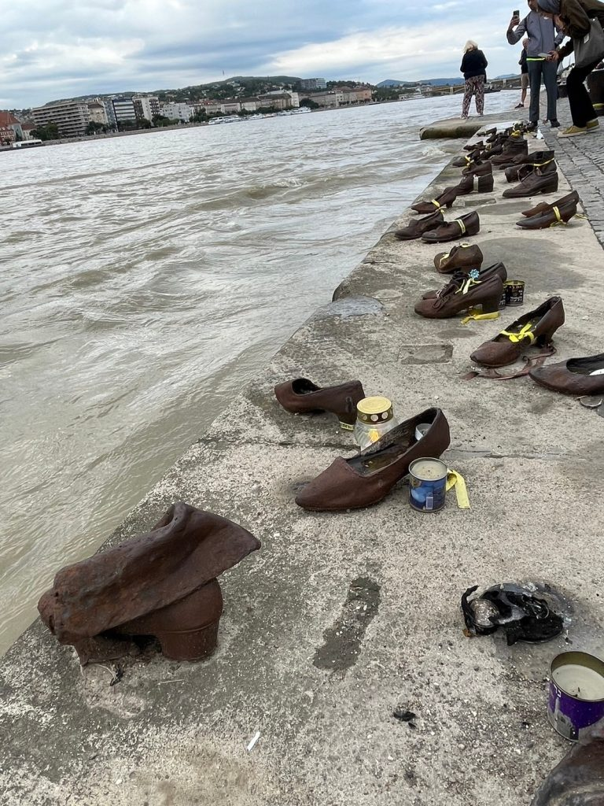](IMG_4862-768x1024.jpg)
  
国会議事堂の裏からドナウ川沿いに歩くとたどり着きます。

**ドナウ川の氾濫警報が出ていて、氾濫するギリギリの状態**でした。<a rel="noopener" href="https://news.yahoo.co.jp/articles/03c325f14805366bd580d0beda66d73a9fefe7d9" target="_blank" title="">ニュース</a>にもなってました。

ルートはこちら

  <a rel="noopener" href="https://maps.app.goo.gl/zGuD8bXGVkeR5aP29" title="国会議事堂 to ドナウ川遊歩道の靴" class="blogcard-wrap external-blogcard-wrap a-wrap cf" target="_blank">
  
  

    

      
    
<figure class="blogcard-thumbnail external-blogcard-thumbnail">
    
    
    
    <noscript>
      
    </noscript></figure>
    
    

      

        国会議事堂 to ドナウ川遊歩道の靴
      

      
      

      

    

    
    

      

        

          
          
          <noscript>
            
          </noscript>
        

        
        

          maps.app.goo.gl
        

      

    

  
</a> 
  
    <a rel="noopener" href="https://news.yahoo.co.jp/articles/03c325f14805366bd580d0beda66d73a9fefe7d9" title="Yahoo!ニュース" class="blogcard-wrap external-blogcard-wrap a-wrap cf" target="_blank">
  
  

    

      
    
<figure class="blogcard-thumbnail external-blogcard-thumbnail">
    
    
    
    <noscript>
      
    </noscript></figure>
    
    

      

        Yahoo!ニュース
      

      
      

        Yahoo!ニュースは、新聞・通信社が配信するニュースのほか、映像、雑誌や個人の書き手が執筆する記事など多種多様なニュースを掲載しています。
      

    

    
    

      

        

          
          
          <noscript>
            
          </noscript>
        

        
        

          news.yahoo.co.jp
        

      

    

  
</a>

### 18時：国宝に指定されている豚「マンガリッツァ豚」料理

    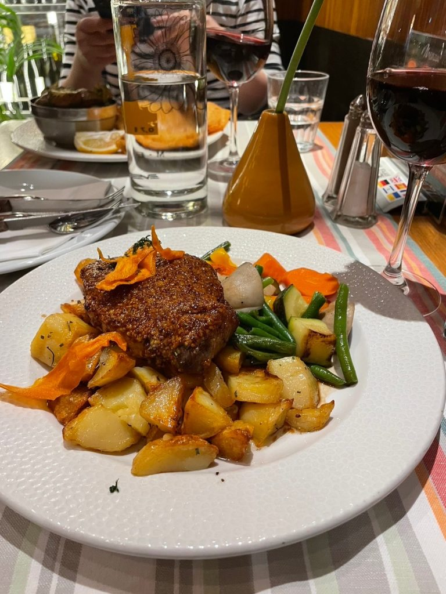](IMG_4866-768x1024.jpg)
  
ブダペストに来たら食べたいと思っていた「マンガリッツァ豚」料理。事前に調べておいてお店と向かいました。

「Menza」というお店で口コミ通りどの料理も美味しく、お腹いっぱいとなりました。

  <a rel="noopener" href="https://note.com/milkprincess17/n/n9925f40ea2e2#25f651b7-7415-478a-8604-e37ba43f176e" title="【旅行記】4泊5日のブダペスト女子旅！おすすめ温泉と美食レストラン｜いしかわゆき（ゆぴ） #ゆる時間術 発売中！" class="blogcard-wrap external-blogcard-wrap a-wrap cf" target="_blank">
  
  

    

      
    
<figure class="blogcard-thumbnail external-blogcard-thumbnail">
    
    
    
    <noscript>
      
    </noscript></figure>
    
    

      

        【旅行記】4泊5日のブダペスト女子旅！おすすめ温泉と美食レストラン｜いしかわゆき（ゆぴ） #ゆる時間術 発売中！
      

      
      

        温泉大国ブダペスト！ ということで温泉大好き温泉ソムリエのわたし、まさかの4日連続温泉に入るというハードスケジュールを組んでまいりました。 温泉と美食で荒れまくっていた肌が落ち着いたよ。好きな国ランキングTOP3に躍り出たよ。そんなブダペス...
      

    

    
    

      

        

          
          
          <noscript>
            
          </noscript>
        

        
        

          note.com
        

      

    

  
</a>

    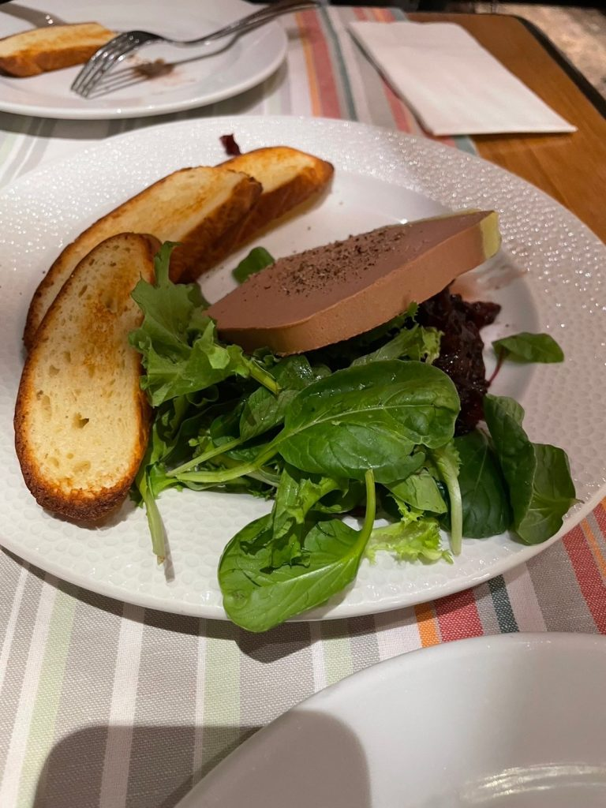](IMG_4863-768x1024.jpg)
      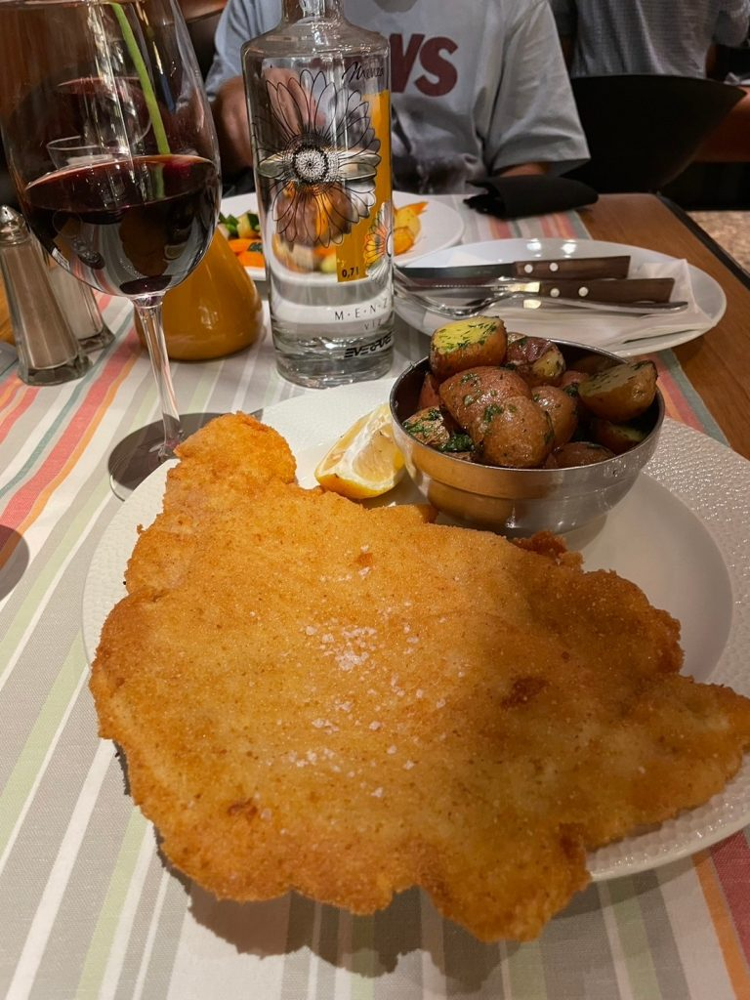](IMG_4864-768x1024.jpg)
  
そのほかにも鴨レバーペースト・シュニッツェルと3品を注文し2人ともお腹いっぱい過ぎました。

お酒も入れて24,416Ftでした。（9,962円）

お店はこちら

  <a rel="noopener" href="https://maps.app.goo.gl/13P8Mujd7EGYyy3r7" title="Menza Étterem és Kávéház · Budapest, Liszt Ferenc tér 2, 1061 ハンガリー" class="blogcard-wrap external-blogcard-wrap a-wrap cf" target="_blank">
  
  

    

      
    
<figure class="blogcard-thumbnail external-blogcard-thumbnail">
    
    
    
    <noscript>
      
    </noscript></figure>
    
    

      

        Menza Étterem és Kávéház · Budapest, Liszt Ferenc tér 2, 1061 ハンガリー
      

      
      

        ★★★★☆ · ハンガリー料理店
      

    

    
    

      

        

          
          
          <noscript>
            
          </noscript>
        

        
        

          maps.app.goo.gl
        

      

    

  
</a>

### 20時：ホテルに帰宅

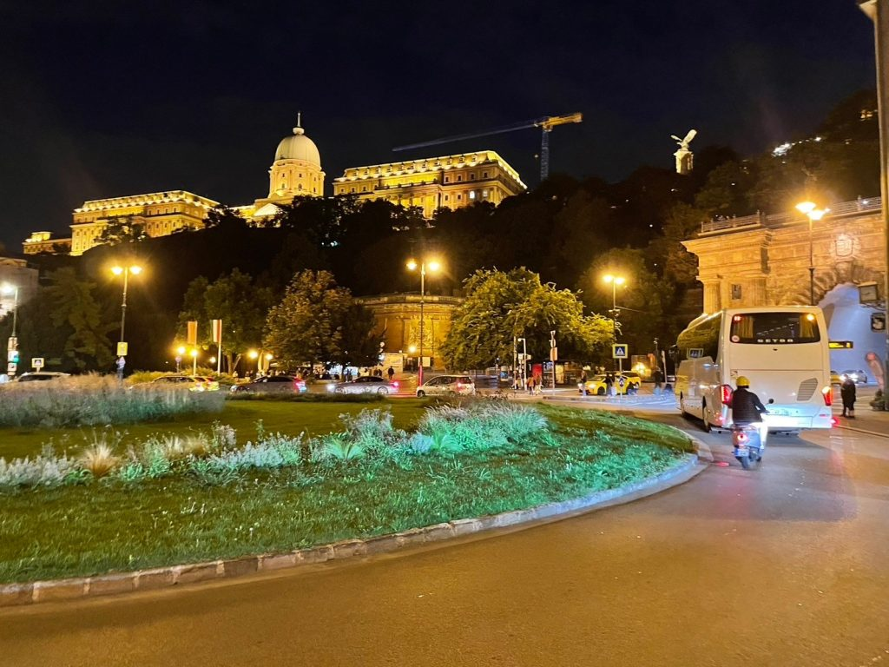](IMG_4865-1024x768.jpg) 

ホテルまではバスで帰宅しました。

  <a rel="noopener" href="https://maps.app.goo.gl/PCqa2ZAWDXMafJJM6" title="Menza Étterem és Kávéház to ブティック ホテル ヴィクトリア ブタペスト" class="blogcard-wrap external-blogcard-wrap a-wrap cf" target="_blank">
  
  

    

      
    
<figure class="blogcard-thumbnail external-blogcard-thumbnail">
    
    
    
    <noscript>
      
    </noscript></figure>
    
    

      

        Menza Étterem és Kávéház to ブティック ホテル ヴィクトリア ブタペスト
      

      
      

      

    

    
    

      

        

          
          
          <noscript>
            
          </noscript>
        

        
        

          maps.app.goo.gl
        

      

    

  
</a>

## 続きは後編へ

次の記事ではブダペスト観光 後編を紹介していきます！

  <a href="https://arukayies.com/diy/travel/europe-honeymoon-budapest-tourism-part2" title="【予算は100万円！個人手配で行くヨーロッパ新婚旅行】3泊4日のブダベスト観光 後編" class="blogcard-wrap internal-blogcard-wrap a-wrap cf" target="_blank">
  
  

    

      
    
](アイキャッチ画像-67071813cc15b-160x90.jpg)
    
    

      

        【予算は100万円！個人手配で行くヨーロッパ新婚旅行】3泊4日のブダベスト観光 後編
      

      
      

        くらこんにちは！この記事を見ていただいている方、ご興味を持っていただいた方、ありがとうございます。タイトルの通りヨーロッパへ新婚旅行に行きました。くら前回はブダペスト観光 前編をまとめました。3日目：セーチェーニ温泉とフォアグラを食べにブダ...
      

    

    
    

      

        

          
          
          <noscript>
            
          </noscript>
        

        
        

          arukayies.com
        

      

      
      

        

          2024.10.30
        

      

    

  
</a>

  <a href="https://arukayies.com/diy/travel/europe-honeymoon-summary" title="【予算は100万円！個人手配で行くヨーロッパ新婚旅行】3カ国を巡った様子のまとめ" class="blogcard-wrap internal-blogcard-wrap a-wrap cf" target="_blank">
  
  

    

      
    
](アイキャッチ画像-6721c6d77511e-160x90.jpg)
    
    

      

        【予算は100万円！個人手配で行くヨーロッパ新婚旅行】3カ国を巡った様子のまとめ
      

      
      

        くらこんにちは！この記事を見ていただいている方、ご興味を持っていただいた方、ありがとうございます。タイトルの通りヨーロッパへ新婚旅行に行きました。ここまでヨーロッパ新婚旅行（ロンドン、ブダペスト、パリ）シリーズをお伝えしてきました。今回はそ...
      

    

    
    

      

        

          
          
          <noscript>
            
          </noscript>
        

        
        

          arukayies.com
        

      

      
      

        

          2024.10.30
        

      

    

  
</a>

