こんにちは！
この記事を見ていただいている方、ご興味を持っていただいた方、ありがとうございます。

ヨーロッパ新婚旅行（ロンドン、ブダペスト、パリ）シリーズの最後に気になる費用の詳細をお伝えします！

この旅は2024年9月14日〜22日に行きました。<strong>物価の高いヨーロッパ旅行で工夫した点をお伝えします！</strong>

<strong>これが今回の新婚旅行にかかった費用100万円の内訳です！</strong>

  <a href="https://arukayies.com/diy/travel/europe-honeymoon-summary" title="【予算は100万円！個人手配で行くヨーロッパ新婚旅行】3カ国を巡った様子のまとめ" class="blogcard-wrap internal-blogcard-wrap a-wrap cf" target="_blank">
  
  

    

      
    
](アイキャッチ画像-6721c6d77511e-160x90.jpg)
    
    

      

        【予算は100万円！個人手配で行くヨーロッパ新婚旅行】3カ国を巡った様子のまとめ
      

      
      

        くらこんにちは！この記事を見ていただいている方、ご興味を持っていただいた方、ありがとうございます。タイトルの通りヨーロッパへ新婚旅行に行きました。ここまでヨーロッパ新婚旅行（ロンドン、ブダペスト、パリ）シリーズをお伝えしてきました。今回はそ...
      

    

    
    

      

        

          
          
          <noscript>
            
          </noscript>
        

        
        

          arukayies.com
        

      

      
      

        

          2024.10.30
        

      

    

  
</a>

    ](費用内訳.png)
      ](image-1.png)
  
種別ごとに費用の詳細をお伝えします！

## 日本→ロンドン→ブダペスト→パリ→日本の航空券は2人で約60万

](IMG_4036-1024x768.jpg) 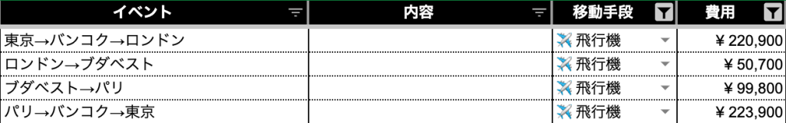](image-2-1024x161.png) 

100万円の半分以上を占めるのは航空券です。ANA、JAL等でヨーロッパに行くと、片道だけで50万超えるのでとても悩みました。ヨーロッパへ行こう！と決心したのも2ヶ月前とかなので、早割もなかったです。

なるべく快適な座席で機内食も美味しそうなところと検討した結果、日本から出国・帰国便は「**タイ国際航空**」・ヨーロッパ間の移動は「**フラッグ・キャリア**」を予約しました。ヨーロッパ間の飛行機はLCCでも良かったのかもしれません。

  <a href="https://arukayies.com/diy/travel/europe-honeymoon-preparation#toc11" title="【予算は100万円！個人手配で行くヨーロッパ新婚旅行】事前準備編" class="blogcard-wrap internal-blogcard-wrap a-wrap cf" target="_blank">
  
  

    

      
    
](アイキャッチ画像-66fb8c4ad58b7-160x90.jpg)
    
    

      

        【予算は100万円！個人手配で行くヨーロッパ新婚旅行】事前準備編
      

      
      

        くらこんにちは！この記事を見ていただいている方、ご興味を持っていただいた方、ありがとうございます。タイトルの通りヨーロッパへ新婚旅行に行きました。くらしかし、夫婦で行ったのは台湾のみとほとんど海外旅行の経験はありません。英語も話せず、しかも...
      

    

    
    

      

        

          
          
          <noscript>
            
          </noscript>
        

        
        

          arukayies.com
        

      

      
      

        

          2024.10.30
        

      

    

  
</a>

航空券の費用を抑えたポイントはこちらです！

      航空券比較サイトを使い（<strong>Trip.com</strong>を利用）、安い航空会社を探す。
  
  
      <strong>直行便よりも乗り継ぎ便で予約する。</strong>
  
  
      日程が決まっていれば、早い段階で予約する
  

## ロンドン2泊、ブダペスト3泊、パリ2泊の宿泊費は約16万

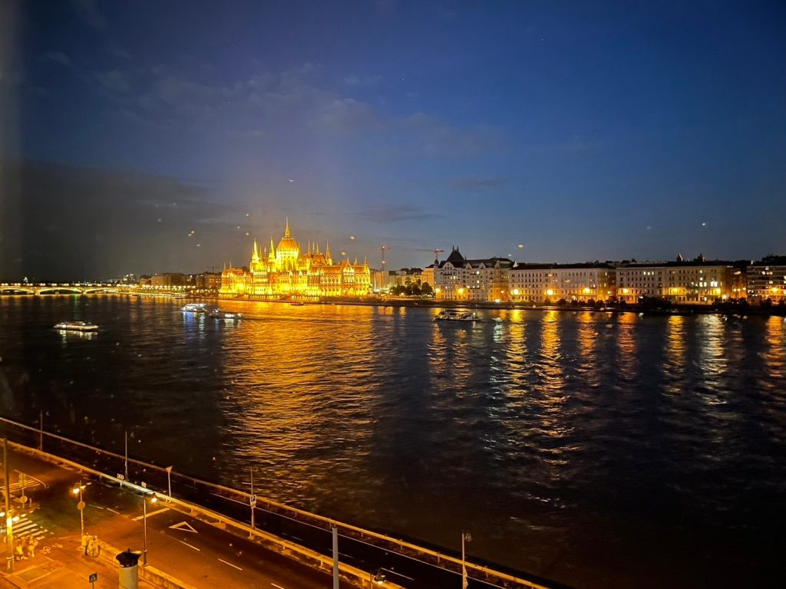](IMG_4822-1024x768.jpg) 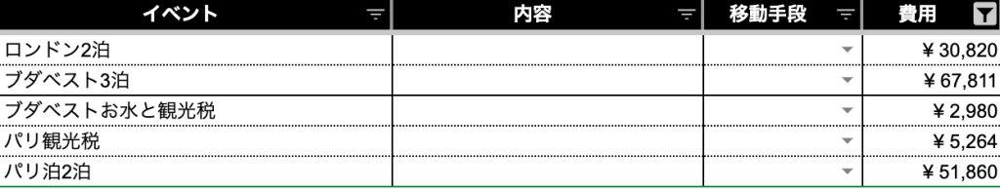](image-3-1024x194.png) 

航空券の次に悩んだのは各地の宿泊場所です。日本と同じような基準で選んでいったのですが、1番気になるのは**治安でした**。

特にパリは最後まで悩み、価格と治安を天秤にかけていました。決め手となったのは**ホテルの日本人が投稿した口コミでした**。

宿泊したホテルの詳細はこちらをご覧ください。

  <a href="https://arukayies.com/diy/travel/europe-honeymoon-preparation#toc18" title="【予算は100万円！個人手配で行くヨーロッパ新婚旅行】事前準備編" class="blogcard-wrap internal-blogcard-wrap a-wrap cf" target="_blank">
  
  

    

      
    
](アイキャッチ画像-66fb8c4ad58b7-160x90.jpg)
    
    

      

        【予算は100万円！個人手配で行くヨーロッパ新婚旅行】事前準備編
      

      
      

        くらこんにちは！この記事を見ていただいている方、ご興味を持っていただいた方、ありがとうございます。タイトルの通りヨーロッパへ新婚旅行に行きました。くらしかし、夫婦で行ったのは台湾のみとほとんど海外旅行の経験はありません。英語も話せず、しかも...
      

    

    
    

      

        

          
          
          <noscript>
            
          </noscript>
        

        
        

          arukayies.com
        

      

      
      

        

          2024.10.30
        

      

    

  
</a>

      比較サイトを使い（<strong>Agoda</strong>を利用）、安いホテルを探す。
  
  
      <strong>日本人の口コミを参考にする</strong>。
  

## 10日間の食事 + お土産(食べ物)にかかった費用は約11万

各地の食事については制限することはなく、食べたいものを食べ、お酒も飲みました。

現地のスーパーも活用したので、費用を抑えることができました。

      事前に食べたい名物を調べ、食べたいものは我慢しない。
  
  
      <strong>スーパーで軽食を購入して、費用を抑えるのとお腹を休ませる</strong>。
  

### ロンドン2泊の食費は2人で約3.3万

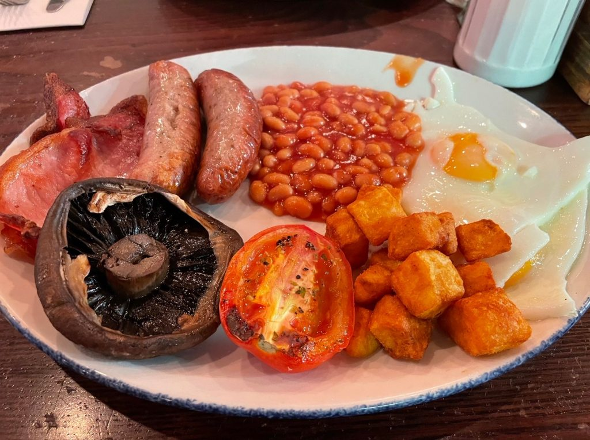](IMG_4035-1024x765.jpg) 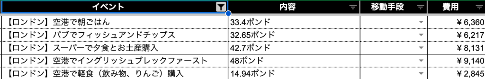](image-4-1024x167.png) 

フィッシュ&チップスとビール、イングリッシュブレックファーストだけは食べる！という夢を達成しました。

### ブダベスト3泊の食費は2人で約3.1万

](IMG_4899-768x1024.jpg) 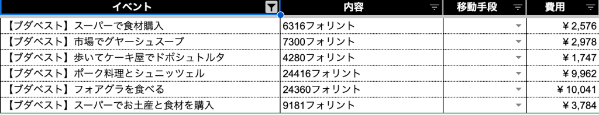](image-5-1024x197.png) 

朝食付きのホテルへ宿泊だったのと夕食はスーパーで買った軽食で済ませていました。

### パリ2泊の食費は2人で約3.6万

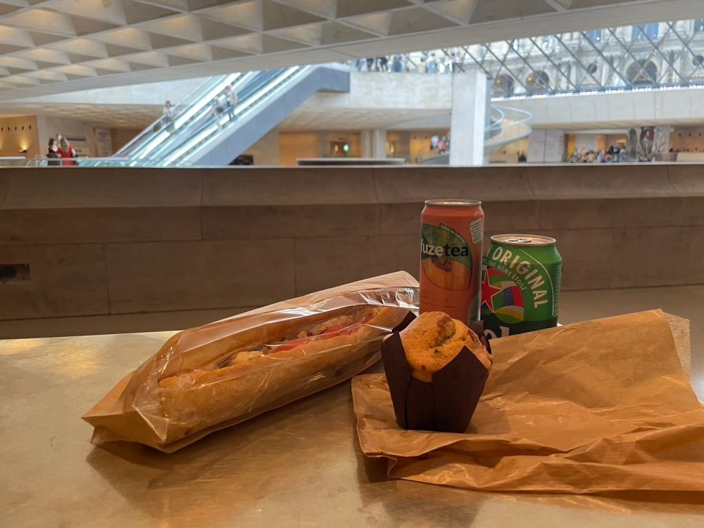](IMG_4994-1024x768.jpg) 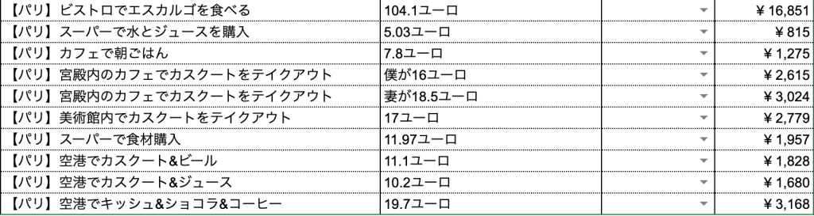](image-6-1024x273.png) 

初日に現地のビストロを訪れ、残りは各観光地でサンドウィッチ（カスクート）をよく食べてました。

## 観光+お土産(物販)にかかった費用は約10万

### バンコク観光の費用は約2.4万

](IMG_3976-768x1024.jpg) 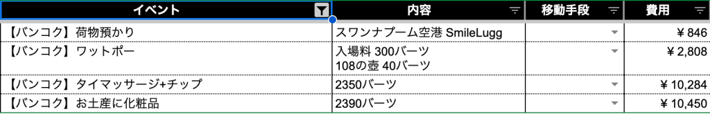](image-7-1024x165.png) 

帰りの乗り継ぎ時に行ったマッサージが割高でした。疲れは取れたので後悔はしていません。

### ロンドン観光の費用は約0.9万

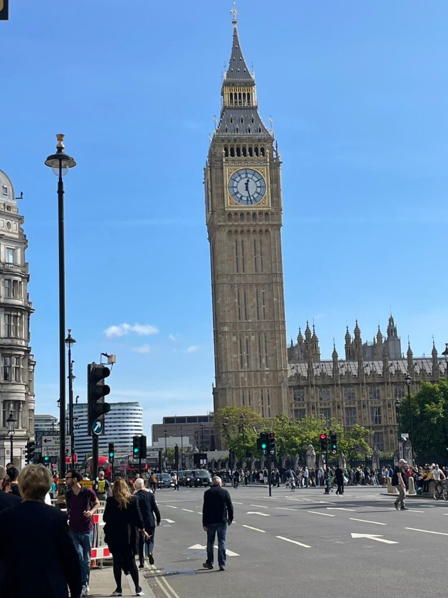](IMG_4018-768x1024.jpg) 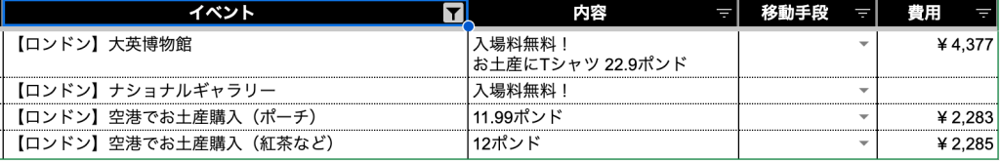](image-8-1024x165.png) 

博物館と建造物を見るだけだったので、**３カ国の中で一番観光費用は安かったです。**

### ブダベスト観光の費用は約2.4万

](IMG_4842-1024x768.jpg) ](image-9-1024x385.png) 

3泊4日とこの旅行で一番長く滞在しましたが、**物価が日本より少し安い**こともありこのぐらいとなりました。

### パリ観光の費用は約3.9万

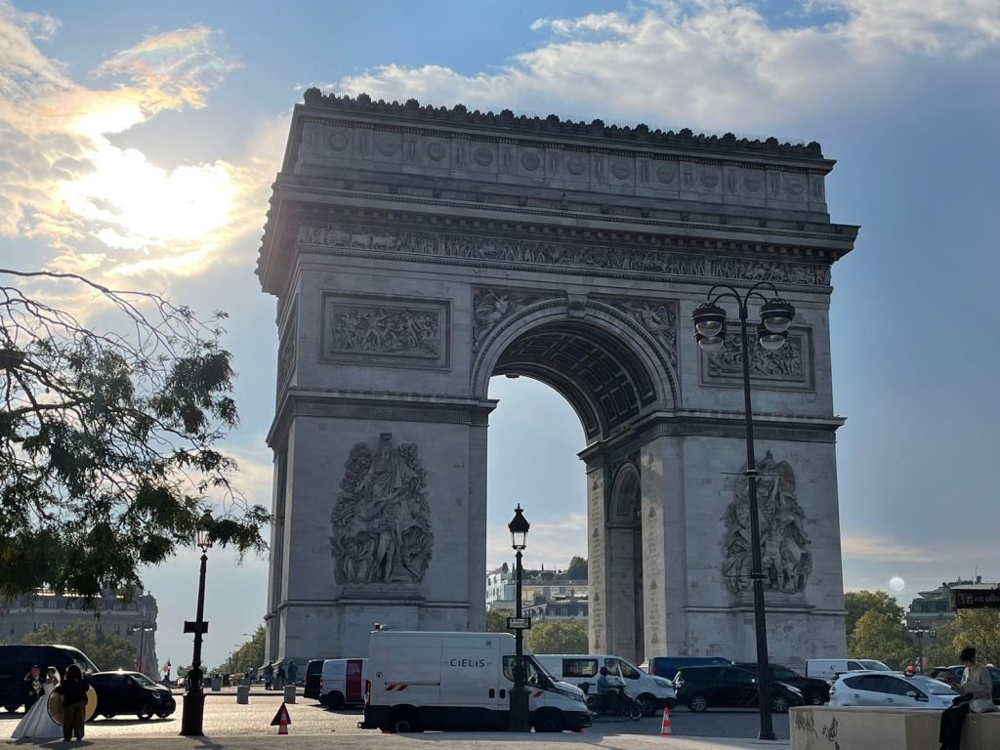](IMG_4936-1024x768.jpg) 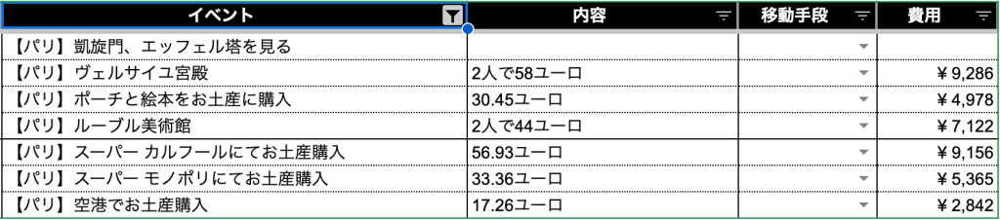](image-10-1024x226.png) 

**最後にお土産を買い込んだので、一番高くなりました**。

## 現地での移動費は約3万！

      各地の公共交通機関の乗り方などを調べたりするのは手間ですが、<strong>コストも抑えられて、乗り物楽しいのでおすすめです！</strong>
  

### バンコクの移動費は2人で約3,600円

](IMG_3967-1024x768.jpg) 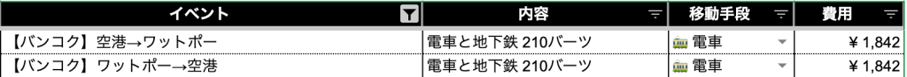](image-11-1024x88.png) 

行きのタイ乗り継ぎ時のみ観光するため電車に乗りました。

### ロンドンの公共交通機関はクレカタッチでらくらく！移動費は2人で約6,000円

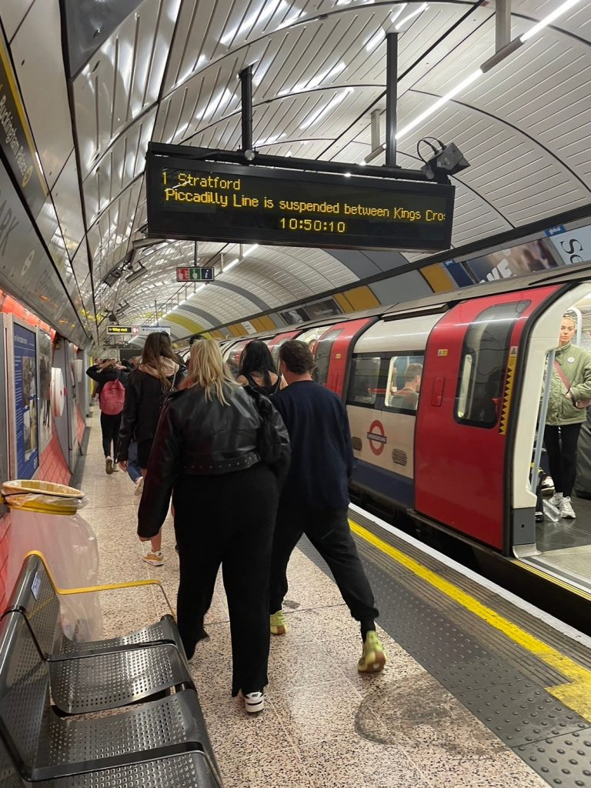](IMG_4011-768x1024.jpg) 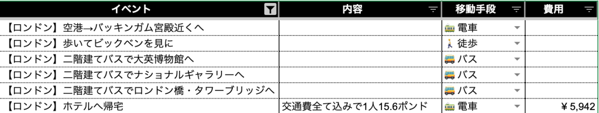](image-12-1024x195.png) 

クレカタッチで地下鉄も二階建てバスも乗車できて便利でした。クレカ明細から合計金額を算出しています。

### ブダベストではBudapestGoを使ってスマホで乗れる！移動費は2人で約7,300円

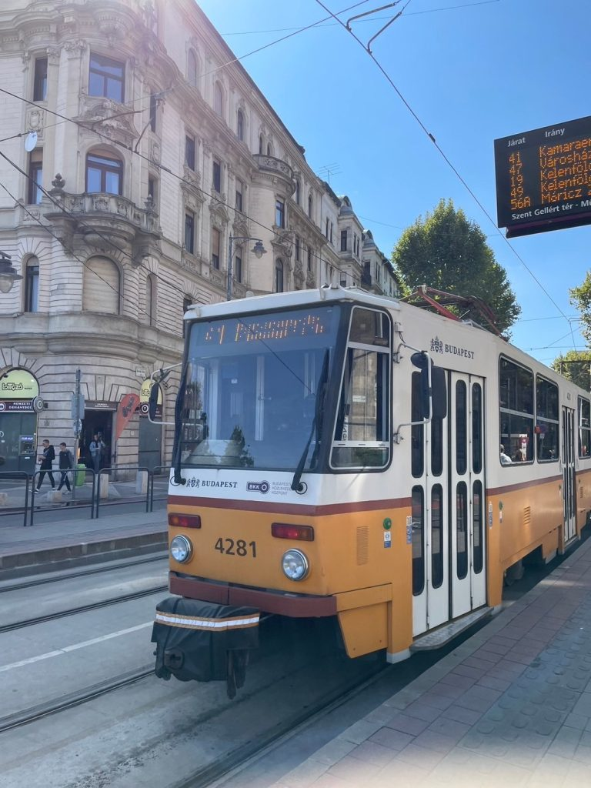](IMG_4845-768x1024.jpg) 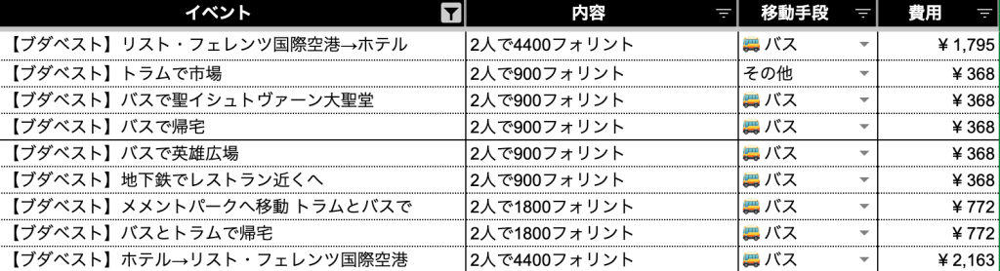](image-13-1024x278.png) 

BudapestGoというアプリをインストールすることで、トラム・バス・地下鉄と3種類乗車しました。

これだけ乗っても2人でこの価格なので、ブダベストの公共交通機関は安いですね。

  <a href="https://arukayies.com/diy/travel/europe-honeymoon-budapest-tourism-part1#toc7" title="【予算は100万円！個人手配で行くヨーロッパ新婚旅行】3泊4日のブダベスト観光 前編" class="blogcard-wrap internal-blogcard-wrap a-wrap cf" target="_blank">
  
  

    

      
    
](アイキャッチ画像-66ff37dcd4e82-160x90.jpg)
    
    

      

        【予算は100万円！個人手配で行くヨーロッパ新婚旅行】3泊4日のブダベスト観光 前編
      

      
      

        くらこんにちは！この記事を見ていただいている方、ご興味を持っていただいた方、ありがとうございます。タイトルの通りヨーロッパへ新婚旅行に行きました。くら前回は2泊3日のロンドン観光編をまとめました。くらこの記事ではブダペスト観光 前編の記録に...
      

    

    
    

      

        

          
          
          <noscript>
            
          </noscript>
        

        
        

          arukayies.com
        

      

      
      

        

          2024.10.30
        

      

    

  
</a>

### Navigoを使えば日本のSuicaと変わらず移動できる！パリでの移動費は2人で約1.4万円

](IMG_5007-768x1024.jpg) 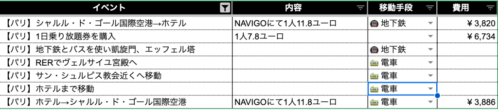](image-14-1024x228.png) 

パリではNavigoをiPhoneに設定して、バス・地下鉄・高速鉄道と3種類乗車しました。

切符を買う必要なく、スムーズに乗り降りできて便利でした。

  <a href="https://arukayies.com/diy/travel/europe-honeymoon-pari-tourism#toc3" title="【予算は100万円！個人手配で行くヨーロッパ新婚旅行】2泊3日のパリ観光" class="blogcard-wrap internal-blogcard-wrap a-wrap cf" target="_blank">
  
  

    

      
    
](アイキャッチ画像-670888f68c142-160x90.jpg)
    
    

      

        【予算は100万円！個人手配で行くヨーロッパ新婚旅行】2泊3日のパリ観光
      

      
      

        くらこんにちは！この記事を見ていただいている方、ご興味を持っていただいた方、ありがとうございます。タイトルの通りヨーロッパへ新婚旅行に行きました。くら前回はブダペスト観光編をまとめました。くらこの記事ではパリ観光の記録になります。1日目：治...
      

    

    
    

      

        

          
          
          <noscript>
            
          </noscript>
        

        
        

          arukayies.com
        

      

      
      

        

          2024.10.30
        

      

    

  
</a>

## 事前にかかった費用など

航空券や宿泊費以外に旅行前に購入したものはこちらです。

  <ul class="wp-block-list">
    <li>
      通信費・・・2人で約3,500円
    </li>
    <li>
      海外旅行保険・・・8,800円
    </li>
  </ul>
  
      以下は今後も使えるグッズなので、費用は省きます。
  
  
  <ul class="wp-block-list">
    <li>
      洗濯グッズ・・・メルカリで購入。現地での手洗いするために購入しました。
    </li>
    <li>
      モバイルバッテリー・・・楽天で購入。必須です！
    </li>
    <li>
      バックパック・・・楽天で購入。バックパックスタイルで旅行しました。
    </li>
  </ul>

詳細はこちらにまとめてあります。

  <a href="https://arukayies.com/diy/travel/europe-honeymoon-preparation" title="【予算は100万円！個人手配で行くヨーロッパ新婚旅行】事前準備編" class="blogcard-wrap internal-blogcard-wrap a-wrap cf" target="_blank">
  
  

    

      
    
](アイキャッチ画像-66fb8c4ad58b7-160x90.jpg)
    
    

      

        【予算は100万円！個人手配で行くヨーロッパ新婚旅行】事前準備編
      

      
      

        くらこんにちは！この記事を見ていただいている方、ご興味を持っていただいた方、ありがとうございます。タイトルの通りヨーロッパへ新婚旅行に行きました。くらしかし、夫婦で行ったのは台湾のみとほとんど海外旅行の経験はありません。英語も話せず、しかも...
      

    

    
    

      

        

          
          
          <noscript>
            
          </noscript>
        

        
        

          arukayies.com
        

      

      
      

        

          2024.10.30
        

      

    

  
</a>

## まとめ

ヨーロッパ3カ国を巡る新婚旅行にかかった費用の内訳でした。

振り返ってみると道中の観光は詰め込みすぎて、休まることはなかったのでもう少しゆったりしても良かったかなーと反省しています。

無事に帰って来れて、楽しめて良い旅行でした。

皆さんの参考になればうれしいです。
